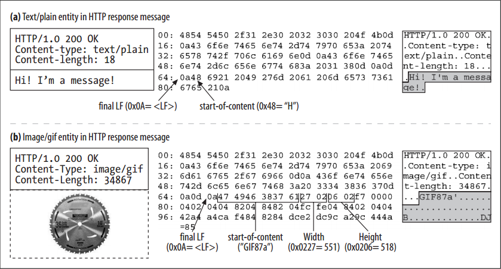

# Content-Length: The Entity’s Size

<!-- TOC -->

- [Content-Length: The Entity’s Size](#content-length-the-entitys-size)
    - [设计思想](#设计思想)
    - [抽象本质](#抽象本质)
    - [Summary](#summary)
    - [Entity Bodies](#entity-bodies)
    - [Detecting Truncation](#detecting-truncation)
    - [Incorrect Content-Length](#incorrect-content-length)
    - [Content-Length and Persistent Connections](#content-length-and-persistent-connections)
    - [Content Encoding](#content-encoding)
    - [Rules for Determining Entity Body Length](#rules-for-determining-entity-body-length)
        - [1. HTTP message type is not allowed to have a body](#1-http-message-type-is-not-allowed-to-have-a-body)
        - [2. Message contains a Transfer-Encoding header](#2-message-contains-a-transfer-encoding-header)
        - [3. Use Content-Length header](#3-use-content-length-header)
        - [4. “multipart/byteranges” media type](#4-multipartbyteranges-media-type)
        - [5. Connection closes](#5-connection-closes)
    - [References](#references)

<!-- /TOC -->

## 设计思想

## 抽象本质

## Summary
1. The `Content-Length` header indicates the size of the entity body in the message, in bytes. 
2. The size includes any content encodings (the `Content-Length` of a gzip-compressed text file will be the compressed size, not the original size).
3. The `Content-Length` header is mandatory for messages with entity bodies, unless the message is transported using chunked encoding. 
4. `Content-Length` is needed to detect premature message truncation when servers crash and to properly segment messages
that share a persistent connection.

## Entity Bodies
1. The entity body just contains the raw cargo. 
2.  If there is a `Content-Encoding` header, the content already has been encoded by the content-encoding algorithm, and the first byte of the entity is the first byte of the encoded (e.g., compressed) cargo.
3. Any other descriptive information is contained in the headers. Because the entity body cargo is just raw data, the entity headers are needed to describe the meaning of that data. 
4. For example, the `Content-Type` entity header tells us how to interpret the data (image, text, etc.), and the `Content-Encoding` entity header tells us if the data was compressed or otherwise recoded. 
5. The raw content begins immediately after the blank CRLF line that marks the end of the header fields. Whatever the content is—text or binary, document or image, compressed or uncompressed, English or French or Japanese—it is placed right after the CRLF.
6. Figure below shows two examples of real HTTP messages, one carrying a text entity, the other carrying an image entity
    
7. The hexadecimal values show the exact contents of the message:
    * In (a), the entity body begins at byte number 65, right after the end-of headers CRLF. The entity body contains the ASCII characters for “Hi! I’m a message!”
    * In (b), the entity body begins at byte number 67. The entity body contains the binary contents of the GIF image. GIF files begin with 6-byte version signature, a 16-bit width, and a 16-bit height. You can see all three of these directly in the entity body.

## Detecting Truncation
1. Older versions of HTTP used connection close to delimit the end of a message. But, without `Content-Length`, clients cannot distinguish between successful connection close at the end of a message and connection close due to a server crash in the middle of a message. Clients need `Content-Length` to detect message truncation.
2. Message truncation is especially severe for caching proxy servers. If a cache receives a truncated message and doesn’t recognize the truncation, it may store the defective content and serve it many times. 
3. Caching proxy servers generally do not cache HTTP bodies that don’t have an explicit `Content-Length` header, to reduce the risk of caching truncated messages.

## Incorrect Content-Length
1. An incorrect `Content-Length` can cause even more damage than a missing `Content-Length`. Because some early clients and servers had well-known bugs with respect to `Content-Length` calculations, some clients, servers, and proxies contain algorithms to try to detect and correct interactions with broken servers. 
2. HTTP/1.1 user agents officially are supposed to notify the user when an invalid length is received and detected.

## Content-Length and Persistent Connections
1. `Content-Length` is essential for persistent connections. If the response comes across a persistent connection, another HTTP response can immediately follow the current response. The `Content-Length` header lets the client know where one message ends and the next begins. 
2. Because the connection is persistent, the client cannot use connection close to identify the message’s end. Without a `Content-Length` header, HTTP applications won’t know where one entity body ends and the next message begins.
3. As we will see in “Transfer Encoding and Chunked Encoding”, there is one situation where you can use persistent connections without having a `Content-Length` header: when you use chunked encoding. Chunked encoding sends the data in a series of chunks, each with a specified size. Even if the server does not know the size of the entire entity at the time the headers are generated (often because the entity is being generated dynamically), the server can use chunked encoding to transmit pieces of well-defined size.

## Content Encoding
1. HTTP lets you encode the contents of an entity body, perhaps to make it more secure or to compress it to take up less space (we explain compression in detail later in this chapter). 
2. If the body has been content-encoded, the `Content-Length` header specifies the length, in bytes, of the *encoded* body, *not* the length of the original, unencoded body. 
3. Some HTTP applications have been known to get this wrong and to send the size of the data before the encoding, which causes serious errors, especially with persistent connections. 
4. Unfortunately, none of the headers described in the HTTP/1.1 specification can be used to send the length of the original, unencoded body, which makes it difficult for clients to verify the integrity of their unencoding processes.
5. Even the `Content-MD5` header, which can be used to send the 128-bit MD5 of the document, contains the MD5 of the encoded document. The `Content-MD5` header is described later in this chapter.

## Rules for Determining Entity Body Length
1. The following rules describe how to correctly determine the length and end of an entity body in several different circumstances. 
2. The rules should be applied in order; the first match applies.
3. The HTTP/1.1 specification counsels that if a request contains a body and no `Content-Length`, the server should send a` 400 Bad Request` response if it cannot determine the length of the message, or a `411 Length Required` response if it wants to insist on receiving a valid `Content-Length`.

### 1. HTTP message type is not allowed to have a body
1. If a particular HTTP message type is not allowed to have a body, ignore the `Content-Length` header for body calculations. 
2. The `Content-Length` headers are informational in this case and do not describe the actual body length. (Naive HTTP applications can get in trouble if they assume `Content-Length` always means there is a body). 
3. The most important example is the `HEAD` response. The `HEAD` method requests that a server send the headers that would have been returned by an equivalent `GET` request, but no body. Because a `GET` response would send back a `Content-Length` header, so will the `HEAD` response—but unlike the `GET` response, the `HEAD` response will not have a body. 
4. 1XX, 204, and 304 responses also can have informational `Content-Length` headers but no entity body. 
5. Messages that forbid entity bodies must terminate at the first empty line after the headers, regardless of which entity header fields are present.

### 2. Message contains a Transfer-Encoding header
If a message contains a `Transfer-Encoding` header (other than the default HTTP “identity” encoding), the entity will be terminated by a special pattern called a “zero-byte chunk,” unless the message is terminated first by closing the connection. We’ll discuss transfer encodings and chunked encodings later in this chapter. 

### 3. Use Content-Length header
1. If a message has a `Content-Length` header (and the message type allows entity bodies), the `Content-Length` value contains the body length, unless there is a non-identity `Transfer-Encoding` header. 
2. If a message is received with both a `Content-Length` header field and a non-identity `Transfer-Encoding` header field, you must ignore the `Content-Length`, because the transfer encoding will change the way entity bodies are represented and transferred (and probably the number of bytes transmitted).

### 4. “multipart/byteranges” media type
1. If the message uses the “multipart/byteranges” media type and the entity length is not otherwise specified (in the `Content-Length` header), each part of the multipart message will specify its own size. 
2. This multipart type is the only entity body type that self-delimits its own size, so this media type must not be sent unless the sender knows the recipient can parse it.
3. Because a `Range` header might be forwarded by a more primitive proxy that does not understand multipart/ byteranges, the sender must delimit the message using methods 1, 3, or 5 in this section if it isn’t sure the receiver understands the self- delimiting format.

### 5. Connection closes
1. If none of the above rules match, the entity ends when the connection closes. 
2. In practice, only servers can use connection close to indicate the end of a message. Clients can’t close the connection to signal the end of client messages, because that would leave no way for the server to send back a response.
3. The client could do a half close of just its output connection, but many server applications aren’t designed to handle this situation and will interpret a half close as the client disconnecting from the server. Connection
management was never well specified in HTTP. 

## References
* [*HTTP: the definitive guide*](https://book.douban.com/subject/1440226/)