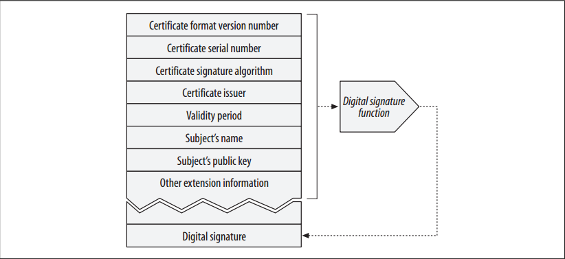
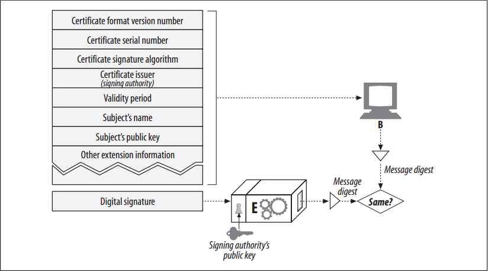

# Digital Certificates

<!-- TOC -->

- [Digital Certificates](#digital-certificates)
    - [设计思想](#设计思想)
    - [抽象本质](#抽象本质)
    - [Summary](#summary)
    - [The Guts of a Certificate](#the-guts-of-a-certificate)
    - [X.509 v3 Certificates](#x509-v3-certificates)
    - [Using Certificates to Authenticate Servers](#using-certificates-to-authenticate-servers)
    - [References](#references)

<!-- /TOC -->

## 设计思想

## 抽象本质

## Summary
1. In this section, we talk about digital certificates, the “ID cards” of the Internet. 
2. Digital certificates (often called “certs”) contain information about a user or firm that has been vouched for by a trusted organization.
3. We all carry many forms of identification. Some IDs, such as passports and drivers’ licenses, are trusted enough to prove one’s identity in many situations.
4. More trusted forms of identification, such as passports, are signed and stamped by a government on special paper. They are harder to forge, so they inherently carry a higher level of trust.
5.  Some corporate badges and smart cards include electronics to help strengthen the identity of the carrier. Some top-secret government organizations even need to match up your fingerprints or retinal capillary patterns with your ID before trusting it!

## The Guts of a Certificate
1. Digital certificates also contain a set of information, all of which is digitally signed by an official “certificate authority”. 
2. Basic digital certificates commonly contain basic things common to printed IDs, such as:
    * Subject’s name (person, server, organization, etc.)
    * Expiration date
    * Certificate issuer (who is vouching for the certificate)
    * Digital signature from the certificate issuer
3. Additionally, digital certificates often contain the public key of the subject, as well as descriptive information about the subject and about the signature algorithm used.
4. Anyone can create a digital certificate, but not everyone can get a well-respected signing authority to vouch for the certificate’s information and sign the certificate with its private key. 
5. A typical certificate structure is shown in figure below
    

## X.509 v3 Certificates

## Using Certificates to Authenticate Servers
1. When you establish a secure web transaction through HTTPS, modern browsers automatically fetch the digital certificate for the server being connected to. If the server does not have a certificate, the secure connection fails. 
2. The server certificate contains many fields, including:
    * Name and hostname of the web site
    * Public key of the web site
    * Name of the signing authority
    * Signature from the signing authority
3. When the browser receives the certificate, it checks the signing authority. If it is a public, well-respected signing authority, the browser will already know its public key (browsers ship with certificates of many signing authorities preinstalled), so it can verify the signature as we discussed in the “Digital Signatures”.
4. Figure below shows how a certificate’s integrity is verified using its digital signature
    
5. If the signing authority is unknown, the browser isn’t sure if it should trust the signing authority and usually displays a dialog box for the user to read and see if he trusts the signer. The signer might be the local IT department, or a software vendor.

## References
* [*HTTP: the definitive guide*](https://book.douban.com/subject/1440226/)