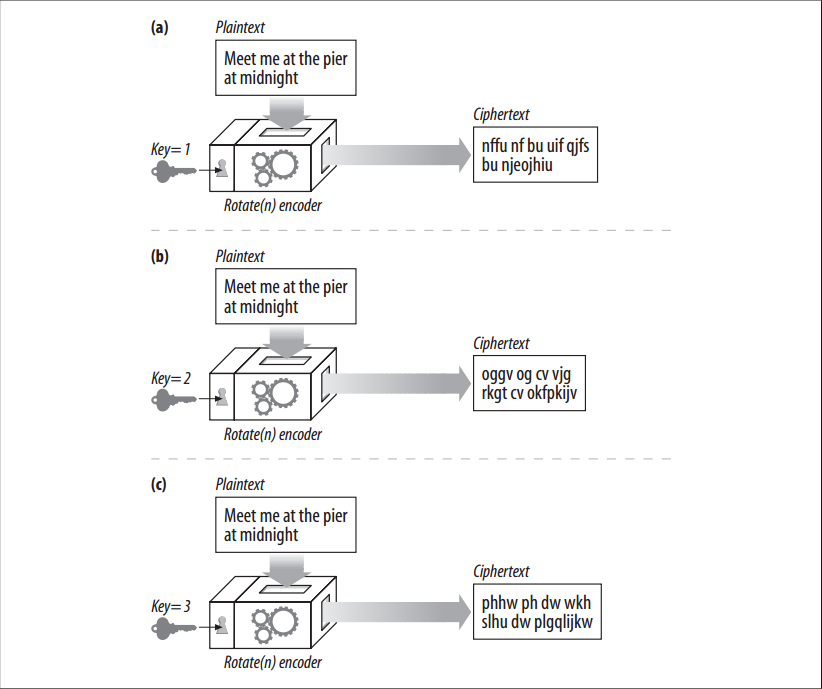

# Making HTTP Safe

<!-- TOC -->

- [Making HTTP Safe](#making-http-safe)
    - [设计思想](#设计思想)
    - [抽象本质](#抽象本质)
    - [Summary](#summary)
    - [The Art and Science of Secret Coding](#the-art-and-science-of-secret-coding)
    - [Ciphers](#ciphers)
    - [Cipher Machines](#cipher-machines)
    - [Keyed Ciphers](#keyed-ciphers)
    - [Digital Ciphers](#digital-ciphers)
    - [Symmetric-Key Cryptography](#symmetric-key-cryptography)
    - [References](#references)

<!-- /TOC -->

## 设计思想

## 抽象本质

## Summary
1. Before we talk in detail about HTTPS, we need to provide a little background about the cryptographic encoding techniques used by SSL and HTTPS. 
2. In the next few sections, we’ll give a speedy primer of the essentials of digital cryptography. In this digital cryptography primer, we’ll talk about:
    * Ciphers: Algorithms for encoding text to make it unreadable to voyeurs
    * Keys: Numeric parameters that change the behavior of ciphers
    * Symmetric-key cryptosystems: Algorithms that use the same key for encoding and decoding
    * Asymmetric-key cryptosystems: Algorithms that use different keys for encoding and decoding
    * Public-key cryptography: A system making it easy for millions of computers to send secret messages
    * Digital signatures: Checksums that verify that a message has not been forged or tampered with
    * Digital certificates: Identifying information, verified and signed by a trusted organization

## The Art and Science of Secret Coding
1. Cryptography is the art and science of encoding and decoding messages. People have used cryptographic methods to send secret messages for thousands of years. 
2. However, cryptography can do more than just encrypt messages to prevent reading by nosy folks; it also can be used to prevent tampering with messages. 
3. Cryptography even can be used to prove that you indeed authored a message or transaction, just like your handwritten signature on a check or an embossed wax seal on an envelope.

## Ciphers
1. Cryptography is based on secret codes called `ciphers`. A cipher is a coding scheme—a particular way to encode a message and an accompanying way to decode the secret later. 
2. The original message, before it is encoded, often is called `plaintext` or `cleartext`. The coded message, after the cipher is applied, often is called `ciphertext`.

## Cipher Machines
1. Ciphers began as relatively simple algorithms, because human beings needed to do the encoding and decoding themselves. Because the ciphers were simple, people could work the codes using pencil and paper and code books. However, it also was possible for clever people to “crack” the codes fairly easily.
2. As technology advanced, people started making machines that could quickly and accurately encode and decode messages using much more complicated ciphers. Instead of just doing simple rotations, these cipher machines could substitute characters, transpose the order of characters, and slice and dice messages to make codes much harder to crack.
3. In reality, having the logic of the machine in your possession can sometimes help you to crack the code, because the machine logic may point to patterns that you can exploit. Modern cryptographic algorithms usually are designed so that even if the algorithm is publicly known, it’s difficult to come up with any patterns that will help evildoers crack the code. In fact, many of the strongest ciphers in common use have their source code available in the public domain, for all to see and study.

## Keyed Ciphers
1. Because code algorithms and machines could fall into enemy hands, most machines had dials that could be set to a large number of different values that changed how the cipher worked. 
2. Even if the machine was stolen, without the right dial settings (key values) the decoder wouldn’t work.
3. These cipher parameters were called **keys**. You needed to enter the right key into the cipher machine to get the decoding process to work correctly. 
4. Cipher keys make a single cipher machine act like a set of many virtual cipher machines, each of which behaves differently because they have different key values.
5. Figure below illustrates an example of keyed ciphers. The cipher algorithm is the trivial “rotate-by-N” cipher. The value of N is controlled by the key. The same input message, “meet me at the pier at midnight,” passed through the same encoding machine, generates different outputs depending on the value of the key
    
6. Today, virtually all cipher algorithms use keys.

## Digital Ciphers
1. With the advent of digital computation, two major advances occurred:
    * Complicated encoding and decoding algorithms became possible, freed from the speed and function limitations of mechanical machinery.
    * It became possible to support very large keys, so that a single cipher algorithm could yield trillions of virtual cipher algorithms, each differing by the value of the key. The longer the key, the more combinations of encodings are possible, and the harder it is to crack the code by randomly guessing keys. 
2. Unlike physical metal keys or dial settings in mechanical devices, digital keys are just numbers. These digital key values are inputs to the encoding and decoding algorithms. The coding algorithms are functions that take a chunk of data and encode/decode it based on the algorithm and the value of the key.
3. Given a plaintext message called *P*, an encoding function called *E*, and a digital encoding key called *e*, you can generate a coded ciphertext message *C*
    
4. You can decode the ciphertext *C* back into the original plaintext *P* by using the decoder function *D* and the decoding key *d*. Of course, the decoding and encoding functions are inverses of each other; the decoding of the encoding of *P* gives back the original message *P*
    

## Symmetric-Key Cryptography
1. Let’s talk in more detail about how keys and ciphers work together. 
2. Many digital cipher algorithms are called **symmetric-key** ciphers, because they use the same key value for encoding as they do for decoding (*e* = *d*). Let’s just call the key *k*.
3. In a symmetric key cipher, both a sender and a receiver need to have the same shared secret key, *k*, to communicate. 
4. The sender uses the shared secret key to encrypt the message and sends the resulting ciphertext to the receiver. The receiver takes the ciphertext and applies the decrypting function, along with the same shared secret key, to recover the original plaintext.
4. Some popular symmetric-key cipher algorithms are DES, Triple-DES, RC2, and RC4.

## References
* [*HTTP: the definitive guide*](https://book.douban.com/subject/1440226/)