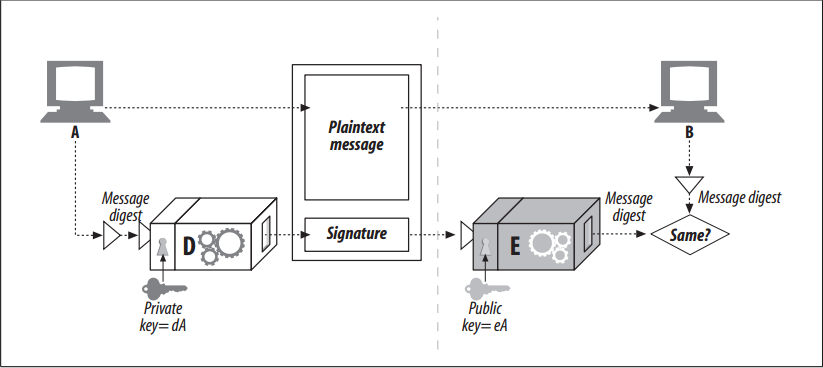

# Digital Signatures

<!-- TOC -->

- [Digital Signatures](#digital-signatures)
    - [设计思想](#设计思想)
    - [抽象本质](#抽象本质)
    - [Summary](#summary)
    - [Signatures Are Cryptographic Checksums](#signatures-are-cryptographic-checksums)
    - [References](#references)

<!-- /TOC -->

## 设计思想

## 抽象本质

## Summary
1. So far, we’ve been talking about various kinds of keyed ciphers, using symmetric and asymmetric keys, to allow us to encrypt and decrypt secret messages. 
2. In addition to encrypting and decrypting messages, cryptosystems can be used to sign messages, proving who wrote the message and proving the message hasn’t been tampered with. 
3. This technique, called **digital signing**, is important for Internet security certificates, which we discuss in the next section.

## Signatures Are Cryptographic Checksums
1. Digital signatures are special cryptographic checksums attached to a message. They have two benefits:
    * Signatures prove the author wrote the message. Because only the author has the author’s top-secret private key, only the author can compute these checksums. The checksum acts as a personal “signature” from the author.
    * Signatures prevent message tampering. If a malicious assailant modified the message in-flight, the checksum would no longer match. And because the checksum involves the author’s secret, private key, the intruder will not be able to fabricate a correct checksum for the tampered-with message.
2. Digital signatures often are generated using asymmetric, public-key technology. The author’s private key is used as a kind of “thumbprint”, because the private key is known only by the owner.
3. Figure blow shows an example of how node A can send a message to node B and sign it:
    
    1. Node A distills the variable-length message into a fixed-sized digest.
    2. Node A applies a “signature” function to the digest that uses the user’s private key as a parameter. Because only the user knows the private key, a correct signature function shows the signer is the owner. In this figure, we use the decoder function D as the signature function, because it involves the user’s private key.
    3. With the RSA cryptosystem, the decoder function D is used as the signature function, because D already takes the private key as input. Note that the decoder function is just a function, so it can be used on any input. Also, in the RSA cryptosystem, the D and E functions work when applied in either order and cancel each other out. So, `E(D(stuff)) = stuff`, just as `D(E(stuff)) = stuff`.
    4. Once the signature is computed, node A appends it to the end of the message and sends both the message and the signature to node B.
    5. On receipt, if node B wants to make sure that node A really wrote the message, and that the message hasn’t been tampered with, node B can check the signature. Node B takes the private-key scrambled signature and applies the inverse function using the public key. If the unpacked digest doesn’t match node B’s own version of the digest, either the message was tampered with in-flight, or the sender did not have node A’s private key (and therefore was not node A).

## References
* [*HTTP: the definitive guide*](https://book.douban.com/subject/1440226/)