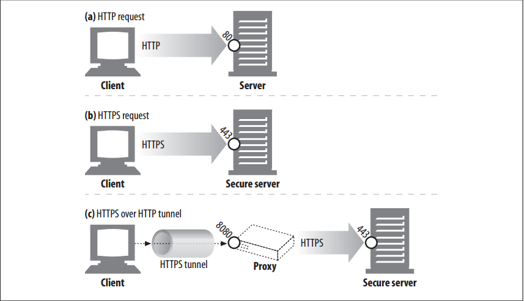

# HTTPS


<!-- TOC -->

- [HTTPS](#https)
    - [设计思想](#设计思想)
    - [抽象本质](#抽象本质)
    - [Summary](#summary)
    - [HTTPS Schemes](#https-schemes)
    - [Secure Transport Setup](#secure-transport-setup)
    - [SSL Handshake](#ssl-handshake)
    - [Server Certificates](#server-certificates)
    - [Site Certificate Validation](#site-certificate-validation)
        - [Date check](#date-check)
        - [Signer trust check](#signer-trust-check)
        - [Signature check](#signature-check)
        - [Site identity check](#site-identity-check)
    - [Virtual Hosting and Certificates](#virtual-hosting-and-certificates)
    - [References](#references)

<!-- /TOC -->


## 设计思想


## 抽象本质


## Summary
1. HTTPS is the most popular secure version of HTTP. It is widely implemented and available in all major commercial browsers and servers. 
2. HTTPS combines the HTTP protocol with a powerful set of symmetric, asymmetric, and certificate-based cryptographic techniques, making HTTPS very secure but also very flexible and easy to administer across the anarchy of the decentralized, global Internet. 
3. HTTPS has accelerated the growth of Internet applications and has been a major force in the rapid growth of web-based electronic commerce. HTTPS also has been critical in the wide-area, secure administration of distributed web applications.
4. HTTPS is just HTTP sent over a secure transport layer. Instead of sending HTTP messages unencrypted to TCP and across the world-wide Internet, HTTPS sends the HTTP messages first to a security layer that encrypts them before
sending them to TCP
    
5. Today, the HTTP security layer is implemented by SSL and its modern replacement, TLS. We follow the common practice of using the term “SSL” to mean either SSL or TLS.


## HTTPS Schemes
1. Today, secure HTTP is optional. Thus, when making a request to a web server, we need a way to tell the web server to perform the secure protocol version of HTTP. This is done in the scheme of the URL.
2. In normal, nonsecure HTTP, the scheme prefix of the URL is http, as in:
    ```
    http://www.joes-hardware.com/index.html
    ```
    In the secure HTTPS protocol, the scheme prefix of the URL is https, as in:
    ```
    https://cajun-shop.securesites.com/Merchant2/merchant.mv?Store_Code=AGCGS
    ```
3. When a client (such as a web browser) is asked to perform a transaction on a web resource, it examines the scheme of the URL:
    * If the URL has an `http` scheme, the client opens a connection to the server on port 80 (by default) and sends it plain-old HTTP command.
    * If the URL has an `https` scheme, the client opens a connection to the server on port 443 (by default) and then “handshakes” with the server, exchanging some SSL security parameters with the server in a binary format, followed by the encrypted HTTP commands.
    
4. Because SSL traffic is a binary protocol, completely different from HTTP, the traffic is carried on different ports (SSL usually is carried over port 443). If both SSL and HTTP traffic arrived on port 80, most web servers would interpret binary SSL traffic as erroneous HTTP and close the connection. 
5. A more integrated layering of security services into HTTP would have eliminated the need for multiple destination ports, but this does not cause severe problems in practice.


## Secure Transport Setup 
1. In unencrypted HTTP, a client opens a TCP connection to port 80 on a web server, sends a request message, receives a response message, and closes the connection.
2. The procedure is slightly more complicated in HTTPS, because of the SSL security layer
    
3. In HTTPS, the client first opens a connection to port 443 (the default port for secure HTTP) on the web server. 
4. Once the TCP connection is established, the client and server initialize the SSL layer, negotiating cryptography parameters and exchanging keys. 
5. When the handshake completes, the SSL initialization is done, and the client can send request messages to the security layer. These messages are encrypted before being sent to TCP.
    

## SSL Handshake
1. Before you can send encrypted HTTP messages, the client and server need to do an SSL handshake, where they:
    * Exchange protocol version numbers
    * Select a cipher that each side knows
    * Authenticate the identity of each side
    * Generate temporary session keys to encrypt the channel
2. Before any encrypted HTTP data flies across the network, SSL already has sent a bunch of handshake data to establish the communication. The essence of the SSL handshake is shown in figure below
    
3. This is a simplified version of the SSL handshake. Depending on how SSL is being used, the handshake can be more complicated, but this is the general idea.


## Server Certificates
1. SSL supports mutual authentication, carrying server certificates to clients and carrying client certificates back to servers. 
2. But today, client certificates are not commonly used for browsing. Most users don’t even possess personal client certificates. A web server can demand a client certificate, but that seldom occurs in practice.
3. Client certificates are used for web browsing in some corporate settings, and client certificates are used for
secure email. Some organizational intranets use client certificates to control employee access to information. In the future, client certificates may become more common for web browsing, but today they’ve caught on very slowly.
4. On the other hand, secure HTTPS transactions always require server certificates. 
5. When you perform a secure transaction on a web server, such as posting your credit card information, you want to know that you are talking to the organization you think you are talking to. 
6. Server certificates, signed by a well-known authority, help you assess how much you trust the server before sending your credit card or personal information.
7. The server certificate is an X.509 v3–derived certificate showing the organization’s name, address, server DNS domain name, and other information. You and your client software can examine the certificate to make sure everything seems to be on the up-and-up
    


## Site Certificate Validation
1. SSL itself doesn’t require you to examine the web server certificate, but most modern browsers do some simple sanity checks on certificates and provide you with the means to do more thorough checks. 
2. One algorithm for web server certificate validation, proposed by Netscape, forms the basis of most browser’s validation techniques. The steps are:

### Date check
1. First, the browser checks the certificate’s start and end dates to ensure the certificate is still valid. 
2. If the certificate has expired or has not yet become active, the certificate validation fails and the browser displays an error.

### Signer trust check
1. Every certificate is signed by some certificate authority (CA), who vouches for the server. 
2. There are different levels of certificate, each requiring different levels of background verification. For example, if you apply for an e-commerce server certificate, you usually need to provide legal proof of incorporation as a business.
3. Anyone can generate certificates, but some CAs are well-known organizations with well-understood procedures for verifying the identity and good business behavior of certificate applicants. 
4. For this reason, browsers ship with a list of signing authorities that are trusted. If a browser receives a certificate signed by some unknown (and possibly malicious) authority, the browser usually displays a warning. 
5. Browsers also may choose to accept any certificates with a valid signing path to a trusted CA. In other words, if a trusted CA signs a certificate for “Sam’s Signing Shop” and Sam’s Signing Shop signs a site certificate, the browser may accept the certificate as deriving from a valid CA path. 不懂

### Signature check
Once the signing authority is judged as trustworthy, the browser checks the certificate’s integrity by applying the signing authority’s public key to the signature and comparing it to the checksum.

### Site identity check
1. To prevent a server from copying someone else’s certificate or intercepting their traffic, most browsers try to verify that the domain name in the certificate matches the domain name of the server they talked to. 
2. Server certificates usually contain a single domain name, but some CAs create certificates that contain lists of server names or wildcarded domain names, for clusters or farms of servers. 
3. If the hostname does not match the identity in the certificate, user-oriented clients must either notify the user or terminate the connection with a bad certificate error.


## Virtual Hosting and Certificates
1. It’s sometimes tricky to deal with secure traffic on sites that are virtually hosted (multiple hostnames on a single server). 
2. Some popular web server programs support only a single certificate. If a user arrives for a virtual hostname that does not strictly match the certificate name, a warning box is displayed.
3. For example, consider the Louisiana-themed e-commerce site `Cajun-Shop.com`. The site’s hosting provider provided the official name `cajun-shop.securesites.com`. 
4. When users go to `https://www.cajun-shop.com`, the official hostname listed in the server certificate (`*.securesites.com`) does not match the virtual hostname the user browsed to (`www.cajun-shop.com`), and the warning appears.
5. To prevent this problem, the owners of `Cajun-Shop.com` redirect all users to `cajunshop.securesites.com` when they begin secure transactions. Cert management for virtually hosted sites can be a little tricky.
    


## References
* [*HTTP: the definitive guide*](https://book.douban.com/subject/1440226/)