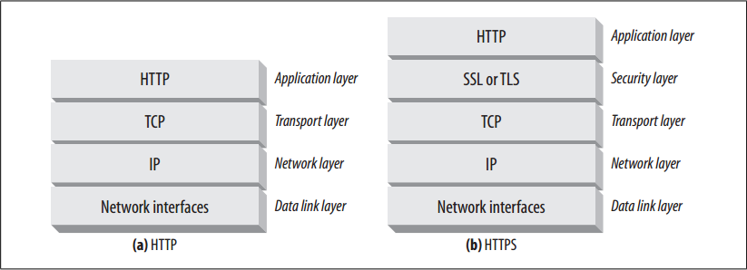

# Making HTTP Safe

<!-- TOC -->

- [Making HTTP Safe](#making-http-safe)
    - [设计思想](#设计思想)
    - [抽象本质](#抽象本质)
    - [Summary](#summary)
        - [HTTPS](#https)
    - [References](#references)

<!-- /TOC -->

## 设计思想

## 抽象本质

## Summary
A secure version of HTTP needs to be efficient, portable, easy to administer, and adaptable to the changing world. It also has to meet societal and governmental requirements. We need a technology for HTTP security that provides:
* Server authentication (clients know they’re talking to the real server, not a phony)
* Client authentication (servers know they’re talking to the real user, not a phony)
* Integrity (clients and servers are safe from their data being changed)
* Encryption (clients and servers talk privately without fear of eavesdropping)
* Efficiency (an algorithm fast enough for inexpensive clients and servers to use)
* Ubiquity (protocols are supported by virtually all clients and servers)
* Administrative scalability (instant secure communication for anyone, anywhere)
* Adaptability (supports the best known security methods of the day)
* Social viability (meets the cultural and political needs of the society)

### HTTPS
1. When using HTTPS, all the HTTP request and response data is encrypted before being sent across the network. 
2. HTTPS works by providing a transport-level cryptographic security layer—using either the Secure Sockets Layer (SSL) or its successor, Transport Layer Security (TLS)—underneath HTTP. 
    
3. Because SSL and TLS are so similar, in this book we use the term “SSL” loosely to represent both SSL and TLS.
4. Because most of the hard encoding and decoding work happens in the SSL libraries, web clients and servers don’t need to change much of their protocol processing logic to use secure HTTP. For the most part, they simply need to replace TCP input/output calls with SSL calls and add a few other calls to configure and manage the security information.

## References
* [*HTTP: the definitive guide*](https://book.douban.com/subject/1440226/)