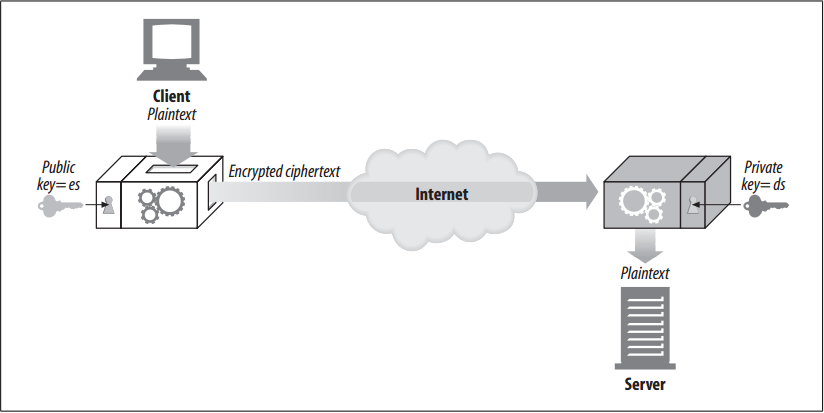
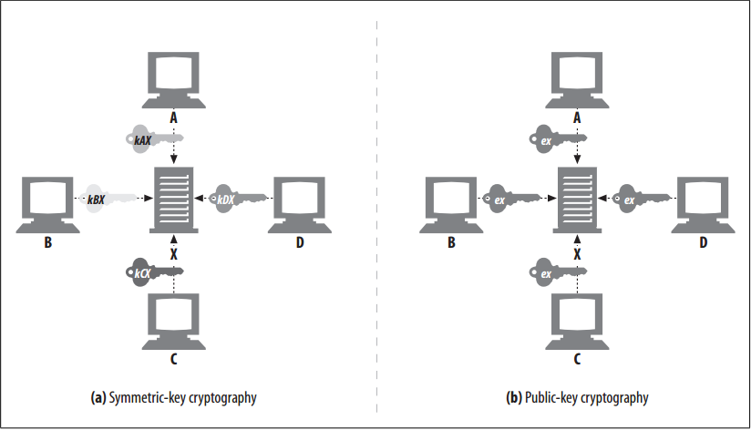

# Public-Key Cryptography

<!-- TOC -->

- [Public-Key Cryptography](#public-key-cryptography)
    - [设计思想](#设计思想)
    - [抽象本质](#抽象本质)
    - [Summary](#summary)
    - [RSA](#rsa)
    - [Hybrid Cryptosystems and Session Keys](#hybrid-cryptosystems-and-session-keys)
    - [References](#references)

<!-- /TOC -->

## 设计思想

## 抽象本质

## Summary
1. Instead of a single encoding/decoding key for every pair of hosts, public-key cryptography uses two asymmetric keys: one for encoding messages for a host, and another for decoding the host’s messages. 
2. The encoding key is publicly known to the world (thus the name public-key cryptography), but only the host knows the private decoding key. 
3. This makes key establishment much easier, because everyone can find the public key for a particular host. But the decoding key is kept secret, so only the recipient can decode messages sent to it
    
4. Node X can take its encoding key $e^x$ and publish it publicly. Now anyone wanting to send a message to node X can use the same, well-known public key. 
    
5. Because each host is assigned an encoding key, which everyone uses, public-key cryptography avoids the $N^2$ explosion of pairwise symmetric keys.
6. Even though everyone can encode messages to X with the same key, no one other than X can decode the messages, because only X has the decoding private key $d^x$. 
7. Splitting the keys lets anyone encode a message but restricts the ability to decode messages to only the owner. This makes it easier for nodes to securely send messages to servers, because they can just look up the server’s public key.
8. Public-key encryption technology makes it possible to deploy security protocols to every computer user around the world.

## RSA 
1. The challenge of any public-key asymmetric cryptosystem is to make sure no bad guy can compute the secret, private key—even if he has all of the following clues: 
	* The public key (which anyone can get, because it’s public) 
	* A piece of intercepted ciphertext (obtained by snooping the network) 
	* A message and its associated ciphertext (obtained by running the encoder on any text)
2. One popular public-key cryptosystem that meets all these needs is the RSA algorithm, invented at MIT and subsequently commercialized by RSA Data Security. 
3. Given a public key, an arbitrary piece of plaintext, the associated ciphertext from encoding the plaintext with the public key, the RSA algorithm itself, and even the source code of the RSA implementation, cracking the code to find the corresponding private key is believed to be as hard a problem as computing huge prime numbers— believed to be one of the hardest problems in all of computer science. 
4. So, if you can find a fast way of factoring large numbers into primes, not only can you break into Swiss bank accounts, but you can also win a Turing Award.

## Hybrid Cryptosystems and Session Keys
1. Asymmetric, public-key cryptography is nifty, because anyone can send secure messages to a public server, just by knowing its public key. Two nodes don’t first have to negotiate a private key in order to communicate securely.
2. But public-key cryptography algorithms tend to be computationally slow. In practice, mixtures of both symmetric and asymmetric schemes are used.
3. For example, it is common to use public-key cryptography to conveniently set up secure communication between nodes but then to use that secure channel to generate and communicate a temporary, random symmetric key to encrypt the rest of the data through faster, symmetric cryptography.

## References
* [*HTTP: the definitive guide*](https://book.douban.com/subject/1440226/)