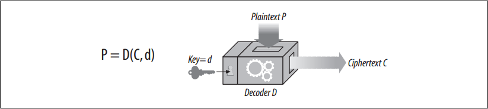

# Symmetric-Key Cryptography

<!-- TOC -->

- [Symmetric-Key Cryptography](#symmetric-key-cryptography)
    - [设计思想](#%E8%AE%BE%E8%AE%A1%E6%80%9D%E6%83%B3)
    - [抽象本质](#%E6%8A%BD%E8%B1%A1%E6%9C%AC%E8%B4%A8)
    - [Summary](#summary)
    - [Key Length and Enumeration Attacks](#key-length-and-enumeration-attacks)
    - [Establishing Shared Keys](#establishing-shared-keys)
    - [References](#references)

<!-- /TOC -->

## 设计思想

## 抽象本质

## Summary
1. Let’s talk in more detail about how keys and ciphers work together. 
2. Many digital cipher algorithms are called **symmetric-key** ciphers, because they use the same key value for encoding as they do for decoding (*e* = *d*). Let’s just call the key *k*.
3. In a symmetric key cipher, both a sender and a receiver need to have the same shared secret key, *k*, to communicate. 
4. The sender uses the shared secret key to encrypt the message and sends the resulting ciphertext to the receiver. The receiver takes the ciphertext and applies the decrypting function, along with the same shared secret key, to recover the original plaintext
    
4. Some popular symmetric-key cipher algorithms are DES, Triple-DES, RC2, and RC4.

## Key Length and Enumeration Attacks
1. It’s very important that secret keys stay secret. In most cases, the encoding and decoding algorithms are public knowledge, so the key is the only thing that’s secret!
2. A good cipher algorithm forces the enemy to try every single possible key value in the universe to crack the code. Trying all key values by brute force is called an **enumeration attack**. 
3. If there are only a few possible key values, a bad guy can go through all of them by brute force and eventually crack the code. But if there are a lot of possible key values, it might take the bad guy days, years, or even the lifetime of the universe to go through all the keys, looking for one that breaks the cipher.
4. The number of possible key values depends on the number of bits in the key and how many of the possible keys are valid. 
5. There are ciphers where only some of the key values are valid. For example, in RSA, the best-known asymmetric-key cryptosystem, valid keys must be related to prime numbers in a certain way. Only a small number of the possible key values have this property.
6. For symmetric-key ciphers, usually all of the key values are valid. An 8-bit key would have only 256 possible keys, a 40-bit key would have 240 possible keys (around one trillion keys), and a 128-bit key would generate around 340,000,000,000,000,000,000,000,000,000,000,000,000 possible keys.
7. For conventional symmetric-key ciphers, 40-bit keys are considered safe enough for small, noncritical transactions. However, they are breakable by today’s high-speed workstations, which can now do billions of calculations per second.
8. In contrast, 128-bit keys are considered very strong for symmetric-key cryptography. In fact, long keys have such an impact on cryptographic security that the U.S. government has put export controls on cryptographic software that uses long keys, to prevent potentially antagonistic organizations from creating secret codes that the U.S. National Security Agency (NSA) would itself be unable to crack.
9. A large key does not mean that the cipher is foolproof, though! There may be an unnoticed flaw in the cipher algorithm or implementation that provides a weakness for an attacker to exploit. It’s also possible that the attacker may have some information about how the keys are generated, so that he knows some keys are more likely than others, helping to focus a brute-force attack. Or a user might leave the secret key someplace where an attacker might be able to steal it.

## Establishing Shared Keys
1. One disadvantage of symmetric-key ciphers is that both the sender and receiver have to have a shared secret key before they can talk to each other.
2. If you wanted to talk securely with Joe’s Hardware store, perhaps to order some wood-working tools after watching a home-improvement program on public television, you’d have to establish a private secret key between you and `www.joes-hardware.com` before you could order anything securely. You’d need a way to generate the secret key and to remember it. Both you and Joe’s Hardware, and every other Internet user, would have thousands of keys to generate and remember.
2. Say that Alice (A), Bob (B), and Chris (C) all wanted to talk to Joe’s Hardware (J). A, B, and C each would need to establish their own secret keys with J. A would need key $k^{AJ}$, B would need key $k^{BJ}$, and C would need key $k^{CJ}$. Every pair of communicating parties needs its own private key. If there are $N$ nodes, and each node has to talk securely with all the other $N–1$ nodes, there are roughly $N^2$ total secret keys: an administrative nightmare.

## References
* [*HTTP: the definitive guide*](https://book.douban.com/subject/1440226/)