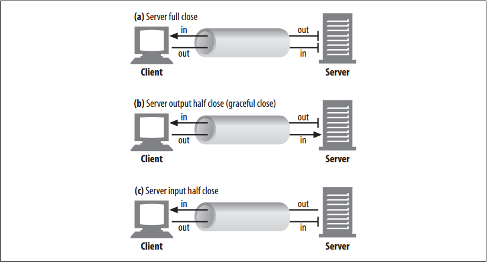

# Connection Close

<!-- TOC -->

- [Connection Close](#connection-close)
    - [设计思想](#设计思想)
    - [抽象本质](#抽象本质)
    - [“At Will” Disconnection](#at-will-disconnection)
    - [Content-Length and Truncation](#content-length-and-truncation)
    - [Connection Close Tolerance, Retries, and Idempotency](#connection-close-tolerance-retries-and-idempotency)
        - [Idempotency](#idempotency)
    - [Graceful Connection Close](#graceful-connection-close)
        - [Full and half closes](#full-and-half-closes)
        - [TCP close and reset errors](#tcp-close-and-reset-errors)
            - [Close the output channel](#close-the-output-channel)
            - [Close the input channel](#close-the-input-channel)
        - [Graceful close](#graceful-close)
    - [References](#references)

<!-- /TOC -->

## 设计思想

## 抽象本质

## “At Will” Disconnection
1. Any HTTP client, server, or proxy can close a TCP transport connection at any time.
2. The connections normally are closed at the end of a message, but during error conditions, the connection may be closed in the middle of a header line or in other strange places. (Servers shouldn’t close a connection in the middle of a response unless client or network failure is suspected.)
3. This situation is common with pipelined persistent connections. HTTP applications are free to close persistent connections after any period of time. 
4. For example, after a persistent connection has been idle for a while, a server may decide to shut it down.
5. However, the server can never know for sure that the client on the other end of the line wasn’t about to send data at the same time that the “idle” connection was being shut down by the server. 
6. If this happens, the client sees a connection error in the middle of writing its request message.

## Content-Length and Truncation
1. Each HTTP response should have an accurate `Content-Length` header to describe the size of the response body. Some older HTTP servers omit the `Content-Length` header or include an erroneous length, depending on a server connection close to signify the actual end of data.
2. When a client or proxy receives an HTTP response terminating in connection close, and the actual transferred entity length doesn’t match the `Content-Length` (or there is no `Content-Length`), the receiver should question the correctness of the length.
3. If the receiver is a caching proxy, the receiver should not cache the response (to minimize future compounding of a potential error). The proxy should forward the questionable message intact, without attempting to “correct” the `Content-Length`, to maintain semantic transparency.

## Connection Close Tolerance, Retries, and Idempotency
1. Connections can close at any time, even in non-error conditions. HTTP applications have to be ready to properly handle unexpected closes. 
2. If a transport connection closes while the client is performing a transaction, the client should reopen the connection and retry one time, unless the transaction has side effects. 
3. The situation is worse for pipelined connections. The client can enqueue a large number of requests, but the origin server can close the connection, leaving numerous requests unprocessed and in need of rescheduling.

### Idempotency
1. Side effects are important. When a connection closes after some request data was sent but before the response is returned, the client cannot be 100% sure how much of the transaction actually was invoked by the server. 
2. Some transactions, such as GETting a static HTML page, can be repeated again and again without changing anything. Other transactions, such as POSTing an order to an online book store, shouldn’t be repeated, or you may risk multiple orders.
3. A transaction is idempotent if it yields the same result regardless of whether it is executed once or many times. 
4. Implementors can assume the `GET`, `HEAD`, `PUT`, `DELETE`, `TRACE`, and `OPTIONS` methods share this property. Administrators who use `GET`-based dynamic forms should make sure the forms are idempotent. 
5. Clients shouldn’t pipeline nonidempotent requests (such as `POST`s). Otherwise, a premature termination of the transport connection could lead to indeterminate results. 
6. If you want to send a nonidempotent request, you should wait for the response status for the previous request.
7. Nonidempotent methods or sequences must not be retried automatically, although user agents may offer a human operator the choice of retrying the request. 
8. For example, most browsers will offer a dialog box when reloading a cached `POST` response, asking if you want to post the transaction again.

## Graceful Connection Close 
1. TCP connections are bidirectional, as shown in figure below.
    
2. Each side of a TCP connection has an input queue and an output queue, for data being read or written. Data placed in the output of one side will eventually show up on the input of the other side.

### Full and half closes
1. An application can close either or both of the TCP input and output channels
    
2. A `close()` sockets call closes both the input and output channels of a TCP connection. This is called a “full close”. 
3. You can use the `shutdown()` sockets call to close either the input or output channel individually. This
is called a “half close”.

### TCP close and reset errors 
1. Simple HTTP applications can use only full closes. But when applications start talking to many other types of HTTP clients, servers, and proxies, and when they start using pipelined persistent connections, it becomes important for them to use half closes to prevent peers from getting unexpected write errors. 

#### Close the output channel
1. In general, closing the output channel of your connection is always safe. 
2. The peer on the other side of the connection will be notified that you closed the connection by getting an end-of-stream notification once all the data has been read from its buffer.

#### Close the input channel
1. Closing the input channel of your connection is riskier, unless you know the other side doesn’t plan to send any more data. 
2. If the other side sends data to your closed input channel, the operating system will issue a TCP “connection reset by peer” message back to the other side’s machine, as shown in figure below
    
3. Most operating systems treat this as a serious error and erase any buffered data the other side has not read yet. This is very bad for pipelined connections. 
4. Say you have sent 10 pipelined requests on a persistent connection, and the responses already have arrived and are sitting in your operating system’s buffer (but the application hasn’t read them yet). 
5. Now say you send request #11, but the server decides you’ve used this connection long enough, and closes it. 
6. Your request #11 will arrive at a closed connection and will reflect a reset back to you. This reset will erase your input buffers.
7. When you finally get to reading data, you will get a connection reset by peer error, and the buffered, unread response data will be lost, even though much of it successfully arrived at your machine. 不懂，服务器输入通道关闭了客户端为什么要删除自己本地已缓冲的数据？
    
### Graceful close
1. The HTTP specification counsels that when clients or servers want to close a connection unexpectedly, they should “issue a graceful close on the transport connection,” but it doesn’t describe how to do that.
2. In general, applications implementing graceful closes will first close their output channels and then wait for the peer on the other side of the connection to close its output channels. When both sides are done telling each other they won’t be sending any more data (i.e., closing output channels), the connection can be closed fully, with no risk of reset.
3. Unfortunately, there is no guarantee that the peer implements or checks for half closes. 
4. For this reason, applications wanting to close gracefully should half close their output channels and periodically check the status of their input channels (looking for data or for the end of the stream). 
5. If the input channel isn’t closed by the peer within some timeout period, the application may force connection close to save resources.

        
        
## References
* [*HTTP: the definitive guide*](https://book.douban.com/subject/1440226/)