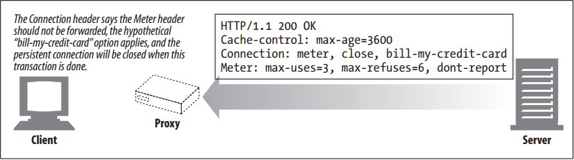
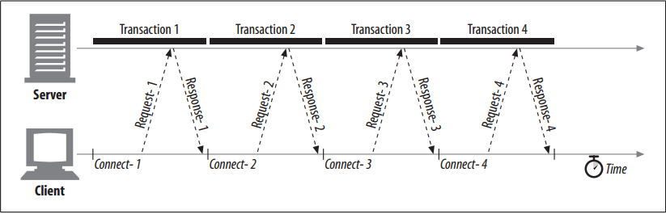

# HTTP Connection Handling

<!-- TOC -->

- [HTTP Connection Handling](#http-connection-handling)
    - [设计思想](#设计思想)
    - [抽象本质](#抽象本质)
    - [The Oft-Misunderstood Connection Header](#the-oft-misunderstood-connection-header)
    - [Serial Transaction Delays](#serial-transaction-delays)
        - [实际的延迟](#实际的延迟)
        - [心理感觉上的延迟](#心理感觉上的延迟)
        - [浏览器渲染等待的延迟](#浏览器渲染等待的延迟)
        - [解决方案](#解决方案)
    - [References](#references)

<!-- /TOC -->

## 设计思想

## 抽象本质

## The Oft-Misunderstood Connection Header
1. HTTP allows a chain of HTTP intermediaries between the client and the ultimate origin server (proxies, caches, etc.). 
2. HTTP messages are forwarded hop by hop from the client, through intermediary devices, to the origin server (or the reverse).
3. In some cases, two adjacent HTTP applications may want to apply a set of options to their shared connection. The HTTP `Connection` header field has a comma-separated list of connection tokens that specify options for the connection that aren’t propagated to other connections. For example, a connection that must be closed after sending the next message can be indicated by `Connection: close`.
4. The `Connection` header sometimes is confusing, because it can carry three different types of tokens:
    * HTTP header field names, listing headers relevant for only this connection
    * Arbitrary token values, describing nonstandard options for this connection
    * The value `close`, indicating the persistent connection will be closed when done
5. If a connection token contains the name of an HTTP header field, that header field contains connection-specific information and must not be forwarded. Any header fields listed in the `Connection` header must be deleted before the message is forwarded. 
6. Placing a hop-by-hop header name in a `Connection` header is known as “protecting the header,” because the `Connection` header protects against accidental forwarding of the local header. The `Connection` header allows the sender to specify connection-specific options
    
7. When an HTTP application receives a message with a `Connection` header, the receiver parses and applies all options requested by the sender. It then deletes the `Connection` header and all headers listed in the `Connection` header before forwarding the message to the next hop. 
8. In addition, there are a few hop-by-hop headers that might not be listed as values of a `Connection` header, but must not be proxied. These include `Proxy-Authenticate`, `Proxy-Connection`, `Transfer-Encoding`, and `Upgrade`.

## Serial Transaction Delays
### 实际的延迟
1. TCP performance delays can add up if the connections are managed naively. 
2. For example, suppose you have a web page with three embedded images. Your browser needs to issue four HTTP transactions to display this page: one for the top-level HTML and three for the embedded images. 
3. If each transaction requires a new connection, the connection and slow-start delays can add up 
    

### 心理感觉上的延迟
1. In addition to the real delay imposed by serial loading, there is also a psychological perception of slowness when a single image is loading and nothing is happening on the rest of the page. 
2. Users prefer multiple images to load at the same time.  This is true even if loading multiple images at the same time is slower than loading images one at a time! Users often perceive multiple-image loading as faster.

### 浏览器渲染等待的延迟
1. Another disadvantage of serial loading is that some browsers are unable to display anything onscreen until enough objects are loaded, because they don’t know the sizes of the objects until they are loaded, and they may need the size information to decide where to position the objects on the screen. 
2. In this situation, the browser may be making good progress loading objects serially, but the user may be faced with a
blank white screen, unaware that any progress is being made at all.
3. HTML designers can help eliminate this “layout delay” by explicitly adding width and height attributes to HTML tags for embedded objects such as images. Explicitly providing the width and height of the embedded image allows the browser to make graphical layout decisions before it receives the objects from the server.

### 解决方案
Several current and emerging techniques are available to improve HTTP connection performance. The next several sections discuss four such techniques:
    * Parallel connections: Concurrent HTTP requests across multiple TCP connections
    * Persistent connections: Reusing TCP connections to eliminate connect/close delays
    * Pipelined connections: Concurrent HTTP requests across a shared TCP connection
    * Multiplexed connections: Interleaving chunks of requests and responses (experimental)

        
## References
* [*HTTP: the definitive guide*](https://book.douban.com/subject/1440226/)