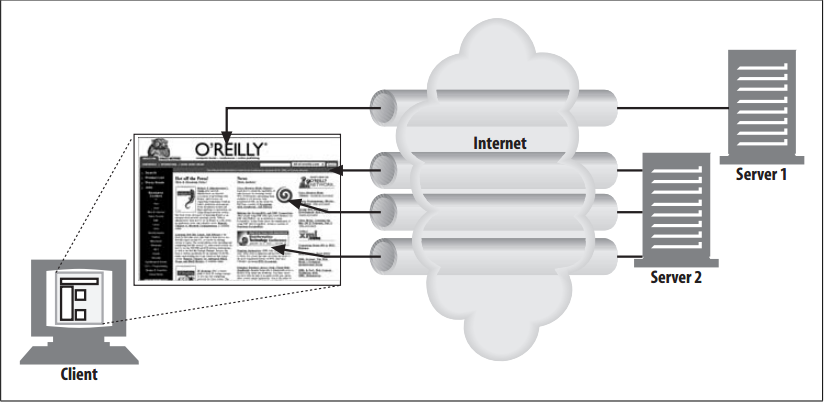
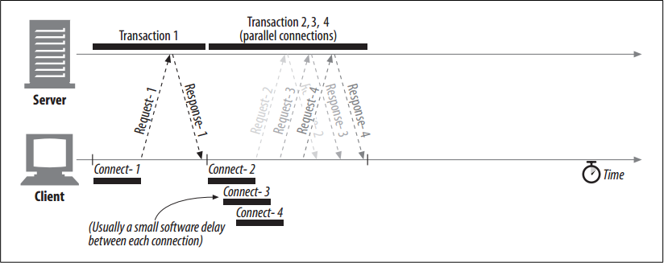

# Parallel Connections

<!-- TOC -->

- [Parallel Connections](#parallel-connections)
    - [设计思想](#设计思想)
    - [抽象本质](#抽象本质)
    - [Summary](#summary)
    - [Parallel Connections May Make Pages Load Faster](#parallel-connections-may-make-pages-load-faster)
    - [Parallel Connections Are Not Always Faster](#parallel-connections-are-not-always-faster)
    - [Parallel Connections May “Feel” Faster](#parallel-connections-may-feel-faster)
    - [References](#references)

<!-- /TOC -->

## 设计思想

## 抽象本质

## Summary
1. As we mentioned previously, a browser could naively process each embedded object serially by completely requesting the original HTML page, then the first embedded object, then the second embedded object, etc. But this is too slow!
2.  HTTP allows clients to open multiple connections and perform multiple HTTP transactions in parallel, as sketched in figure below
    
3. In this example, four embedded images are loaded in parallel, with each transaction getting its own TCP connection.
4. The embedded components do not all need to be hosted on the same web server, so the parallel connections can be established to multiple servers.

## Parallel Connections May Make Pages Load Faster
1. Composite pages consisting of embedded objects may load faster if they take advantage of the dead time and bandwidth limits of a single connection. 
2. The delays can be overlapped, and if a single connection does not saturate the client’s Internet bandwidth, the unused bandwidth can be allocated to loading additional objects.
3. Figure below shows a timeline for parallel connections. The enclosing HTML page is loaded first, and then the remaining three transactions are processed concurrently, each with their own connection
    
4. Because the images are loaded in parallel, the connection delays are overlapped.
5. There will generally still be a small delay between each connection request due to software overheads, but
the connection requests and transfer times are mostly overlapped.

## Parallel Connections Are Not Always Faster
1. Even though parallel connections may be faster, however, they are not always faster.
2. When the client’s network bandwidth is scarce, most of the time might be spent just transferring data. In this situation, a single HTTP transaction to a fast server could easily consume all of the available modem bandwidth.
3. If multiple objects are loaded in parallel, each object will just compete for this limited bandwidth, so each object
will load proportionally slower, yielding little or no performance advantage.
4. Also, a large number of open connections can consume a lot of memory and cause performance problems of their own. 
5. Complex web pages may have tens or hundreds of embedded objects. Clients might be able to open hundreds of connections, but few web servers will want to do that, because they often are processing requests for many other users at the same time. 
6. A hundred simultaneous users, each opening 100 connections, will put the burden of 10,000 connections on the server. This can cause significant server slowdown. The same situation is true for high-load proxies.
7. In practice, browsers do use parallel connections, but they limit the total number of parallel connections to a small number. Servers are free to close excessive connections from a particular client.

## Parallel Connections May “Feel” Faster
1. Okay, so parallel connections don’t always make pages load faster. But even if they don’t actually speed up the page transfer, as we said earlier, parallel connections often make users feel that the page loads faster, because they can see progress being made as multiple component objects appear onscreen in parallel.
2. This effect is amplified by the increasing use of progressive images that produce low-resolution approximations of images first and gradually increase the resolution.
3. Human beings perceive that web pages load faster if there’s lots of action all over the screen, even if a stopwatch actually shows the aggregate page download time to be slower!

        
## References
* [*HTTP: the definitive guide*](https://book.douban.com/subject/1440226/)