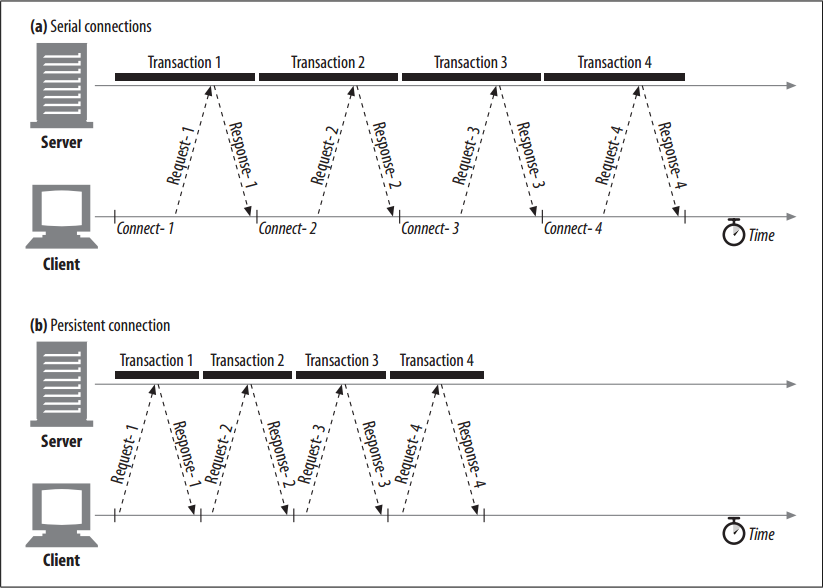
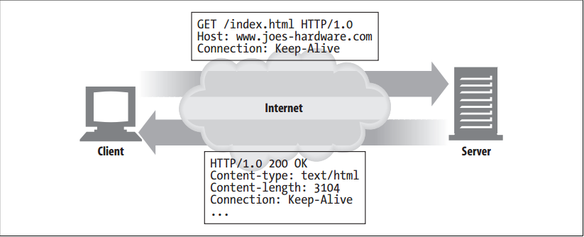

# Persistent Connections


<!-- TOC -->

- [Persistent Connections](#persistent-connections)
    - [设计思想](#%E8%AE%BE%E8%AE%A1%E6%80%9D%E6%83%B3)
    - [抽象本质](#%E6%8A%BD%E8%B1%A1%E6%9C%AC%E8%B4%A8)
    - [Summary](#summary)
    - [Persistent Versus Parallel Connections](#persistent-versus-parallel-connections)
    - [HTTP/1.0+ Keep-Alive Connections](#http10-keep-alive-connections)
    - [Keep-Alive Operation](#keep-alive-operation)
    - [Keep-Alive Options](#keep-alive-options)
    - [Keep-Alive Connection Restrictions and Rules](#keep-alive-connection-restrictions-and-rules)
    - [Keep-Alive and Dumb Proxies](#keep-alive-and-dumb-proxies)
    - [The Proxy-Connection Hack](#the-proxy-connection-hack)
    - [HTTP/1.1 Persistent Connections](#http11-persistent-connections)
    - [Persistent Connection Restrictions and Rules](#persistent-connection-restrictions-and-rules)
    - [References](#references)

<!-- /TOC -->


## 设计思想


## 抽象本质


## Summary
1. Web clients often open connections to the same site. For example, most of the embedded images in a web page often come from the same web site, and a significant number of hyperlinks to other objects often point to the same site. 
2. Thus, an application that initiates an HTTP request to a server likely will make more requests to that server in the near future (to fetch the inline images, for example). This property is called **site locality**.
3. For this reason, HTTP/1.1 (and enhanced versions of HTTP/1.0) allows HTTP devices to keep TCP connections open after transactions complete and to reuse the preexisting connections for future HTTP requests. 
4. TCP connections that are kept open after transactions complete are called **persistent connections**. 
5. Nonpersistent connections are closed after each transaction. Persistent connections stay open across transactions, until either the client or the server decides to close them.
6. By reusing an idle, persistent connection that is already open to the target server, you can avoid the slow connection setup. 
7. In addition, the already open connection can avoid the slow-start congestion adaptation phase, allowing faster data transfers.


## Persistent Versus Parallel Connections
1. As we’ve seen, parallel connections can speed up the transfer of composite pages. But parallel connections have some disadvantages:
    * Each transaction opens/closes a new connection, costing time and bandwidth.
    * Each new connection has reduced performance because of TCP slow start.
    * There is a practical limit on the number of open parallel connections.
2. Persistent connections offer some advantages over parallel connections. They reduce the delay and overhead of connection establishment, keep the connections in a tuned state, and reduce the potential number of open connections. 
3. However, persistent connections need to be managed with care, or you may end up accumulating a large number of idle connections, consuming local resources and resources on remote clients and servers.
4. Persistent connections can be most effective when used in conjunction with parallel connections. Today, many web applications open a small number of parallel connections, each persistent. 
5. There are two types of persistent connections: the older HTTP/1.0+ “keep-alive” connections and the modern HTTP/1.1 “persistent” connections. 


## HTTP/1.0+ Keep-Alive Connections
1. Many HTTP/1.0 browsers and servers were extended (starting around 1996) to support an early, experimental type of persistent connections called **keep-alive connections**. 
2. These early persistent connections suffered from some interoperability design problems that were rectified in later revisions of HTTP/1.1, but many clients and servers still use these earlier keep-alive connections.
3. Some of the performance advantages of keep-alive connections are visible in figure below, which compares the timeline for four HTTP transactions over serial connections against the same transactions over a single persistent connection
    
4. The timeline is compressed because the connect and close overheads are removed. Additionally, the request and response time might also be reduced because of elimination of the slow-start phase. This performance benefit is not depicted in the figure.


## Keep-Alive Operation
1. Keep-alive is deprecated and no longer documented in the current HTTP/1.1 specification. 
2. However, keep-alive handshaking is still in relatively common use by browsers and servers, so HTTP implementors should be prepared to interoperate with it. 看到现在 HTTP/1.1 的请求还是会带上 `Connection: keep-alive` 来兼容 HTTP/1.0。
3. We’ll take a quick look at keep-alive operation now.
4. Clients implementing HTTP/1.0 keep-alive connections can request that a connection be kept open by including the `Connection: Keep-Alive` request header.
5. If the server is willing to keep the connection open for the next request, it will respond with the same header in the response. If there is no `Connection: keep-alive` header in the response, the client assumes that the server does
not support keep-alive and that the server will close the connection when the response message is sent back.
    

        
## Keep-Alive Options
1. Note that the keep-alive headers are just requests to keep the connection alive. Clients and servers do not need to agree to a keep-alive session if it is requested. They can close idle keep-alive connections at any time and are free to limit the number of transactions processed on a keep-alive connection.
2. The keep-alive behavior can be tuned by comma-separated options specified in the Keep-Alive general header:
    * The `timeout` parameter is sent in a `Keep-Alive` response header. It estimates how long the server is likely to keep the connection alive for. This is not a guarantee.
    * The `max` parameter is sent in a `Keep-Alive` response header. It estimates how many more HTTP transactions the server is likely to keep the connection alive for. This is not a guarantee.
    * The `Keep-Alive` header also supports arbitrary unprocessed attributes, primarily for diagnostic and debugging purposes. The syntax is `name [= value]`.
3. The `Keep-Alive` header is completely optional but is permitted only when `Connection: Keep-Alive` also is present. 
4. Here’s an example of a `Keep-Alive` response header indicating that the server intends to keep the connection open for at most five more transactions, or until it has sat idle for two minutes:
    ```
    Connection: Keep-Alive
    Keep-Alive: max=5, timeout=120
    ```


## Keep-Alive Connection Restrictions and Rules
Here are some restrictions and clarifications regarding the use of keep-alive connections:
* Keep-alive does not happen by default in HTTP/1.0. The client must send a `Connection: Keep-Alive` request header to activate keep-alive connections.
* The `Connection: Keep-Alive` header must be sent with all messages that want to continue the persistence. If the client does not send a `Connection: Keep-Alive` header, the server will close the connection after that request.
* Clients can tell if the server will close the connection after the response by detecting the absence of the `Connection: Keep-Alive` response header.
* The connection can be kept open only if the length of the message’s entity body can be determined without sensing a connection close—this means that the entity body must have a correct `Content-Length`, have a multipart media type, or be encoded with the chunked transfer encoding. Sending the wrong `Content-Length` back on a keep-alive channel is bad, because the other end of the transaction will not be able to accurately detect the end of one message and the start of another.
* Proxies and gateways must enforce the rules of the `Connection` header; the proxy or gateway must remove any header fields named in the `Connection` header, and the `Connection` header itself, before forwarding or caching the message.
* Formally, keep-alive connections should not be established with a proxy server that isn’t guaranteed to support the `Connection` header, to prevent the problem with dumb proxies described below. This is not always possible in practice.
* Technically, any `Connection` header fields (including `Connection: Keep-Alive`) received from an HTTP/1.0 device should be ignored, because they may have been forwarded mistakenly by an older proxy server. In practice, some clients and servers bend this rule, although they run the risk of hanging on older proxies.
* Clients must be prepared to retry requests if the connection closes before they receive the entire response, unless the request could have side effects if repeated.


## Keep-Alive and Dumb Proxies


## The Proxy-Connection Hack


## HTTP/1.1 Persistent Connections
1. HTTP/1.1 phased out support for keep-alive connections, replacing them with an improved design called **persistent connections**. 
2. The goals of persistent connections are the same as those of keep-alive connections, but the mechanisms behave better.
3. Unlike HTTP/1.0+ keep-alive connections, HTTP/1.1 persistent connections are active by default. HTTP/1.1 assumes all connections are persistent unless otherwise indicated. 
4. HTTP/1.1 applications have to explicitly add a `Connection: close` header to a message to indicate that a connection should close after the transaction is complete. This is a significant difference from previous versions of the HTTP protocol, where keep-alive connections were either optional or completely unsupported.
5. However, clients and servers still can close idle connections at any time. Not sending `Connection: close` does not mean that the server promises to keep the connection open forever.


## Persistent Connection Restrictions and Rules
Here are the restrictions and clarifications regarding the use of persistent connections:
* After sending a `Connection: close` request header, the client can’t send more requests on that connection.
* If a client does not want to send another request on the connection, it should send a `Connection: close` request header in the final request.
* The connection can be kept persistent only if all messages on the connection have a correct, self-defined message length—i.e., the entity bodies must have correct `Content-Length`s or be encoded with the chunked transfer encoding.
* HTTP/1.1 proxies must manage persistent connections separately with clients and servers—each persistent connection applies to a single transport hop.
* HTTP/1.1 proxy servers should not establish persistent connections with an HTTP/1.0 client (because of the problems of older proxies forwarding `Connection` headers) unless they know something about the capabilities of the client. This is, in practice, difficult, and many vendors bend this rule.
* Regardless of the values of `Connection` headers, HTTP/1.1 devices may close the connection at any time, though servers should try not to close in the middle of transmitting a message and should always respond to at least one request before closing.
* HTTP/1.1 applications must be able to recover from asynchronous closes. Clients should retry the requests as long as they don’t have side effects that could accumulate. 不懂
* Clients must be prepared to retry requests if the connection closes before they receive the entire response, unless the request could have side effects if repeated.
* A single user client should maintain at most two persistent connections to any server or proxy, to prevent the server from being overloaded. Because proxies may need more connections to a server to support concurrent users, a proxy should maintain at most 2N connections to any server or parent proxy, if there are N users trying to access the servers.


## References
* [*HTTP: the definitive guide*](https://book.douban.com/subject/1440226/)