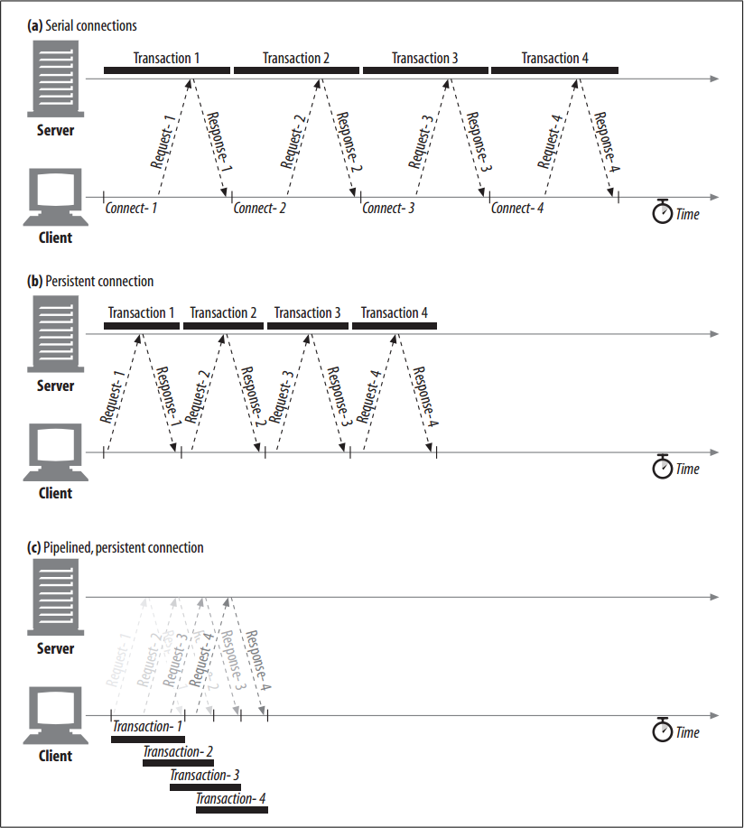

# Pipelined Connections

<!-- TOC -->

- [Pipelined Connections](#pipelined-connections)
    - [设计思想](#设计思想)
    - [抽象本质](#抽象本质)
    - [Summary](#summary)
    - [restrictions](#restrictions)
    - [References](#references)

<!-- /TOC -->

## 设计思想

## 抽象本质

## Summary
1. HTTP/1.1 permits optional **request pipelining** over persistent connections. This is a further performance optimization over keep-alive connections.
2. Multiple requests can be enqueued before the responses arrive. While the first request is streaming across the network to a server on the other side of the globe, the second and third requests can get underway. 
3. This can improve performance in high-latency network conditions, by reducing network round trips.
4. Figure blow shows how persistent connections can eliminate TCP connection delays and how pipelined requests can eliminate transfer latencies
    

## restrictions
* HTTP clients should not pipeline until they are sure the connection is persistent.
* HTTP responses must be returned in the same order as the requests. HTTP messages are not tagged with sequence numbers, so there is no way to match responses with requests if the responses are received out of order.
* HTTP clients must be prepared for the connection to close at any time and be prepared to redo any pipelined requests that did not finish. If the client opens a persistent connection and immediately issues 10 requests, the server is free to close the connection after processing only, say, 5 requests. The remaining 5 requests will fail, and the client must be willing to handle these premature closes and reissue the requests.
* HTTP clients should not pipeline requests that have side effects (such as `POST`s). In general, on error, pipelining prevents clients from knowing which of a series of pipelined requests were executed by the server. Because non-idempotent requests such as `POST`s cannot safely be retried, you run the risk of some methods never being executed in error conditions.
        
        
## References
* [*HTTP: the definitive guide*](https://book.douban.com/subject/1440226/)