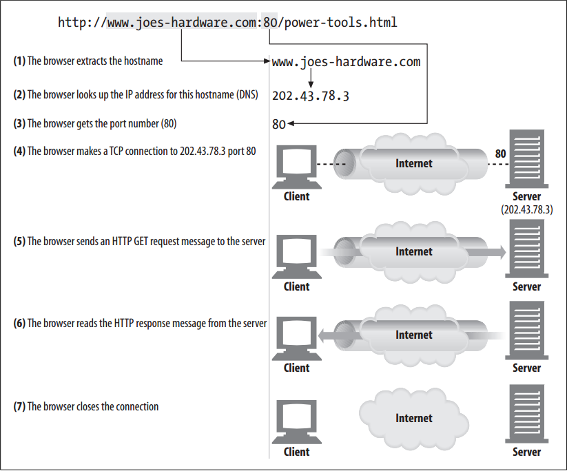
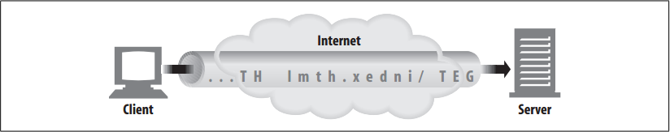
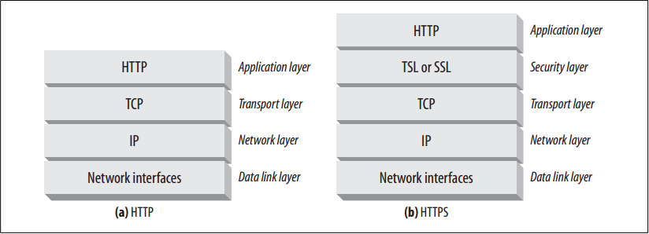
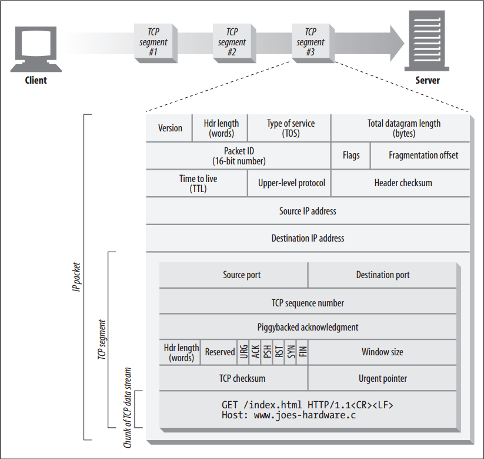
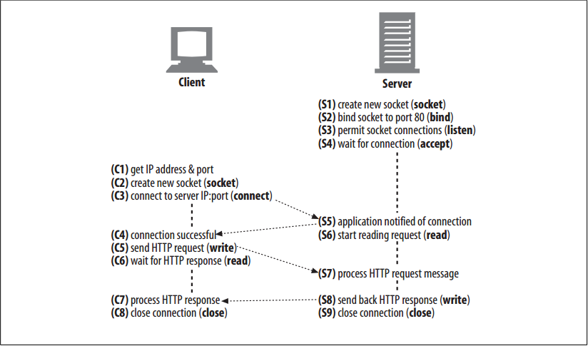

# The Flow of Messages


<!-- TOC -->

- [The Flow of Messages](#the-flow-of-messages)
    - [设计思想](#%E8%AE%BE%E8%AE%A1%E6%80%9D%E6%83%B3)
    - [抽象本质](#%E6%8A%BD%E8%B1%A1%E6%9C%AC%E8%B4%A8)
    - [Summary](#summary)
    - [TCP Reliable Data Pipes](#tcp-reliable-data-pipes)
    - [TCP Streams Are Segmented and Shipped by IP Packets](#tcp-streams-are-segmented-and-shipped-by-ip-packets)
    - [Keeping TCP Connections Straight](#keeping-tcp-connections-straight)
    - [Programming with TCP Sockets](#programming-with-tcp-sockets)
        - [API](#api)
        - [一次使用流程举例](#%E4%B8%80%E6%AC%A1%E4%BD%BF%E7%94%A8%E6%B5%81%E7%A8%8B%E4%B8%BE%E4%BE%8B)
    - [References](#references)

<!-- /TOC -->


## 设计思想


## 抽象本质


## Summary
1. Just about all of the world’s HTTP communication is carried over TCP/IP, a popular layered set of packet-switched network protocols spoken by computers and network devices around the globe. 
2. A client application can open a TCP/IP connection to a server application, running just about anywhere in the world. 
3. Once the connection is established, messages exchanged between the client’s and server’s computers will never be lost, damaged, or received out of order. 
4. Say you want the latest power tools price list from Joe’s Hardware store: 
    ```
    http://www.joes-hardware.com:80/power-tools.html
    ```
5. When given this URL, your browser performs the steps shown below
    
6. In Steps 1–3, the IP address and port number of the server are pulled from the URL. 
7. A TCP connection is made to the web server in Step 4, and a request message is sent across the connection in Step 5. 
8. The response is read in Step 6, and the connection is closed in Step 7.


## TCP Reliable Data Pipes
1. HTTP connections really are nothing more than TCP connections, plus a few rules about how to use them. 
2. TCP connections are the reliable connections of the Internet. To send data accurately and quickly, you need to know the basics of TCP.
3. TCP gives HTTP a reliable bit pipe. Bytes stuffed in one side of a TCP connection come out the other side correctly, and in the right order
    


## TCP Streams Are Segmented and Shipped by IP Packets
1. TCP sends its data in little chunks called **IP packets** (or **IP datagrams**). 
2. In this way, HTTP is the top layer in a “protocol stack” of “HTTP over TCP over IP”.
3. A secure variant, HTTPS, inserts a cryptographic encryption layer (called TLS or SSL) between HTTP and TCP
    
4. When HTTP wants to transmit a message, it streams the contents of the message data, in order, through an open TCP connection. 
5. TCP takes the stream of data, chops up the data stream into chunks called segments, and transports the segments across the Internet inside envelopes called IP packets
    
6. This is all handled by the TCP/IP software; the HTTP programmer sees none of it. 
7. Each TCP segment is carried by an IP packet from one IP address to another IP address. Each of these IP packets contains: 
    * An IP packet header (usually 20 bytes) 
    * A TCP segment header (usually 20 bytes) 
    * A chunk of TCP data (0 or more bytes) 
8. The IP header contains the source and destination IP addresses, the size, and other flags. The TCP segment header contains TCP port numbers, TCP control flags, and numeric values used for data ordering and integrity checking.


## Keeping TCP Connections Straight
1. A computer might have several TCP connections open at any one time. TCP keeps all these connections straight through port numbers.
2. Port numbers are like employees’ phone extensions. Just as a company’s main phone number gets you to the front desk and the extension gets you to the right employee, the IP address gets you to the right computer and the port number gets you to the right application. 
3. A TCP connection is distinguished by four values:
    ```
    <source-IP-address, source-port, destination-IP-address, destination-port>
    ```
4. Together, these four values uniquely define a connection. Two different TCP connections are not allowed to have the same values for all four address components (but different connections can have the same values for some of the components).


## Programming with TCP Sockets
### API
1. Operating systems provide different facilities for manipulating their TCP connections. Let’s take a quick look at one TCP programming interface, to make things concrete. 
2. Table below shows some of the primary interfaces provided by the sockets API. This sockets API hides all the details of TCP and IP from the HTTP programmer. 

    Sockets API call | Description
    --|--
    `s = socket(<parameters>)` | Creates a new, unnamed, unattached socket.
    `bind(s, <local IP:port>)` | Assigns a local port number and interface to the socket.
    `connect(s, <remote IP:port>)` | Establishes a TCP connection to a local socket and a remote host and port.
    `listen(s,...)` | Marks a local socket as legal to accept connections.
    `s2 = accept(s)` | Waits for someone to establish a connection to a local port.
    `n = read(s,buffer,n)` | Tries to read n bytes from the socket into the buffer.
    `n = write(s,buffer,n)` | Tries to write n bytes from the buffer into the socket.
    `close(s)` | Completely closes the TCP connection.
    `shutdown(s,<side>)` | Closes just the input or the output of the TCP connection.
    `getsockopt(s, . . . )` | Reads the value of an internal socket configuration option.
    `setsockopt(s, . . . )` | Changes the value of an internal socket configuration option.

3. The sockets API was first developed for the Unix operating system, but variants are now available for almost every operating system and language.
4. The sockets API lets you create TCP endpoint data structures, connect these endpoints to remote server TCP endpoints, and read and write data streams. 
5. The TCP API hides all the details of the underlying network protocol handshaking and the segmentation and reassembly of the TCP data stream to and from IP packets.

### 一次使用流程举例
1. The pseudocode in figure below sketches how we might use the sockets API to highlight the steps the client and server could perform to implement this HTTP transaction.
    
2. We begin with the web server waiting for a connection (S4). 
3. The client determines the IP address and port number from the URL and proceeds to establish a TCP connection to the server (C3). 
4. Establishing a connection can take a while, depending on how far away the server is, the load on the server, and the congestion of the Internet.
5. Once the connection is set up, the client sends the HTTP request (C5) and the server reads it (S6). 
6. Once the server gets the entire request message, it processes the request, performs the requested action (S7), and
writes the data back to the client. 
7. The client reads it (C6) and processes the response data (C7).
        
        
## References
* [*HTTP: the definitive guide*](https://book.douban.com/subject/1440226/)