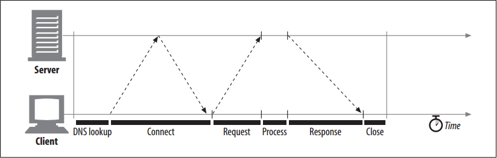

# TCP Performance Considerations

<!-- TOC -->

- [TCP Performance Considerations](#tcp-performance-considerations)
    - [设计思想](#%E8%AE%BE%E8%AE%A1%E6%80%9D%E6%83%B3)
    - [抽象本质](#%E6%8A%BD%E8%B1%A1%E6%9C%AC%E8%B4%A8)
    - [Summary](#summary)
    - [HTTP Transaction Delays](#http-transaction-delays)
        - [Several possible causes of delay in an HTTP transaction:](#several-possible-causes-of-delay-in-an-http-transaction)
            - [域名解析](#%E5%9F%9F%E5%90%8D%E8%A7%A3%E6%9E%90)
            - [建立 TCP 链接](#%E5%BB%BA%E7%AB%8B-tcp-%E9%93%BE%E6%8E%A5)
            - [发送和处理请求](#%E5%8F%91%E9%80%81%E5%92%8C%E5%A4%84%E7%90%86%E8%AF%B7%E6%B1%82)
            - [响应请求](#%E5%93%8D%E5%BA%94%E8%AF%B7%E6%B1%82)
    - [Performance Focus Areas](#performance-focus-areas)
    - [References](#references)

<!-- /TOC -->

## 设计思想

## 抽象本质

## Summary
1. Because HTTP is layered directly on TCP, the performance of HTTP transactions depends critically on the performance of the underlying TCP plumbing. 
2. This section highlights some significant performance considerations of these TCP connections. By understanding some of the basic performance characteristics of TCP, you’ll better appreciate HTTP’s connection optimization features, and you’ll be able to design and implement higher-performance HTTP applications.
3. This section requires some understanding of the internal details of the TCP protocol. If you are not interested in (or are comfortable with) the details of TCP performance considerations, feel free to skip ahead to “HTTP Connection Handling.” Because TCP is a complex topic, we can provide only a brief overview of TCP performance here.

## HTTP Transaction Delays
1. Let’s start our TCP performance tour by reviewing what networking delays occur in the course of an HTTP request. Figure below depicts the major connect, transfer, and processing delays for an HTTP transaction. Timeline of a serial HTTP transaction
    
2. Notice that the transaction processing time can be quite small compared to the time required to set up TCP connections and transfer the request and response messages.
3. Unless the client or server is overloaded or executing complex dynamic resources, most HTTP delays are caused by TCP network delays.
4. The magnitude of these TCP network delays depends on hardware speed, the load of the network and server, the size of the request and response messages, and the distance between client and server. The delays also are significantly affected by technical intricacies of the TCP protocol.

### Several possible causes of delay in an HTTP transaction:
#### 1. 域名解析
1. A client first needs to determine the IP address and port number of the web server from the URI. 
2. If the hostname in the URI was not recently visited, it may take tens of seconds to convert the hostname from a URI into an IP address using the DNS resolution infrastructure.
3. Luckily, most HTTP clients keep a small DNS cache of IP addresses for recently accessed sites. When the IP address is already “cached” (recorded) locally, the lookup is instantaneous. Because most web browsing is to a small number of popular sites, hostnames usually are resolved very quickly.

#### 2. 建立 TCP 链接
1. Next, the client sends a TCP connection request to the server and waits for the server to send back a connection acceptance reply. Connection setup delay occurs for every new TCP connection.
2. This usually takes at most a second or two, but it can add up quickly when hundreds of HTTP transactions are made.

#### 3. 发送和处理请求
1. Once the connection is established, the client sends the HTTP request over the newly established TCP pipe. 
2. The web server reads the request message from the TCP connection as the data arrives and processes the request. 
3. It takes time for the request message to travel over the Internet and get processed by the server.

#### 4. 响应请求
The web server then writes back the HTTP response, which also takes time.

## Performance Focus Areas
1. The remainder of this section outlines some of the most common TCP-related delays affecting HTTP programmers, including the causes and performance impacts of:
    * The TCP connection setup handshake
    * TCP slow-start congestion control
    * Nagle’s algorithm for data aggregation
    * TCP’s delayed acknowledgment algorithm for piggybacked acknowledgments
    * TIME_WAIT delays and port exhaustion
2. If you are writing high-performance HTTP software, you should understand each of these factors. If you don’t need this level of performance optimization, feel free to skip ahead.

TODO Performance Focus Areas 里面的内容
        

        
## References
* [*HTTP: the definitive guide*](https://book.douban.com/subject/1440226/)