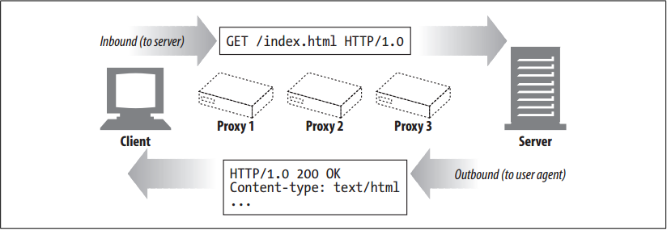
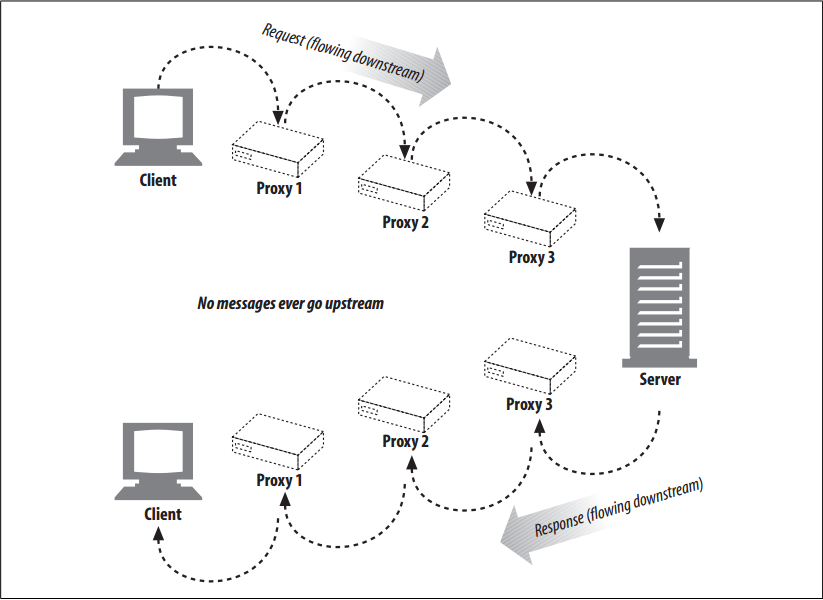

# The Flow of Messages

<!-- TOC -->

- [The Flow of Messages](#the-flow-of-messages)
    - [设计思想](#设计思想)
    - [抽象本质](#抽象本质)
    - [Summary](#summary)
    - [Messages Commute Inbound to the Origin Server](#messages-commute-inbound-to-the-origin-server)
    - [Messages Flow Downstream](#messages-flow-downstream)
    - [References](#references)

<!-- /TOC -->

## 设计思想

## 抽象本质

## Summary
1. HTTP messages are the blocks of data sent between HTTP applications. 
2. These blocks of data begin with some text meta-information describing the message contents and meaning, followed by optional data. 
3. These messages flow between clients, servers, and proxies. 
4. The terms “inbound,” “outbound,” “upstream,” and “downstream” describe message direction.

## Messages Commute Inbound to the Origin Server
1. HTTP uses the terms *inbound* and *outbound* to describe *transactional* direction. 
2. Messages travel inbound to the origin server, and when their work is done, they travel outbound back to the user agent.
    

## Messages Flow Downstream
1. HTTP messages flow like rivers. All messages flow `downstream`, regardless of whether they are request messages or response messages. 
2. The sender of any message is `upstream` of the receiver. In Figure below, proxy 1 is upstream of proxy 3 for
the request but downstream of proxy 3 for the response.
    

## References
* [*HTTP: the definitive guide*](https://book.douban.com/subject/1440226/)