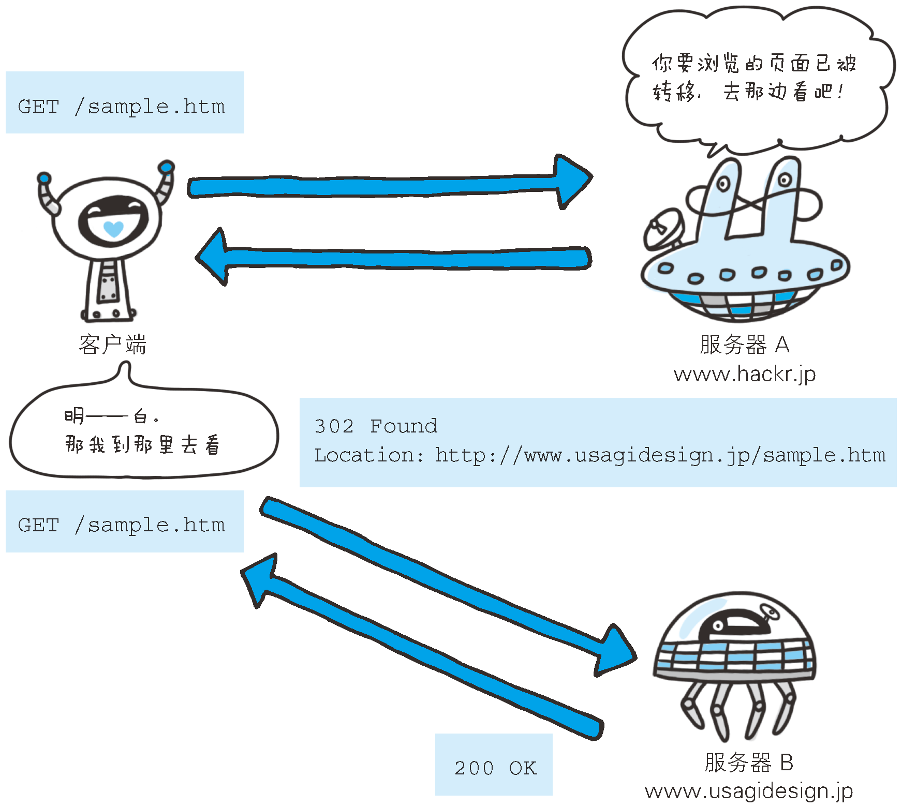

# Response headers

1. Response headers provide clients with extra information, such as who is sending the response, the capabilities of the responder, or even special instructions regarding the response. 
2. These headers help the client deal with the response and make better requests in the future.


<!-- TOC -->

- [Response headers](#response-headers)
    - [Negotiation headers](#negotiation-headers)
        - [Accept-Ranges](#accept-ranges)
        - [Vary](#vary)
    - [Response security headers](#response-security-headers)
        - [Proxy-Authenticate](#proxy-authenticate)
        - [Set-Cookie](#set-cookie)
        - [WWW-Authenticate](#www-authenticate)
    - [Age](#age)
    - [Location](#location)
    - [Retry-After](#retry-after)
    - [Server](#server)
    - [References](#references)

<!-- /TOC -->


## Negotiation headers
HTTP/1.1 provides servers and clients with the ability to negotiate for a resource if multiple representations are available—for instance, when there are both French and German translations of an HTML document on a server. 

### `Accept-Ranges`
1. 首部字段 `Accept-Ranges` 是用来告知客户端服务器是否能处理范围请求，以指定获取服务器端某个部分的资源。
2. 可指定的字段值有两种，可处理范围请求时指定其为范围值的单位值（目前只有 `bytes` 这一种值），反之则指定其为 `none`。

### `Vary`
1. A list of other headers that the server looks at and that may cause the response to vary; i.e., a list of
headers the server looks at to pick which is the best version of a resource to send the client.
2. 比如在跨域请求中，如果 `Access-Control-Allow-Origin` 返回的不是通配符而是某个具体的域的话，那还必须同时设置 `Vary` 头，值为 `Origin`。这告诉客户端：我并不是为所有的跨域请求都做出同样的响应，我可能会根据不同请求的 `Origin` 首部来做出不同的响应。


## Response security headers
### `Proxy-Authenticate`
1. Defines the authentication method that should be used to gain access to a resource behind a proxy server. 
2. It authenticates the request to the proxy server, allowing it to transmit the request further.
3. The `Proxy-Authenticate` header is sent along with a `407 Proxy Authentication Required`.
4. Examples
    ```
    Proxy-Authenticate: Basic

    Proxy-Authenticate: Basic realm="Access to the internal site"
    ```

### `Set-Cookie`
Not a true security header, but it has security implications; used to set a token on the client side that the server can use to identify the client.

### `WWW-Authenticate`
1. Defines the authentication method that should be used to gain access to a resource. 例如
    ```
    WWW-Authenticate: Basic realm="Access to the staging site", charset="UTF-8"
    ```
2. The `WWW-Authenticate` header is sent along with a `401 Unauthorized` response.


## `Age`
```
Age: 600
```
1. 告知客户端，源服务器在多久前创建了响应。字段值的单位为秒。
2. A cached response is "fresh" if its age does not exceed its freshness lifetime.


## `Location`
```
Location: http://www.usagidesign.jp/sample.html
```
1. 使用首部字段 `Location` 可以将响应接收方引导至某个与请求 URI 位置不同的资源。
2. 基本上，该字段会配合 `3xx ：Redirection` 的响应，提供重定向的 URI。
3. 几乎所有的浏览器在接收到包含首部字段 `Location` 的响应后，都会强制性地尝试对已提示的重定向资源的访问。
    ```js
    // 对 http://localhost:3000 的访问将跳转到 http://www.douban.com
    require('http').createServer((req, res)=>{
        if (req.url !== '/favicon.ico'){
            res.writeHead(302, {
                'Location': 'http://www.douban.com',
            });
        }
        res.end();
    }).listen(3000);
    ```




## `Retry-After`
```
Retry-After: 120
```
1. 告知客户端应该在多久之后再次发送请求。主要配合状态码 `503 Service Unavailable` 响应、`429 Too Many Requests` 或 `3xx Redirect` 响应一起使用
    ```js
    require('http').createServer((req, res)=>{
        if (req.url !== '/favicon.ico'){
            res.writeHead(503, 'Service Unavailable', {
                'Retry-After': 3600,
                'Content-Type': 'text/plain; charset=utf-8',
            });
        }
        res.end('服务器暂时无法访问，请一小时后再试');
    }).listen(3000);
    ```
2. 字段值可以指定为具体的日期时间（Wed, 04 Jul 2012 06：34：24 GMT 等格式），也可以是创建响应后的秒数。
3. 至少对于浏览器来说，并不会在指定的时间到达后重新访问。


## `Server`
```
Server: Apache/2.2.6 (Unix) PHP/5.2.5
```
1. 首部字段 `Server` 告知客户端当前服务器上安装的 HTTP 服务器应用程序的信息。
2. 不单单会标出服务器上的软件应用名称，还有可能包括版本号和安装时启用的可选项。


## References
* [HTTP: The Definitive Guide](https://book.douban.com/subject/1440226/)
* [MDN](https://developer.mozilla.org/en-US/docs/Web/HTTP/Headers)
