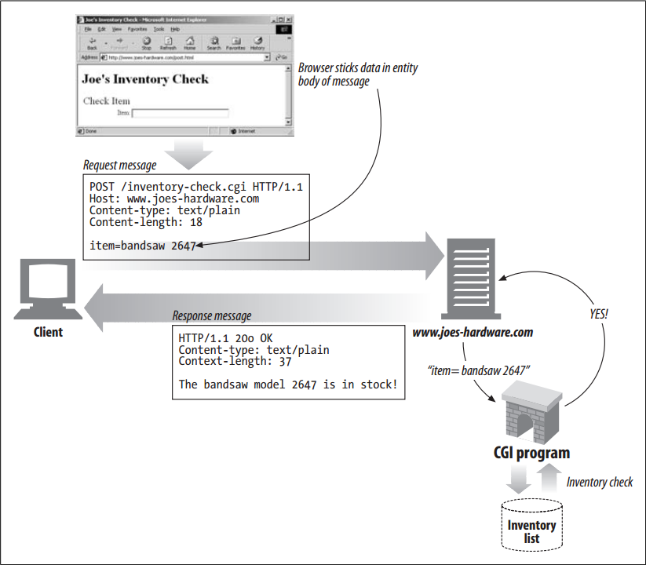
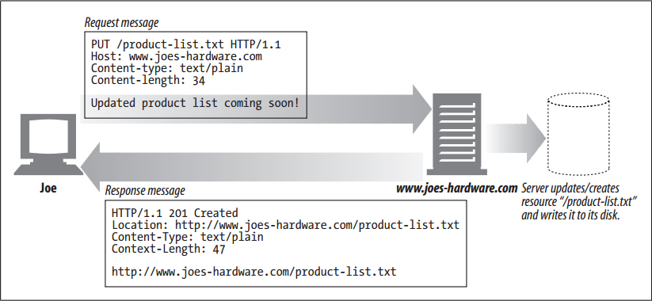
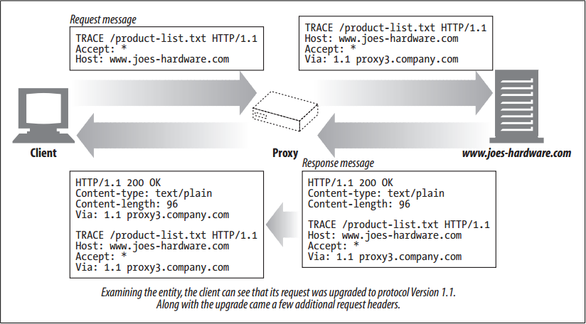
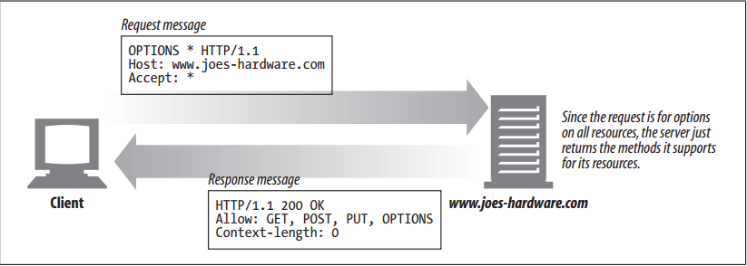

# Methods

<!-- TOC -->

- [Methods](#methods)
    - [设计思想](#%E8%AE%BE%E8%AE%A1%E6%80%9D%E6%83%B3)
    - [抽象本质](#%E6%8A%BD%E8%B1%A1%E6%9C%AC%E8%B4%A8)
    - [Safe Methods](#safe-methods)
    - [GET](#get)
    - [HEAD](#head)
    - [POST](#post)
    - [PUT](#put)
    - [GET 和 POST 的比较](#get-%E5%92%8C-post-%E7%9A%84%E6%AF%94%E8%BE%83)
    - [TRACE](#trace)
    - [OPTIONS](#options)
    - [DELETE](#delete)
    - [Extension Methods](#extension-methods)
    - [References](#references)

<!-- /TOC -->

## 设计思想

## 抽象本质

## Safe Methods
1. HTTP defines a set of methods that are called *safe* methods. The `GET` and `HEAD` methods are said to be safe, meaning that no action should occur as a result of an HTTP request that uses either the `GET` or `HEAD` method.
2. By no action, we mean that nothing will happen on the server as a result of the HTTP request. 
3. For example, consider when you are shopping online at Joe’s Hardware and you click on the “submit purchase” button. Clicking on the button submits a POST request with your credit card information, and an action is performed on the server on your behalf. In this case, the action is your credit card being charged for your purchase.
4. There is no guarantee that a safe method won’t cause an action to be performed (in practice, that is up to the web developers). 
5. Safe methods are meant to allow HTTP application developers to let users know when an unsafe method that may cause
some action to be performed is being used. 
6. In our Joe’s Hardware example, your web browser may pop up a warning message letting you know that you are making a
request with an unsafe method and that, as a result, something might happen on the server (e.g., your credit card being charged).

## GET
`GET` is the most common method. It usually is used to ask a server to send a resource. HTTP/1.1 requires servers to implement this method.

## HEAD
1. The `HEAD` method behaves exactly like the `GET` method, but the server returns only the headers in the response. No entity body is ever returned. 
2. This allows a client to inspect the headers for a resource without having to actually get the resource. 
3. Using `HEAD`, you can:
    * Find out about a resource (e.g., determine its type) without getting it.
    * See if an object exists, by looking at the status code of the response.
    * Test if the resource has been modified, by looking at the headers.
4. Server developers must ensure that the headers returned are exactly those that a GET request would return.

## POST
1. The `POST` method was designed to send input data to the server. In practice, it is often used to support HTML forms. 
2. The data from a filled-in form typically is sent to the server, which then marshals it off to where it needs to go (e.g., to a server gateway program, which then processes it).
    
3. `POST` is used to send data to a server. `PUT` is used to deposit data into a resource on the server (e.g., a file)

## PUT
1. The `PUT` method writes documents to a server, in the inverse of the way that `GET` reads documents from a server. 
2. Some publishing systems let you create web pages and install them directly on a web server using `PUT`.
3. The semantics of the `PUT` method are for the server to take the body of the request and either use it to create a new document named by the requested URL or, if that URL already exists, use the body to replace it
    
4. 可以看到与 `POST` 的明显不同时，`PUT` 提交的内容会被创建为一个独立的资源，之后的响应也会返回这个资源的 URL。而 `POST` 提交的数据可以只是用来验证身份或者在数据库里插入一条记录，并不是一个独立的资源。
5. Because `PUT` allows you to change content, many web servers require you to log in with a password before you can perform a `PUT`.

## GET 和 POST 的比较
<table>
    <theader>
        <tr>
            <th>Item</th>
            <th>GET</th>
            <th>POST</th>
        </tr>
    </theader>
    <tbody>
        <tr>
            <td>语义</td>
            <td>请求数据</td>
            <td>提交数据</td>
        </tr>
        <tr>
            <td>
                Side effect
            </td>
            <td>
                因为是请求数据，所以适用于请求不会改变服务器数据的情况
            </td>
            <td>
                因为是提交数据，所以一般都是涉及修改，适用于请求会改变服务器数据的情况
            </td>
        </tr>
        <tr>
            <td>
                Cached
            </td>
            <td>
                因为没有副作用，同样的请求每次返回的结果都一样。所以响应的结果可以被缓存
            </td>
            <td>
                因为会改变服务器数据，所以每次请求结果可能不同。例如一个存款请求，每次返回的账户余额都不同。所以响应的结果不应该被缓存。
            </td>
        </tr>
        <tr>
            <td>
                速度
            </td>
            <td>
                从性能角度来看，以发送相同的数据计，<code>GET</code> 请求的速度最多可达到 <code>POST</code> 请求的两倍。
            </td>
            <td>
                与 <code>GET</code> 请求相比，<code>POST</code> 请求消耗的资源会更多一些。
            </td>
        </tr>
        <tr>
            <td>
                History
            </td>
            <td>
                Parameters remain in browser history because they are part of the URL
            </td>
            <td>
                Parameters are not saved in browser history.
            </td>
        </tr>
        <tr>
            <td>
                Bookmarked
            </td>
            <td>
                Can be bookmarked
            </td>
            <td>
                Can not be bookmarked
            </td>
        </tr>
        <tr>
            <td>
                BACK button/re-submit behaviour
            </td>
            <td>
                <code>GET</code> requests are re-executed but may not be re-submitted to server if the HTML is stored in the browser cache
            </td>
            <td>
                The browser usually alerts the user that data will need to be re-submitted
            </td>
        </tr>
        <tr>
            <td>
                Encoding type (enctype attribute) 不懂
            </td>
            <td>
                <code>application/x-www-form-urlencoded</code>
            </td>
            <td>
                <code>multipart/form-data</code> or <code>application/x-www-form-urlencoded</code>, use multipart encoding for binary data
            </td>
        </tr>
        <tr>
            <td>
                Parameters
            </td>
            <td>
                Can send but the parameter data is limited to what we can stuff into the request line (URL). Safest to use less than 2K of parameters, some servers handle up to 64K
            </td>
            <td>
                Can send parameters, including uploading files, to the server.
            </td>
        </tr>
        <tr>
            <td>
                Security
            </td>
            <td>
                <code>GET</code> is less secure compared to <code>POST</code> because data sent is part of the URL. So it's saved in browser history and server logs in plaintext.
            </td>
            <td>
                <code>POST</code> is a little（应该是可以被忽略的程度） safer than <code>GET</code> because the parameters are not stored in browser history or in web server logs.
            </td>
        </tr>
        <tr>
            <td>
                Restrictions on form data type
            </td>
            <td>
                Yes, only ASCII characters allowed.
            </td>
            <td>
                No restrictions. Binary data is also allowed.
            </td>
        </tr>
        <tr>
            <td>
                Restrictions on form data length
            </td>
            <td>
                Yes, since form data is in the URL and URL length is restricted. A safe URL length limit is often 2048 characters but varies by browser and web server.
            </td>
            <td>
                No restrictions
            </td>
        </tr>
        <tr>
            <td>
                Visibility
            </td>
            <td>
                <code>GET</code> method is visible to everyone (it will be displayed in the browser's address bar) and has limits on the amount of information to send.
            </td>
            <td>
                <code>POST</code> method variables are not displayed in the URL.
            </td>
        </tr>
    </tbody>
</table>

## TRACE
1. When a client makes a request, that request may have to travel through firewalls, proxies, gateways, or other applications. Each of these has the opportunity to modify the original HTTP request. 
2. The `TRACE` method allows clients to see how its request looks when it finally makes it to the server.
3. A `TRACE` request initiates a “loopback” diagnostic at the destination server. The server at the final leg of the trip bounces back a `TRACE` response, with the virgin request message it received in the body of its response. 
4. A client can then see how, or if, its original message was munged or modified along the request/response chain of
any intervening HTTP applications
    
5. The `TRACE` method is used primarily for diagnostics; i.e., verifying that requests are going through the request/response chain as intended. It’s also a good tool for seeing the effects of proxies and other applications on your requests.
6. As good as `TRACE` is for diagnostics, it does have the drawback of assuming that intervening applications will treat different types of requests (different methods—`GET`, `HEAD`, `POST`, etc.) the same. 
7. Many HTTP applications do different things depending on the method—for example, a proxy might pass a `POST` request directly to the server but attempt to send a `GET` request to another HTTP application (such as a web cache). 
8. `TRACE` does not provide a mechanism to distinguish methods. Generally, intervening applications make the call as to how they process a `TRACE` request.
9. No entity body can be sent with a `TRACE` request. The entity body of the `TRACE` response contains, verbatim, the request that the responding server received.

## OPTIONS
1. The `OPTIONS` method asks the server to tell us about the various supported capabilities of the web server. 
2. You can ask a server about what methods it supports in general or for particular resources. (Some servers may support particular operations only on particular kinds of objects).
    
3. This provides a means for client applications to determine how best to access various resources without actually having to access them.

## DELETE
1. The `DELETE` method does just what you would think—it asks the server to delete the resources specified by the request URL. 
2. However, the client application is not guaranteed that the delete is carried out. This is because the HTTP specification allows the server to override the request without telling the client.

## Extension Methods
1. HTTP was designed to be field-extensible, so new features wouldn’t cause older software to fail. 
2. Extension methods are methods that are not defined in the HTTP/1.1 specification. They provide developers with a means of extending the capabilities of the HTTP services their servers implement on the resources that the servers manage.
3. It’s important to note that not all extension methods are defined in a formal specification. If you define an extension method, it’s likely not to be understood by most HTTP applications. Likewise, it’s possible that your HTTP applications could run into extension methods being used by other applications that it does not understand.
4. In these cases, it is best to be tolerant of extension methods. Proxies should try to relay messages with unknown methods through to downstream servers if they are capable of doing that without breaking end-to-end behavior. Otherwise, they should respond with a 501 Not Implemented status code.
5.  Dealing with extension methods (and HTTP extensions in general) is best done with the old rule, “be conservative in
what you send, be liberal in what you accept.”

    
## References
* [*HTTP: the definitive guide*](https://book.douban.com/subject/1440226/)