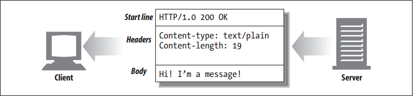
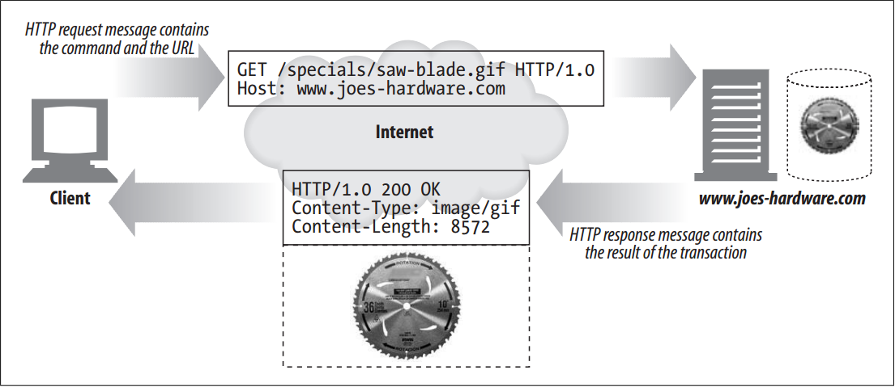

# The Parts of a Message


<!-- TOC -->

- [The Parts of a Message](#the-parts-of-a-message)
    - [设计思想](#设计思想)
    - [抽象本质](#抽象本质)
    - [Summary](#summary)
    - [Message Syntax](#message-syntax)
        - [格式](#格式)
        - [Quick description of the various parts](#quick-description-of-the-various-parts)
            - [method](#method)
            - [request-URL](#request-url)
            - [version](#version)
            - [status-code](#status-code)
            - [reason-phrase](#reason-phrase)
            - [headers](#headers)
            - [entity-body](#entity-body)
    - [Start Lines](#start-lines)
        - [Request line](#request-line)
        - [Response line](#response-line)
        - [Methods](#methods)
        - [Status codes](#status-codes)
        - [Reason phrases](#reason-phrases)
        - [Version numbers](#version-numbers)
    - [Headers](#headers)
        - [Header classifications](#header-classifications)
        - [Header continuation lines](#header-continuation-lines)
    - [Entity Bodies](#entity-bodies)
    - [References](#references)

<!-- /TOC -->


## 设计思想


## 抽象本质


## Summary
1. HTTP messages are simple, formatted blocks of data. Each message contains either a request from a client or a response from a server. They consist of three parts: a start line describing the message, a block of headers containing attributes, and an optional body containing data.
2. The start line and headers are just ASCII text, broken up by lines. Each line ends with a two-character end-of-line sequence, consisting of a carriage return (ASCII 13) and a line-feed character (ASCII 10). This end-of-line sequence is written “CRLF.” 
3. It is worth pointing out that while the HTTP specification for terminating lines is CRLF, robust applications also should accept just a line-feed character. Some older or broken HTTP applications do not always send both the carriage return and line feed.
4. The entity body or message body (or just plain “body”) is simply an optional chunk of data. Unlike the start line and headers, the body can contain text or binary data or can be empty.
    


## Message Syntax
### 格式
1. Both request and response messages have the same basic message structure. Figure below shows request and response messages to get a GIF image
    
2. Here’s the format for a request message:
    ```
    <method> <request-URL> <version>
    <headers>
    <entity-body>
    ```
3. Here’s the format for a response message (note that the syntax differs only in the start line):
    ```
    <version> <status> <reason-phrase>
    <headers>
    <entity-body>
    ```

### Quick description of the various parts
#### method
1. The action that the client wants the server to perform on the resource. 
2. It is a single word, like “GET,” “HEAD,” or “POST”. 

#### request-URL
1. A complete URL naming the requested resource, or the path component of the URL. 
2. If you are talking directly to the server, the path component of the URL is usually okay as long as it is the absolute path to the resource—the server can assume itself as the host/port of the URL.

#### version
1. The version of HTTP that the message is using. 
2. Its format looks like: 
    ```
    HTTP/<major>.<minor>
    ```
3. major and minor both are integers. 

#### status-code
1. A three-digit number describing what happened during the request. 
2. The first digit of each code describes the general class of status (“success,” “error,” etc.).

#### reason-phrase
1. A human-readable version of the numeric status code, consisting of all the text until the end-of-line sequence. 
2. The reason phrase is meant solely for human consumption, so, for example, response lines containing `HTTP/1.0 200 NOT OK` and `HTTP/1.0 200 OK` should be treated as equivalent success indications, despite the reason phrases suggesting
otherwise.

#### headers
1. Zero or more headers, each of which is a name, followed by a colon (`:`), followed by optional whitespace, followed by a value, followed by a CRLF. 
2. The headers are terminated by a blank line (CRLF), marking the end of the list of headers and the beginning of the entity body. 
3. Some versions of HTTP, such as HTTP/1.1, require certain headers to be present for the request or response message to be valid.
4. Note that a set of HTTP headers should always end in a blank line (bare CRLF), even if there are no headers and even if there is no entity body. Historically, however, many clients and servers (mistakenly) omitted the final CRLF if there was no entity body. To interoperate with these popular but noncompliant implementations, clients and servers should accept messages that end without the final CRLF.

#### entity-body
1. The entity body contains a block of arbitrary data. 
2. Not all messages contain entity bodies, so sometimes a message terminates with a bare CRLF. 


## Start Lines
All HTTP messages begin with a start line. The start line for a request message says what to do. The start line for a response message says what happened.

### Request line
1. Request messages ask servers to do something to a resource. The start line for a request message, or *request line*, contains a method describing what operation the server should perform and a request URL describing the resource on which to perform the method. 
2. The request line also includes an HTTP *version* which tells the server what dialect of HTTP the client is speaking. 
3. All of these fields are separated by whitespace.

### Response line
1. Response messages carry status information and any resulting data from an operation back to a client. 
2. The start line for a response message, or *response line*, contains the HTTP version that the response message is using, a numeric status code, and a textual reason phrase describing the status of the operation.

### Methods
1. The method begins the start line of requests, telling the server what to do. For example, in the line `GET /specials/saw-blade.gif HTTP/1.0`, the method is `GET`.
2. The HTTP specifications have defined a set of common request methods. For example, the `GET` method gets a document from a server, the `POST` method sends data to a server for processing, and the `OPTIONS` method determines the general capabilities of a web server or the capabilities of a web server for a specific resource.
4. Because HTTP was designed to be easily extensible, other servers may implement their own request methods. These additional methods are called *extension methods*, because they extend the HTTP specification.

### Status codes
1. As methods tell the server what to do, status codes tell the client what happened.
2. Status codes live in the start lines of responses. For example, in the line `HTTP/1.0 200 OK`, the status code is 200.
3. When clients send request messages to an HTTP server, many things can happen. If you are fortunate, the request will complete successfully. You might not always be so lucky. The server may tell you that the resource you requested could not be found, that you don’t have permission to access the resource, or perhaps that the resource has moved someplace else.
4. Status codes are returned in the start line of each response message. Both a numeric and a human-readable status are returned. 
5. The numeric code makes error processing easy for programs, while the reason phrase is easily understood by humans.
6. The different status codes are grouped into classes by their three-digit numeric codes.
7. Status codes between 200 and 299 represent success. Codes between 300 and 399 indicate that the resource has been moved. Codes between 400 and 499 mean that the client did something wrong in the request. Codes between 500 and 599 mean
something went awry on the server.
8. Current versions of HTTP define only a few codes for each status category. As the protocol evolves, more status codes will be defined officially in the HTTP specification. If you receive a status code that you don’t recognize, chances are someone has defined it as an extension to the current protocol. You should treat it as a general member of the class whose range it falls into.
9. For example, if you receive status code 515 (which is outside of the defined range for 5XX codes), you should treat the response as indicating a server error, which is the general class of 5XX messages.

### Reason phrases
1. The reason phrase is the last component of the start line of the response. It provides a textual explanation of the status code. For example, in the line `HTTP/1.0 200 OK`, the reason phrase is `OK`.
2. Reason phrases are paired one-to-one with status codes. The reason phrase provides a human-readable version of the status code that application developers can pass along to their users to indicate what happened during the request.
3. The HTTP specification does not provide any hard and fast rules for what reason phrases should look like.

### Version numbers
1. Version numbers appear in both request and response message start lines in the format `HTTP/x.y`. They provide a means for HTTP applications to tell each other what version of the protocol they conform to.
2. Version numbers are intended to provide applications speaking HTTP with a clue about each other’s capabilities and the format of the message. 
3. An HTTP Version 1.2 application communicating with an HTTP Version 1.1 application should know that it should not use any new 1.2 features, as they likely are not implemented by the application speaking the older version of the protocol.
4. The version number indicates the highest version of HTTP that an application supports. In some cases this leads to confusion between applications, because `HTTP/1.0` applications interpret a response with `HTTP/1.1` in it to indicate that the response is a 1.1 response, when in fact that’s just the level of protocol used by the responding application. 是说虽然标注 `HTTP/1.1` 的意思是可以支持 `HTTP/1.1` 但不一定这次试用的就是 `HTTP/1.1`？
5. Note that version numbers are not treated as fractional numbers. Each number in the version (for example, the “1” and “0” in `HTTP/1.0`) is treated as a separate number. So, when comparing HTTP versions, each number must be compared separately in order to determine which is the higher version. For example, `HTTP/2.22` is a higher version than `HTTP/2.3`, because 22 is a larger number than 3.


## Headers
1. The previous section focused on the first line of request and response messages (methods, status codes, reason phrases, and version numbers). Following the start line comes a list of zero, one, or many HTTP header fields.
2. HTTP header fields add additional information to request and response messages. They are basically just lists of name/value pairs. For example, the following header line assigns the value 19 to the `Content-Length` header field:
    ```
    Content-length: 19
    ```

### Header classifications
1. The HTTP specification defines several header fields. Applications also are free to invent their own home-brewed headers. 
2. HTTP headers are classified into:
    * General headers: Can appear in both request and response messages
    * Request headers: Provide more information about the request
    * Response headers: Provide more information about the response
    * Entity headers: Describe body size and contents, or the resource itself
    * Extension headers: New headers that are not defined in the specification
3. Each HTTP header has a simple syntax: a name, followed by a colon (`:`), followed by optional whitespace, followed by the field value, followed by a CRLF. 

### Header continuation lines
Long header lines can be made more readable by breaking them into multiple lines, preceding each extra line with at least one space or tab character. For example:
```
HTTP/1.0 200 OK
Content-Type: image/gif
Content-Length: 8572
Server: Test Server
    Version 1.0
```


## Entity Bodies
1. The third part of an HTTP message is the optional entity body. Entity bodies are the payload of HTTP messages. They are the things that HTTP was designed to transport.
2. HTTP messages can carry many kinds of digital data: images, video, HTML documents, software applications, credit card transactions, electronic mail, and so on.

    
## References
* [*HTTP: the definitive guide*](https://book.douban.com/subject/1440226/)