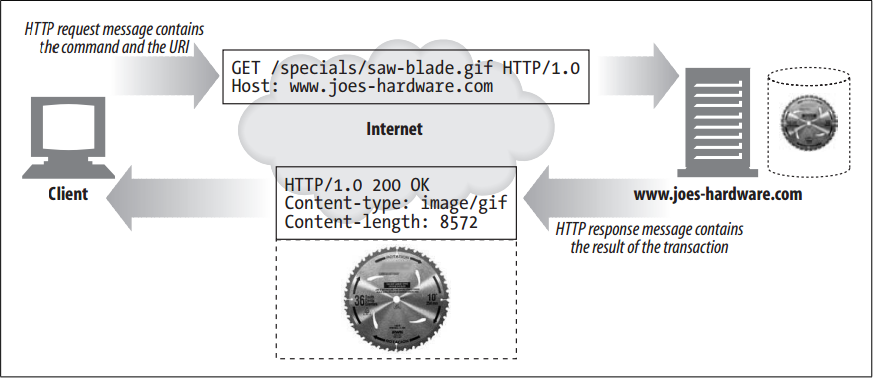
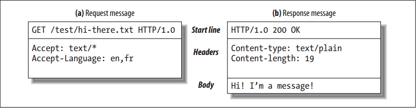
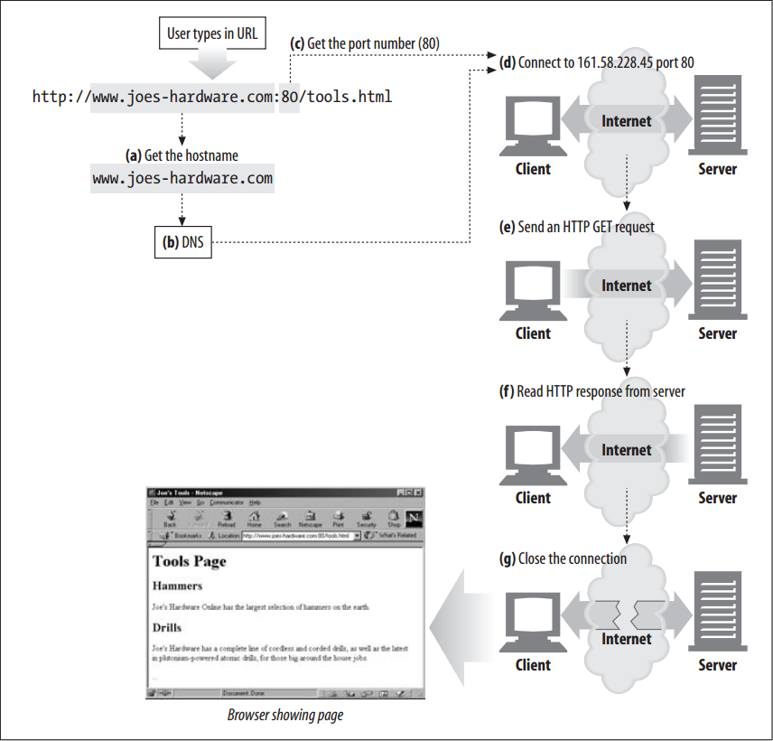
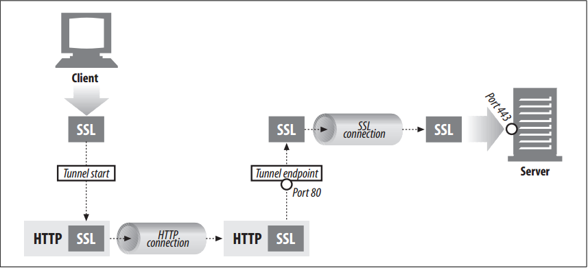

# Overview


<!-- TOC -->

- [Overview](#overview)
    - [设计思想](#设计思想)
    - [抽象本质](#抽象本质)
    - [Resources](#resources)
        - [Media Types](#media-types)
        - [URIs](#uris)
            - [URLs](#urls)
            - [URNs](#urns)
    - [Transactions（事务）](#transactions事务)
        - [Messages（报文）](#messages报文)
        - [Methods](#methods)
        - [Status Codes](#status-codes)
    - [Messages（报文）](#messages报文-1)
        - [报文结构](#报文结构)
        - [Simple Message Example](#simple-message-example)
    - [Connections](#connections)
    - [Architectural Components of the Web](#architectural-components-of-the-web)
        - [Proxies](#proxies)
        - [Caches](#caches)
        - [Gateways](#gateways)
        - [Tunnels](#tunnels)
        - [Agents](#agents)
    - [References](#references)

<!-- /TOC -->


## 设计思想


## 抽象本质


## Resources
### Media Types
1. Web servers attach a MIME type to all HTTP object data. When a web browser gets an object back from a server, it looks at the associated MIME type to see if it knows how to handle the object. 
2. A MIME type is a textual label, represented as a primary object type and a specific subtype, separated by a slash. For example:
    * An HTML-formatted text document would be labeled with type `text/html`.
    * A plain ASCII text document would be labeled with type `text/plain`.
    * A JPEG version of an image would be `image/jpeg`.
    * A GIF-format image would be `image/gif`.
    * An Apple QuickTime movie would be `video/quicktime`.
    * A Microsoft PowerPoint presentation would be `application/vnd.ms-powerpoint`.

### URIs
1. Each web server resource has a name, so clients can point out what resources they are interested in. 
2. The server resource name is called a **uniform resource identifier**, or URI. 
3. URIs are like the postal addresses of the Internet, uniquely identifying and locating information resources around the world.
4. URIs come in two flavors, called URLs and URNs.

#### URLs
1. The **uniform resource locator** (URL) is the most common form of resource identifier.
2. URLs describe the specific location of a resource on a particular server. They tell you exactly how to fetch a resource from a precise, fixed location. 
3. Most URLs follow a standardized format of three main parts:
    * The first part of the URL is called the **scheme**, and it describes the protocol used to access the resource.
    * The second part gives the server Internet address (e.g., www.joes-hardware.com).
    * The rest names a resource on the web server (e.g., /specials/saw-blade.gif ).
4. Today, almost every URI is a URL.

#### URNs
1. The second flavor of URI is the **uniform resource name**, or URN. 
2. A URN serves as a unique name for a particular piece of content, independent of where the resource currently resides. 
3. These location-independent URNs allow resources to move from place to place. 
4. URNs also allow resources to be accessed by multiple network access protocols while maintaining the same name.
4. For example, the following URN might be used to name the Internet standards document “RFC 2141” regardless of where it resides (it may even be copied in several places):
    ```
    urn:ietf:rfc:2141
    ```
5. URNs are still experimental and not yet widely adopted. To work effectively, URNs need a supporting infrastructure to resolve resource locations; the lack of such an infrastructure has also slowed their adoption. But URNs do hold some exciting promise for the future. 


## Transactions（事务）
### Messages（报文）
1. An HTTP transaction consists of a request command (sent from client to server), and a response result (sent from the server back to the client). 
2. This communication happens with formatted blocks of data called **HTTP messages**, as illustrated below
    

### Methods
1. HTTP supports several different request commands, called **HTTP methods**. 
2. Every HTTP request message has a method. The method tells the server what action to perform (fetch a web page, run a gateway program, delete a file, etc.). 

### Status Codes
1. Every HTTP response message comes back with a status code. 
2. The status code is a three-digit numeric code that tells the client if the request succeeded, or if other actions are required. 
3. HTTP also sends an explanatory textual “reason phrase” with each numeric status code. 
4. The textual phrase is included only for descriptive purposes; the numeric code is used for all processing. The following status codes and reason phrases are treated identically by HTTP software:
    ```
    200 OK
    200 Document attached
    200 Success
    200 All’s cool, dude
    ```


## Messages（报文）
### 报文结构
1. HTTP messages are simple, line-oriented sequences of characters. Because they are plain text, not binary, they are easy for humans to read and write.
2. HTTP messages sent from web clients to web servers are called **request messages**. Messages from servers to clients are called **response messages**. There are no other kinds of HTTP messages. 
3. The formats of HTTP request and response messages are very similar
    
4. HTTP messages consist of three parts:
    * **Start line**: The first line of the message is the start line, indicating what to do for a request or what happened for a response.
    * **Header fields**: Zero or more header fields follow the start line. Each header field consists of a name and a value, separated by a colon (`:`) for easy parsing. The headers end with a blank line. Adding a header field is as easy as adding another line.
    * **Body**: After the blank line is an optional message body containing any kind of data. Request bodies carry data to the web server; response bodies carry data back to the client. Unlike the start lines and headers, which are textual and structured, the body can contain arbitrary binary data (e.g., images, videos, audio tracks, software applications). Of course, the body can also contain text.

### Simple Message Example
1. Figure below shows the HTTP messages that might be sent as part of a simple transaction. The browser requests the resource `http://www.joes-hardware.com/tools.html`
    
2. The browser sends an HTTP request message. The request has a GET method in the start line, and the local resource is `/tools.html`. The request indicates it is speaking Version 1.0 of the HTTP protocol. The request message has no body,
because no request data is needed to GET a simple document from a server.
3. The server sends back an HTTP response message. The response contains the HTTP version number (HTTP/1.0), a success status code (200), a descriptive reason phrase (OK), and a block of response header fields, all followed by the response body containing the requested document. The response body length is noted in the `Content-Length` header, and the document’s MIME type is noted in the `Content-Type` header.


## Connections
1. Before an HTTP client can send a message to a server, it needs to establish a TCP/IP connection between the client and server using Internet protocol (IP) addresses and port numbers.
2. Setting up a TCP connection is sort of like calling someone at a corporate office. First, you dial the company’s phone number. This gets you to the right organization. Then, you dial the specific extension of the person you’re trying to reach.
3. In TCP, you need the IP address of the server computer and the TCP port number associated with the specific software program running on the server.
4. This is all well and good, but how do you get the IP address and port number of the HTTP server in the first place? Why, the URL, of course! We mentioned before that URLs are the addresses for resources, so naturally enough they can provide us with the IP address for the machine that has the resource. 
5. Let’s take a look at a few URLs:
    * `http://207.200.83.29:80/index.html`
    * `http://www.netscape.com:80/index.html`
    * `http://www.netscape.com/index.html`
6. The first URL has the machine’s IP address, “207.200.83.29”, and port number, “80”. 
7. The second URL doesn’t have a numeric IP address; it has a textual domain name, or `hostname` (“www.netscape.com”). The hostname is just a human-friendly alias for an IP address. Hostnames can easily be converted into IP addresses through a facility called the Domain Name Service (DNS), so we’re all set here, too. 
8. The final URL has no port number. When the port number is missing from an HTTP URL, you can assume the default value of port 80.
9. With the IP address and port number, a client can easily communicate via TCP/IP. Figure below shows how a browser uses HTTP to display a simple HTML resource that resides on a distant server.
    
10. Here are the steps:
    1. (a) The browser extracts the server’s hostname from the URL.
    2. (b) The browser converts the server’s hostname into the server’s IP address.
    3. (c) The browser extracts the port number (if any) from the URL.
    4. (d) The browser establishes a TCP connection with the web server.
    5. (e) The browser sends an HTTP request message to the server.
    6. (f) The server sends an HTTP response back to the browser.
    7. (g) The connection is closed, and the browser displays the document


## Architectural Components of the Web
Besides web browsers and web servers, there are many other web applications that you interact with on the Internet. In this section, we’ll outline several other important applications, including:
* Proxies：HTTP intermediaries that sit between clients and servers
* Caches: HTTP storehouses that keep copies of popular web pages close to clients
* Gateways: Special web servers that connect to other applications
* Tunnels: Special proxies that blindly forward HTTP communications
* Agents: Semi-intelligent web clients that make automated HTTP requests

### Proxies
1. Let’s start by looking at HTTP proxy servers, important building blocks for web security, application integration, and performance optimization.
2. A proxy sits between a client and a server, receiving all of the client’s HTTP requests and relaying the requests to the server (perhaps after modifying the requests). 
3. These applications act as a proxy for the user, accessing the server on the user’s behalf.
4. Proxies are often used for security, acting as trusted intermediaries through which all web traffic flows. Proxies can also filter requests and responses; for example, to detect application viruses in corporate downloads or to filter adult content away from elementary-school students. 

### Caches
1. A web cache or caching proxy is a special type of HTTP proxy server that keeps copies of popular documents that pass through the proxy. 
2. The next client requesting the same document can be served from the cache’s personal copy.
3. A client may be able to download a document much more quickly from a nearby cache than from a distant web server. 
4. HTTP defines many facilities to make caching more effective and to regulate the freshness and privacy of cached content.

### Gateways
1. Gateways are special servers that act as intermediaries for other servers. They are often used to convert HTTP traffic to another protocol.
2. A gateway always receives requests as if it was the origin server for the resource. The client may not be aware it
is communicating with a gateway.
3. For example, an HTTP/FTP gateway receives requests for FTP URIs via HTTP requests but fetches the documents using the FTP protocol . The resulting document is packed into an HTTP message and sent to the client. 

### Tunnels
1. Tunnels are HTTP applications that, after setup, blindly relay raw data between two connections. 
2. HTTP tunnels are often used to transport non-HTTP data over one or more HTTP connections, without looking at the data.
3. One popular use of HTTP tunnels is to carry encrypted Secure Sockets Layer (SSL) traffic through an HTTP connection, allowing SSL traffic through corporate firewalls that permit only web traffic. 
3. As sketched in figure below, an HTTP/SSL tunnel receives an HTTP request to establish an outgoing connection to a destination address and port, then proceeds to tunnel the encrypted SSL traffic over the HTTP channel so that it can be blindly relayed to the destination server
    

### Agents
1. User agents (or just agents) are client programs that make HTTP requests on the user’s behalf. 
2. Any application that issues web requests is an HTTP agent. So far, we’ve talked about only one kind of HTTP agent: web browsers. But there are many other kinds of user agents.
3. For example, there are machine-automated user agents that autonomously wander the Web, issuing HTTP transactions and fetching content, without human supervision. 
4. These automated agents often have colorful names, such as “spiders” or “web robots”. Spiders wander the Web to build useful archives of web content, such as a search engine’s database or a product catalog for a comparison-shopping robot. 


## References
* [*HTTP: the definitive guide*](https://book.douban.com/subject/1440226/)