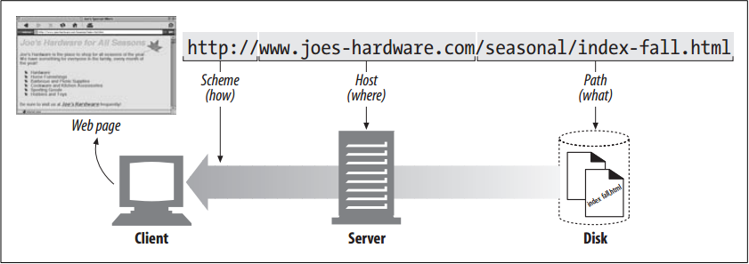

# Navigating the Internet’s Resources

<!-- TOC -->

- [Navigating the Internet’s Resources](#navigating-the-internets-resources)
    - [设计思想](#设计思想)
    - [抽象本质](#抽象本质)
    - [URI](#uri)
    - [URL 使用举例](#url-使用举例)
    - [References](#references)

<!-- /TOC -->

## 设计思想

## 抽象本质

## URI
1. URLs actually are a subset of a more general class of resource identifier called a uniform resource identifier, or URI. 
2. URIs are a general concept comprised of two main subsets, URLs and URNs. 
3. URLs identify resources by describing where resources are located, whereas URNs (which we’ll cover later in this chapter) identify resources by name, regardless of where they currently reside.
4. The HTTP specification uses the more general concept of URIs as its resource identifiers; in practice, however, HTTP applications deal only with the URL subset of URIs. 
5. Throughout this book, we’ll sometimes refer to URIs and URLs interchangeably, but we’re almost always talking about URLs.

## URL 使用举例
1. Say you want to fetch the URL `http://www.joes-hardware.com/seasonal/index-fall.html`:
    * The first part of the URL (*http*) is the *URL scheme*. The scheme tells a web client *how* to access the resource. In this case, the URL says to use the HTTP protocol.
    *  The second part of the URL (*`www.joes-hardware.com`*) is the server location. This tells the web client *where* the resource is hosted.
    *  The third part of the URL (*/seasonal/index-fall.html*) is the resource path. The path tells *what* particular local resource on the server is being requested.
2. How URLs relate to browser, machine, server, and location on the server’s filesystem
    
3. URLs can direct you to resources available through protocols other than HTTP. They can point you to any resource on the Internet, from a person’s email account: `mailto:president@whitehouse.gov` to files that are available through other protocols, such as the File Transfer Protocol (FTP): `ftp://ftp.lots-o-books.com/pub/complete-price-list.xls` to movies hosted off of streaming video servers: `rtsp://www.joes-hardware.com:554/interview/cto_video`.
4. URLs provide a way to uniformly name resources. Most URLs have the same `scheme://server location/path` structure. So, for every resource out there and every way to get those resources, you have a single way to name each resource so that anyone can use that name to find it.

## References
* [*HTTP: the definitive guide*](https://book.douban.com/subject/1440226/)