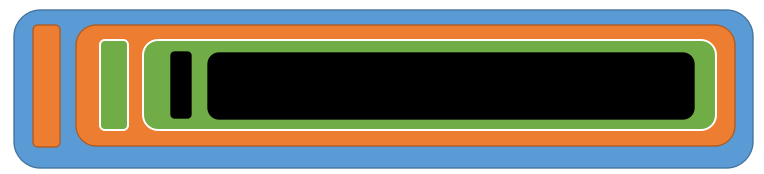

# Internet protocol suite

## Layers
#### 1. Physical Layer
使用物理方法传输二进制信号

#### 2. Link Layer
1. 将二进制信号分组为一个个包含Head和Data的数据包
    * Head包含对本frame的说明项。例如 发送者、接受者、数据类型等
    * Data是具体数据。
    * Head长度固定为18byte；Data最短为46byte，最长为1500byte。因此如果一次传输的数据过长，就要分为多个数据包进行发送。
2. 发送方通过Ethernet protocol 对本网络内所有计算机进行frame broadcasting。本网络内每台计算机都会收到广播，然后读取Head，查看其中的接收方MAC地址是否就是自己的MAC地址。如果是则接受该数据包，否则就丢弃。

#### 3. Network Layer
1. 同一个子网络中，通过broadcating的方式发送数据。如果接收方位于其他的子网络，则需要通过routing的方式发送到其他子网络。因为MAC地址中并没有路由信息，所有的MAC地址都是同一类的，并不能划分出分组来区分各个子网络，所以需要Newwork Layer来根据不同的子网络进行routing。
2. Network Layer 为了区分不同的子网络，在MAC地址上又规划出了带有分组信息的地址形式——网络地址
3. "网络层"出现以后，每台计算机有了两种地址，一种是MAC地址，另一种是网络地址。两种地址之间没有任何联系，MAC地址是绑定在网卡上的，网络地址则是管理员分配的，它们只是随机组合在一起。
4. 网络地址帮助我们确定计算机所在的子网络，MAC地址则将数据包送到该子网络中的目标网卡。因此，从逻辑上可以推断，必定是先处理网络地址，然后再处理MAC地址。  

**IP Protocol**
1. 规定网络地址的协议，叫做IP协议。它所定义的地址，就被称为IP地址。
2. 对于IPv4协议，网络地址由32个二进制位组成。互联网上的每一台计算机，都会分配到一个IP地址。这个地址分成两个部分，前一部分代表网络，后一部分代表主机。处于同一个子网络的电脑，它们IP地址的网络部分必定是相同的，但是单单从IP地址，我们无法判断网络部分，必须再根据subnet mask来进行判断。
3. 所谓subnet mask，就是表示子网络特征的一个参数。它在形式上等同于IP地址，也是一个32位二进制数字，它的网络部分全部为1，主机部分全部为0。知道subnet mask，我们就能判断，任意两个IP地址是否处在同一个子网络。  

**IP 数据包**
1. 根据IP协议发送的数据，就叫做IP数据包，其中包括IP地址信息。
2. IP数据包也包含Head和Data两部分，Head部分主要包含版本、长度、IP地址等信息，Data部分则是IP数据包的具体内容。
3. 在将IP数据包装入Ethernet数据包时，上述两部分都是装进Ethernet数据包的Data部分。
4. IP数据包的Head部分的长度为20到60 byte，整个数据包的总长度最大为65,535 byte。因为Ethernet数据包的Data部分最长只有1500 byte。所以如果IP数据包超过了1500字节，它就需要分割成几个Ethernet数据包，分开发送。

**ARP Protocol**
1. 地址解析协议，即ARP（Address Resolution Protocol），是根据IP地址获取物理地址的一个TCP/IP协议。
2. 因为IP数据包是放在以太网数据包里发送的，所以我们必须同时知道两个地址，一个是对方的MAC地址，另一个是对方的IP地址。通常情况下，对方的IP地址是已知的，但是我们不知道它的MAC地址。所以我们需要一种机制，能够从IP地址得到MAC地址。这分为两种情况：
    * 如果两台主机不在同一个子网络，那么事实上没有办法得到对方的MAC地址，只能把数据包传送到两个子网络连接处的gateway，让gateway去处理。
    * 如果两台主机在同一个子网络，那么我们可以用ARP协议，得到对方的MAC地址。其原理如下：
        1. 以太网数据包中也会包含一个ARP协议的数据包，该数据包包含它所要查询的主机的IP地址。而接收方的MAC地址设置为FF:FF:FF:FF:FF:FF，表示进行broadcasting，从而让子网内每一台主机都会接收到。
        2. 每一台接收到的主机从中读取目标IP地址。如果该目标地址就是自己的IP地址，则回复给对方自己的MAC地址；否则丢弃收到的数据包。
        3. 发送方就可以收到目标IP和MAC地址，并保存到ARP缓存中。下次传输数据时可以根据目标IP查询该缓存，如果能找到对应的MAC地址，就不需要broadcasting就可以直接发送了。

#### 4. Transport Layer
**port**
1. 数据成功的发送给了一个主机后，还需要确定是该主机的哪个网络应用程序应进程该接受该数据。这就需要用的端口。
2. 端口号是从0到65535的整数。其中0到1023端口被系统占用，其他应用程序进程只能选择之后的端口。

**UDP Protocol**   
*User Datagram Protocol*
1. 因此发送的数据中还应该加入端口信息，才能传递给准确的应用程序。这就需要将数据根据UDP协议组成UDP数据包。
2. UDP数据包也包含Head和Data。Head保存端口信息，Data保存具体数据。整个数据包不超过65535 byte，正好可以放进一个IP数据包。

**TCP Protocol**  
*Transmission Control Protocol*
1. UDP协议的优点是比较简单，容易实现，但是缺点是可靠性较差，一旦数据包发出，无法知道对方是否收到。
2. 可以近似认为，TCP协议就是有确认机制的UDP协议，每发出一个数据包都要求确认。如果有一个数据包遗失，就收不到确认，发出方就知道有必要重发这个数据包了。
3. TCP协议能够确保数据不会遗失。它的缺点是过程复杂、实现困难、消耗较多的资源。
4. TCP数据包和UDP数据包一样，都是内嵌在IP数据包的Data部分。TCP数据包没有长度限制，理论上可以无限长，但是为了保证网络的效率，通常TCP数据包的长度不会超过IP数据包的长度，以确保单个TCP数据包不必再分割。
5. 因此，在传输一个Ethernet数据包时，实际上是以如下的嵌套结构：

#### Application Layer
1. 应用程序收到"传输层"的数据，接下来就要进行解读。由于互联网是开放架构，数据来源五花八门，必须事先规定好格式。
2. TCP协议可以为各种各样的程序传递数据，比如Email、WWW、FTP等等。那么，必须有不同协议规定电子邮件、网页、FTP数据的格式，这些应用程序协议就构成了"应用层"。
3. 这是最高的一层，直接面对用户。它的数据就放在TCP数据包的Data部分。

***************

## 一个通信实例
以一次HTTP请求为例，要将应用层中的一个HTTP请求数据发送到目标服务器。

#### 1. 通过 DHCP Protocol 获取本地上网设置
如果不是使用静态设置，则需要通过 DHCP（Dynamic Host Configuration Protocol）协议从DHCP服务器获得本机动态IP地址及其他设置信息
1. DHCP协议是应用层协议，建立在UDP协议之上。
2. 接入网络的计算机会广播一个数据包。（即MAC地址为FF-FF-FF-FF-FF-FF）
3. 由于不知道自己和DHCP服务器的IP地址，所以该数据包的IP Head 中设定自己的IP地址为0.0.0.0，设定接收方的IP地址设为255.255.255.255。
4. UDP Head中根据DHCP协议的规定，设定自己的端口是68，接收方的端口是67。
5. DHCP服务器看到数据中的IP设置后，确定这是向自己的IP地址请求，然后将动态IP、子网掩码、网关地址、DNS服务器地址等信息发给请求方。

#### 2. 通过 DNS 获取目标主机IP地址
1. 如果不是使用固定的目标主机IP地址，则需要使用DNS协议将目标域名解析为IP地址。
2. 通过向DNS服务器发送一个包含目标主机域名的数据包，DNS服务器会做出响应，返回该域名对应的IP地址。

#### 3. 通过 Subnet Mask 判断自己和对方是否在同一个子网
1. 根据前两步获得的自己和对方的IP地址以及子网掩码，可以确定是否处在同一个子网。
2. 如果在同一个子网，则通过广播获取目标MAC地址进行通信；如果不在同一个子网，则发送的数据包中的MAC地址需要设定为网关的MAC地址，将数据包交给网关由其进行路由转发。

#### 4. 设置TCP数据包
在TCP数据包中设置自己和接收方的端口，并嵌入HTTP数据包。

#### 5. 设置IP数据包
在IP数据包中设置双方的IP地址，并嵌入TCP数据包

#### 6. 设置Ethernet数据包
在Ethernet数据包中设置自己和目标的MAC地址（目标MAC地址有可能是网关的也有可能是真实接收方的），并嵌入IP数据包。

#### 7. 发送Ethernet数据包
因为Ethernet数据包长度相比于IP数据包较短，所以可能IP数据包将被分割装入多个Ethernet数据包进行发送，每个Ethernet数据包都有IP Head。

#### 8. 接受Ethernet数据包
经过多个网关的转发，接收方服务器接收到了这若干个Ethernet数据包，对着若干个包进行拼接，最终取出完整的TCP数据包，读出里面的HTTP请求，并作出相应的相应。

## Reference
* [互联网协议入门（一）](http://www.ruanyifeng.com/blog/2012/05/internet_protocol_suite_part_i.html)
* [互联网协议入门（二）](http://www.ruanyifeng.com/blog/2012/06/internet_protocol_suite_part_ii.html)
* [Wiki Internet protocol suite](https://en.wikipedia.org/wiki/Internet_protocol_suite)
