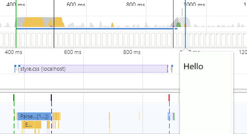
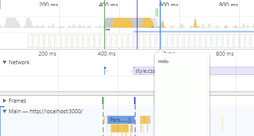

# Render Blocking CSS


<!-- TOC -->

- [Render Blocking CSS](#render-blocking-css)
    - [By default, CSS is treated as a render blocking resource](#by-default-css-is-treated-as-a-render-blocking-resource)
    - [Media types and media queries allow us to mark some CSS resources as non-render blocking](#media-types-and-media-queries-allow-us-to-mark-some-css-resources-as-non-render-blocking)

<!-- /TOC -->


## By default, CSS is treated as a render blocking resource
1. which means that the browser won't render any processed content until the CSSOM is constructed. Make sure to keep your CSS lean, deliver it as quickly as possible, and use media types and queries to unblock rendering.
2. 这是很合理的，CSS 直接影响渲染结果，所以就应该等到 CSS 解析完成后再渲染。
3. 注意，只会阻塞渲染，而不会阻塞解析，即不影响 `DOMContentLoaded` 事件的发生。DOM 的解 析和 CSSOM 的解析是独立的过程，但渲染树的构建却是两者一起组合起来完成的
    
    上图中的渲染是在 `style.css` 下载和解析完成之后


## Media types and media queries allow us to mark some CSS resources as non-render blocking
```html
<link href="style.css" rel="stylesheet">
<link href="print.css" rel="stylesheet" media="print">
<link href="other.css" rel="stylesheet" media="(min-width: 40em)">
```
1. First stylesheet declaration doesn't provide a media type or query, so it applies in all cases; that is to say, it is always render blocking.
2. On the other hand, the second stylesheet declaration applies only when the content is being printed---perhaps you want to rearrange the layout, change the fonts, and so on, and hence this stylesheet declaration doesn't need to block the rendering of the page when it is first loaded.
3. Finally, the last stylesheet declaration provides a "media query," which is executed by the browser: if the conditions match, the browser blocks rendering until the style sheet is downloaded and processed.
4. When declaring your style sheet assets, pay close attention to the media type and queries; they greatly impact critical rendering path performance.
5. Finally, note that "render blocking" only refers to whether the browser has to hold the initial rendering of the page on that resource. In either case, the browser still downloads the CSS asset, albeit with a lower priority for non-blocking resources.
    
    上图中的渲染是在 `style.css` 下载过程中
