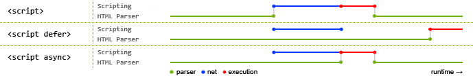

# Javascript Blocking

## 三种原生JS文件加载和执行方式
### 默认
同步加载，同步执行。在下载脚本并执行完成之前都不会解析之后的 HTML 代码，即脚本的加载和
执行都会阻塞解析文档。

### `defer`
* 异步加载，延迟执行。延迟至文档解析完成之后再执行。
* 保证先后顺序，`b.js`会在`a.js`执行之后再执行，`b.js`可以依赖`a.js`
    ```html
    <script defer src="a.js"></script>
    <script defer src="b.js"></script>
    ```

### `async`
* 异步加载，同步执行
* 不保证先后顺序，`b.js`不一定会在`a.js`执行之后再执行，`b.js`不能依赖`a.js`
    ```html
    <script async src="a.js"></script>
    <script async src="b.js"></script>
    ```
* If a `<script>` tag has both attributes, a browser that supports both will
honor the `async` attribute and ignore the `defer` attribute.

  


## `document.readyState`
Describes the loading state of the document.

### 三个阶段的值
1. `loading`  
The document is still loading.
2. `interactive`
    * The document has finished loading and the document has been parsed but
    sub-resources such as images, stylesheets and frames are still loading.
    jQuery 中的`ready`方法回调就是进入了这一阶段。
    * 即使文档没有完成解析，js 也可以读取和操作它前面的已解析的节点
        ```html
        <p>Hello</p>
        <script>
        console.log(document.querySelector('p').textContent); // "Hello"
        document.querySelector('p').textContent = 'World';
        console.log(document.querySelector('p').textContent); // "World"
        console.log(document.readyState); // "loading"
        </script>
        ```
    * 根据 Chrome DevTools 的分析，在没有 JS 只有 CSS 的情况下，不需要等待加载 CSS
    就可以进入该状态，即发生`DOMContentLoaded`事件；而如果再加上 JS，就必须要等到 CSS
     加载解析完成才能进入该状态。原因见下一篇的分析：`Theories\Web\Architecture\Performance\CriticalRenderingPath与首屏优化\4.AnalyzingCriticalRenderingPathPerformance.md`
3. `complete`  
The document and all sub-resources have finished loading. The state indicates
that the `load` event is about to fire.

### 与`DOMContentLoaded`事件和`load`事件的关系
```js
document.addEventListener('readystatechange', function(){
    if (document.readyState === 'interactive'){
        console.log('interactive: ' + (new Date()).getTime());
    }
    if (document.readyState === 'complete'){
        console.log('complete: ' + (new Date()).getTime());
    }
});
document.addEventListener('DOMContentLoaded', function(){
    console.log('DOMContentLoaded: ' + (new Date()).getTime());
});
window.addEventListener('load', function(){
    console.log('load: ' + (new Date()).getTime());
});
```

`DOMContentLoaded`的时间会和`interactive`相同或晚几毫秒；`load`的时间会和`complete`
相同或晚几毫秒。说明在`document.readyState`变为`interactive`之后，接着就会触发
`DOMContentLoaded`事件；在变为`complete`之后，接着就会触发`load`事件。


## 文档加载时间线  
**This is an idealized timeline and all browsers do not support all of its
details.**
1. The web browser creates a `Document` object and begins parsing the web page,
adding Element objects and Text nodes to the document as it parses HTML elements
 and their textual content. The `document.readyState` property has the value
`loading` at this stage.
2. When the HTML parser encounters `<script>` elements that have neither the
`async` nor `defer` attributes, it adds those elements to the document and then
executes the inline or external script. These scripts are executed synchronously
, and the parser pauses while the script downloads (if necessary) and runs.
3. 异步下载带有`async`或者`defer`属性的 scripts，并在下载完成后立刻同步执行带有
`async`属性的脚本文件
4. When the document is completely parsed, the `document.readyState` property
changes to `interactive`.
5. Any scripts that had the `defer` attribute set are executed
6. The browser fires a `DOMContentLoaded` event on the `Document` object. This
marks the transition from synchronous script execution phase to the asynchronous
 event-driven phase of program execution. Note, however, that there may still be
async scripts that have not yet executed at this point.
7. The document is completely parsed at this point, but the browser may still be
 waiting for additional content, such as images, to load. When all such content
finishes loading, and when all async scripts have loaded and executed, the
`document.readyState` property changes to `complete` and the web browser fires a
 `load` event on the `Window` object.
8. From this point on, event handlers are invoked asynchronously in response to
user input events, network events, timer expirations, and so on.

*This timeline does not specify when the document becomes visible to the user or
 when the web browser must start responding to user input events. Those are
implementation details. For very long documents or very slow network connections
, it is theoretically possible that a web browser will render part of a document
 and allow the user to start interacting with it before all the scripts have
executed. In that case, user input events might be fired before the event-driven
 phase of program execution has formally started.*


## `<script>`放到最后也会阻塞渲染的情况
### inline script 在任何位置都会阻塞渲染
```html
<body>
    <div>1</div>
    <div>2</div>
    <script>
    for (let i=0; i<99999999; i++){
        Math.random();
    }
    console.log('done')
    </script>
</body>
```
1. 在 Chrome（67.0.3396.99） 和 FF 实际效果都是页面先空白，等几秒钟后，"1、"2"和
"done"同时出现。
2. 查看 Chrome Performance 的 timeline 会发现，在执行脚本之前之后都各有一次 paint 的
过程。但查看帧画面，在第一次 paint 之后页面上仍然是空的，只有第二次 paint 之后页面才有
内容。
3. 使用 Chrome Audit 也是一样的情况，“Frist meaningful paint”用了超过15秒，而如果删
掉循环，只要不到一秒就有“Frist meaningful paint”。

### Chrome 中，外部脚本的执行对渲染的阻塞
只有在脚本加载的足够快的情况下才会出现，在实际情况下可能并不容易出现。  
测试版本是：
```
版本 67.0.3396.99（正式版本） （32 位）
```
即使把`<script>`放到最后也会阻塞渲染的情况：
1. 解析 HTML，遇到`<script>`则阻塞解析，同步加载脚本。这是正常的。
2. 如果脚本加载完成时，页面已经完成了渲染，则不存在阻塞。
3. 但是如果脚本很快就加载完了，而此时页面还没有进行渲染，则 Chrome 不会先进行渲染，而会
先执行脚本。**这里的逻辑应该是如果此时先渲染绘制了的话，脚本如果会导致重渲染，则会让页
面出现可见的重新布局。**
4. 必须要等到脚本执行完才会进行统一的渲染。如果脚本之内有耗时操作的话，会导致延迟渲染。
5. 而在 FF 中，则会正常的先渲染绘制完成后再执行脚本。
6. 因此，如果在 Chrome 中使用`defer`，如果异步下载完成时页面没有渲染，同样也会先执行脚
本再渲染页面，也会导致页面内容延迟出现。
7. 这就要求，即使`<script>`放在底部，其内部也不能有耗时的同步操作。例如
    ```js
    for (let i=0; i<99999999; i++){
        Math.random();
    }
    ```
8. 甚至即使把耗时操作放在异步回调时，如果该回调很快执行也不行：
    ```js
    setTimeout(()=>{
        for (let i=0; i<99999999; i++){
            Math.random();
        }
    }, 30)
    ```
30毫秒之后，页面如果仍然没有渲染，则仍然会先执行回调中的操作，从而阻塞加载。
9. 除非你设定更长的异步操作，让耗时操作在渲染完成后执行
    ```js
    setTimeout(()=>{
        for (let i=0; i<99999999; i++){
            Math.random();
        }
    }, 300)
    ```
    这样，在异步回调执行前页面已经渲染绘制完成。
10. 使用`DOMContentLoaded`事件和`load`事件的情况。因为`DOMContentLoaded`事件发生时
只是文档被解析了而没有被渲染，所以该事件的回调仍然会阻塞。`load`事件的出现会更晚一些，
但如果页面没什么外部资源或者都加载的很快，那么有可能`load`的时候页面仍然没有渲染，所以
仍然不能保证。
11. 最后，我的测试都是加载本地脚本，所以才会出现加载很快的情况。在实际情况下，位于`body`
底部的`<script>`可能并不会有限加载，而且因为加载基本上都是远程，也不会很快，所以可能不
容易出现上述的阻塞。


## References
* [Script-injected "async scripts" considered harmful](https://www.igvita.com/2014/05/20/script-injected-async-scripts-considered-harmful/)  
