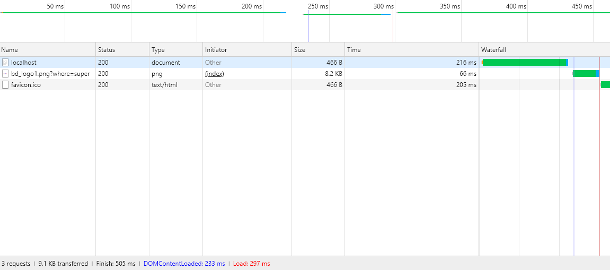
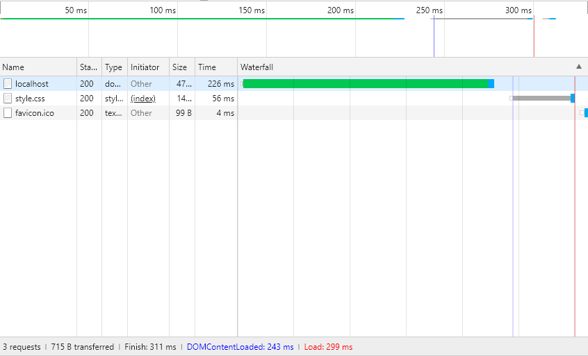
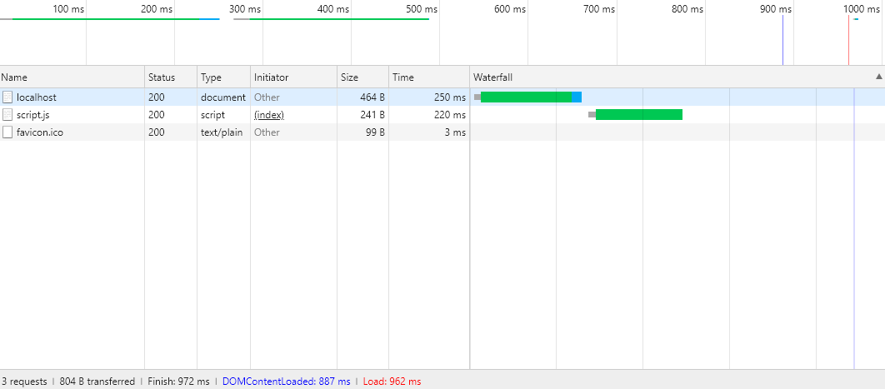
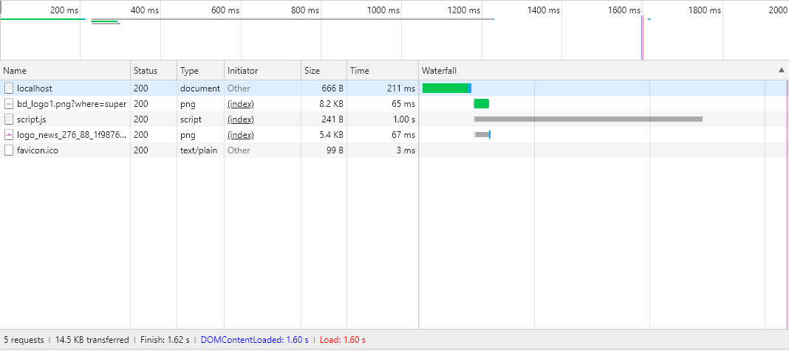
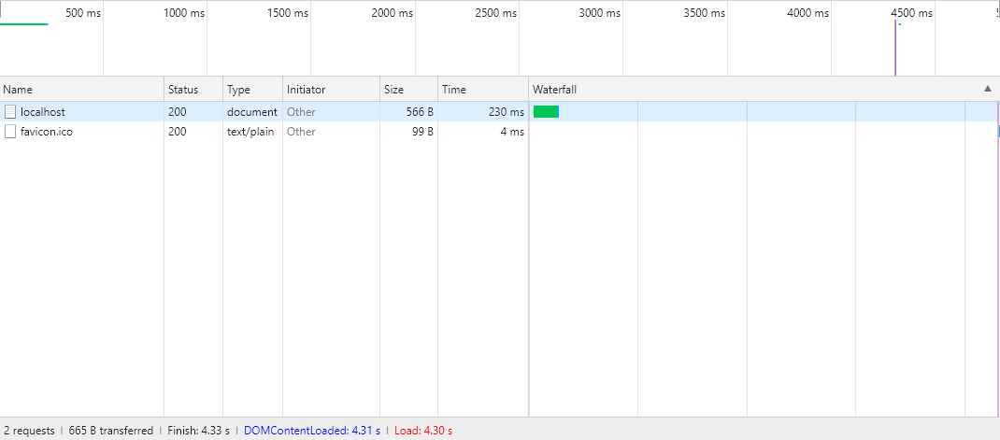
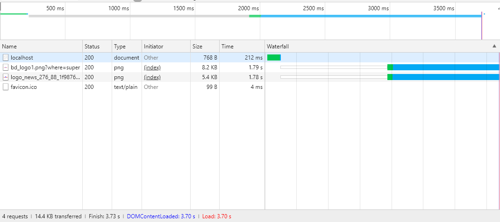
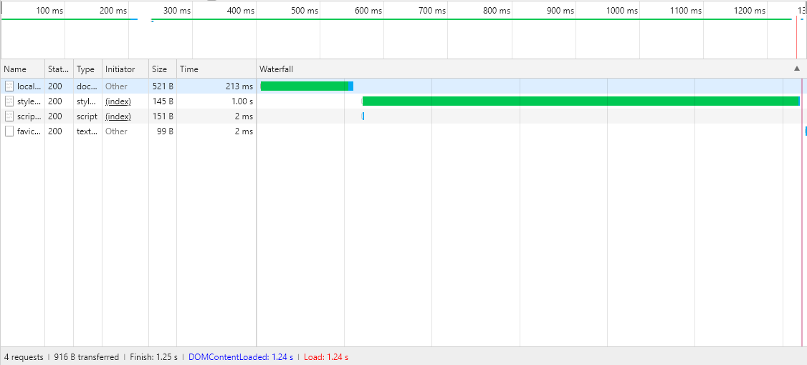

# Analyzing Critical Rendering Path Performance


## 没有 CSS 和 JS 的情况
```js
if (req.url === '/'){
    res.setHeader('content-type', 'text/html; charset=utf-8');
    setTimeout(()=>{
        res.end(`
            <!DOCTYPE html>
            <html>
            <head>
            <meta charset="utf-8">
            <title></title>
            </head>
            <body>
            <p>Hello</p>
            </body>
            </html>`);
        }, 200);
}
else {
    res.end()
}
```


1. HTML 文件下载（末尾的蓝色部分）完成后，过了很短的时间，就发生了`DOMContentLoaded`,
即那条淡蓝色的竖线。
2. 也就是说文档刚下载完很快就完成了解析。
3. 之后在图片下载完成后，就发生了`load`，即红色的竖线。


## 有 CSS 的情况
```js
if (req.url === '/'){
    res.setHeader('content-type', 'text/html; charset=utf-8');
    setTimeout(()=>{
        res.end(`
            <!DOCTYPE html>
            <html>
            <head>
            <meta charset="utf-8">
            <title></title>
            <link href="style.css" rel="stylesheet">
            </head>
            <body>
            <p>Hello</p>
            </body>
            </html>`);
        }, 200);
}
else if (req.url === '/style.css'){
    res.setHeader('content-type', 'text/css');
    setTimeout(()=>{
        res.end(`body{font-size: 2em;}`);
    }, 50);
}
else {
    res.end();
}
```
  
可以看到，CSS 文件的下载并没有阻塞 HTML 的解析，同样也是很快就`DOMContentLoaded`了


## 有外部 JS 的情况
```js
if (req.url === '/'){
    res.setHeader('content-type', 'text/html; charset=utf-8');
    setTimeout(()=>{
        res.end(`
            <!DOCTYPE html>
            <html>
            <head>
            <meta charset="utf-8">
            <title></title>
            </head>
            <body>
            <p>Hello</p>
            <script src="script.js"></script>
            </body>
            </html>`);
        }, 200);
}
else if (req.url === '/script.js'){
    res.setHeader('content-type', 'text/javascript');
    setTimeout(()=>{
        res.end(`console.log('hello');
        for (let i=0; i<9999999; i++){
            Math.random();
        }`);
    }, 200);
}
else {
    res.end();
}
```
  

1. 外部 JS 的加载和执行会延长文档的解析时间，**即使是放在`body`尾部**
2. 虽然放在哪里都会延长文档的解析时间，但还是应该放在最后。因为即使文档没有完全解析，js
 也可以读取和操作它前面的已解析的节点，如果放在被操作节点前面，就会发生错误
    ```html
    <p>Hello</p>
    <script>
    console.log(document.querySelector('p').textContent); // "Hello"
    document.querySelector('p').textContent = 'World';
    console.log(document.querySelector('p').textContent); // "World"
    console.log(document.readyState); // "loading"
    </script>
    ```

### 所谓的“JS 阻塞解析”
以及“JS 放到文档最后来避免阻塞解析”这样的说法，本身就不正确。
1. 首先，文档的解析过程是自上而下的。
2. 即使基本`<script>`放到最后，但解析器解析到这个`<script>`之后，并不知道后面还有没有
内容，所以它不能遇见`<script>`就下结论说“后面没有其他 DOM 节点了，我已经解析完成了”。
3. 所以即使`<script>`放到文档最后，也一样会延长整个解析的过程。解析器必须要下载执行完
JS 才能继续往后进行，才能发现后面已经没有内容了，从而才能完成解析。所以如果不是异步 JS
内容，其中的`document.readyState`肯定永远都是`loading`。
4. `<script>`并不是独立于文档之外的东西，`<script>`并不会说“你们解析你们的，我在最后，
不会影响你们的解析过程”。`<script>`本来和其他节点 token 一样，也是要被解析的 token 之
一。解析器遇到了`<div>`会解析，遇到了`<script>`也会同样解析。只不过解析`<div>`不需要
下载和执行，而解析`<script>`需要下载和执行，而且可能耗时很久。JS 的下载和执行也是属于
解析的一部分！
5. 所以不能说 “JS 阻塞了解析”，只能说 “`<script>`的解析阻塞了其他节点的解析”。或者说“
`<script>`的解析阻塞了 DOM 树的构建”，因为 JS 不属于 DOM 树。
6. 将`<script>`放到最后的意义只是：
    * 它前面的 DOM 节点都已经被解析了，这样它可以访问到这些节点
    * 页面结构清晰
7. 如果想让`<script>`的解析完全不影响构建 DOM，那就只能使用`defer`，`async`也有可能影
响。

### 但外部 JS 的加载和执行并不会阻塞其他资源的加载
```js
if (req.url === '/'){
    res.setHeader('content-type', 'text/html; charset=utf-8');
    setTimeout(()=>{
        res.end(`
            <!DOCTYPE html>
            <html>
            <head>
            <meta charset="utf-8">
            <title></title>
            </head>
            <body>
            <p>Hello</p>
            
            <script src="script.js"></script>
            
            </body>
            </html>`);
        }, 200);
}
else if (req.url === '/script.js'){
    res.setHeader('content-type', 'text/javascript');
    setTimeout(()=>{
        res.end(`console.log('hello');
        for (let i=0; i<9999999; i++){
            Math.random();
        }`);
    }, 1000);
}
else {
    res.end();
}
```
  

1. 也就是说，在这种情况，不管`<script>`放在那里，都是一样不会阻塞其他资源的加载。不管是
外部脚本还是图片等资源，肯定都是并行下载的，所以不会影响；而 JS 执行其实是属于解析的过程
，也不会影响外部资源的加载。
2. 但同样的，为了能读取前面的节点，`<script>`还是应该放在最后。


## 行内 JS 的情况
```js
if (req.url === '/'){
    res.setHeader('content-type', 'text/html; charset=utf-8');
    setTimeout(()=>{
        res.end(`
            <!DOCTYPE html>
            <html>
            <head>
            <meta charset="utf-8">
            <title></title>
            </head>
            <body>
            <p>Hello</p>
            <script>
            for (let i=0; i<99999999; i++){
                Math.random();
            }
            </script>
            </body>
            </html>`);
        }, 200);
}
else {
    res.end();
}
```
  
理解了前面所说的“脚本执行也是解析的一部分”，这里也就不难理解了。

### 但是与外部 JS 正好相反，行内 JS 在任何地方都会阻塞其他资源的加载
```js
if (req.url === '/'){
    res.setHeader('content-type', 'text/html; charset=utf-8');
    setTimeout(()=>{
        res.end(`
            <!DOCTYPE html>
            <html>
            <head>
            <meta charset="utf-8">
            <title></title>
            <link href="style.css" rel="stylesheet">
            </head>
            <body>
            <p>Hello</p>
            
            
            <script>
            for (let i=0; i<99999999; i++){
                Math.random();
            }
            </script>
            </body>
            </html>`);
        }, 200);
}
else {
    res.end();
}
```
  

这里不懂原因是什么，是结论就是：**不要使用行内 JS**


## 上述两种 JS 再加上 CSS 的情况
```js
if (req.url === '/'){
    res.setHeader('content-type', 'text/html; charset=utf-8');
    setTimeout(()=>{
        res.end(`
            <!DOCTYPE html>
            <html>
            <head>
            <meta charset="utf-8">
            <title></title>
            <link href="style.css" rel="stylesheet">
            </head>
            <body>
            <p>Hello</p>
            <script src="script.js"></script>
            </body>
            </html>`);
        }, 200);
}
else if (req.url === '/style.css'){
    res.setHeader('content-type', 'text/css');
    setTimeout(()=>{
        res.end(`body{font-size: 2em;}`);
    }, 1000);
}
else if (req.url === '/script.js'){
    res.setHeader('content-type', 'text/javascript');
        res.end(`console.log('hello')`);
}
else {
    res.end();
}
```
  

### CSS 会使得 JS 延迟执行，JS 的延迟执行求导致了文档解析被阻塞
1. 之前在只有 CSS 的情况下，CSS 是不会阻塞解析的。
2. 但是现在加上了 JS，虽然该 JS 很快就加载并完成执行，但 CSS 却阻塞了解析。
3. 如果把外部 JS 换成行内 JS，CSS 也是一样会阻塞解析。
4. 而且注意，虽然 JS 文件很快就加载完成了，但是`console.log`输出却是在大约一秒之后，即
CSS 文件加载解析完成之后。使用行内 JS 的情况也是一样。

### 原因：纠结的依赖
1. 前面说了，CSS 不影响解析。所以本来 CSSOM 在文档解析完成后再下载和解析也没什么问题。
2. 但就像 JS 有可能要读取和改变它前面已解析的节点一样，JS 也有可能访问 CSSOM。
3. 这就要求 JS 应该等到 CSS 解析完成后再执行。所以，CSS 的解析阻塞了 JS 的执行。
4. 而前面说了，JS 的执行就是文档解析的一部分，JS 不执行文档就不能继续解析，就不可能解析
完成并发生`DOMContentLoaded`。

### 解决方法
Prefer asynchronous JavaScript resources


## References
* [Analyzing Critical Rendering Path Performance](https://developers.google.com/web/fundamentals/performance/critical-rendering-path/analyzing-crp)
