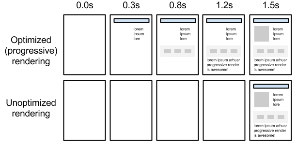
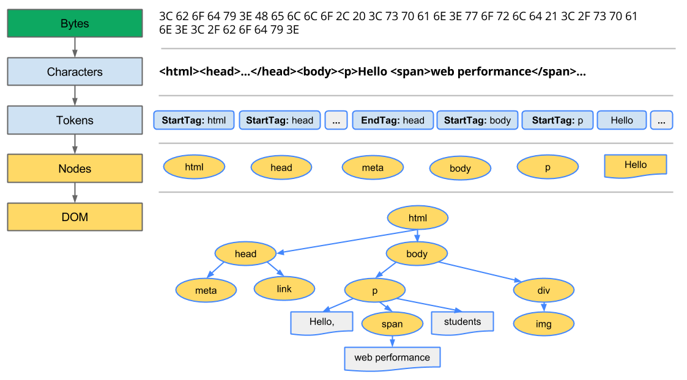

# Critical rendering path

1. How exactly does the browser go from consuming our HTML, CSS, and JavaScript
to rendered pixels on the screen?  
2. Optimizing for performance is all about understanding what happens in these
intermediate steps between receiving the HTML, CSS, and JavaScript bytes and the
 required processing to turn them into rendered pixels - that's the **critical
rendering path**.
3. Optimizing the critical rendering path refers to prioritizing the display of
content that relates to the current user action.

## 页面白屏阶段
1. Constructing the Object Model
2. Render-tree Construction, Layout, and Paint
3. Render Blocking CSS
4. Adding Interactivity with JavaScript

## Constructing the Object Model
* 可以直接看 [Google developers 的文章](https://developers.google.com/web/fundamentals/performance/critical-rendering-path/constructing-the-object-model)

Before the browser can render the page, it needs to construct the DOM and CSSOM
trees. As a result, we need to ensure that we deliver both the HTML and CSS to
the browser as quickly as possible.  

### TL;DR
* Bytes → characters → tokens → nodes → object model.
* HTML markup is transformed into a Document Object Model (DOM); CSS markup is
transformed into a CSS Object Model (CSSOM).
* DOM and CSSOM are independent data structures.

### Document Object Model (DOM)

1. **Conversion**: The browser reads the raw bytes of HTML off the disk or
network, and translates them to individual characters based on specified
encoding of the file (for example, UTF-8).
2. **Tokenizing**: The browser converts strings of characters into distinct
tokens—as specified by the [W3C HTML5 standard](https://www.w3.org/TR/html5/);
for example, "<html>", "<body>"—and other strings within angle brackets. Each
token has a special meaning and its own set of rules.
3. **Lexing**: The emitted tokens are converted into "objects," which define
their properties and rules.
4. **DOM construction**: Finally, because the HTML markup defines relationships
between different tags (some tags are contained within other tags) the created
objects are linked in a tree data structure that also captures the parent-child
relationships defined in the original markup: the HTML object is a parent of the
 body object, the body is a parent of the paragraph object, and so on.
5. The final output of this entire process is the Document Object Model (DOM),
which the browser uses for all further processing of the page.

### CSS Object Model (CSSOM)

#### Why does the CSSOM have a tree structure?
When computing the final set of styles for any object on the page, the browser
starts with the most general rule applicable to that node (for example, if it is
 a child of a body element, then all body styles apply) and then recursively
refines the computed styles by applying more specific rules; that is, the rules
"cascade down."

## References
* [Google developers](https://developers.google.com/web/fundamentals/performance/critical-rendering-path/)
* [无线性能优化：页面可见时间与异步加载](http://taobaofed.org/blog/2016/01/20/mobile-wpo-pageshow-async/)
