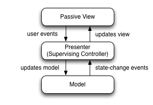

# 1. Raw Architecture
A website without using a framework like Vue or React

***
## The nature of a website
1. A website is an application which contains one or more web pages
2. A web page has the following functions:
    * **Shows informations, necessary**
    * **Gets informations, unnecessary**  
      If a web page dosen't get client side infomation, it's a static web page. That
      means it will not communicate with server side
    * **Performs calculations, unnecessary**  
      If a web page dosen't perform any calculation, it has no necessasy to use
      JS.
3. A HTML document in a page shows informations, and also can get informations
   which will passed to JS.
4. JS can get informations, from DOM or from other sources like cookies. JS can
   modify document by DOM. Also, JS can perform calculations, and communicate
   with server side by sending or getting data.

***
## Architecture of a raw web page
It's like a MVP（Model-View-Presenter）architecture:  
  
*From [Wikipedia](https://en.wikipedia.org/wiki/Model%E2%80%93view%E2%80%93presenter)*
