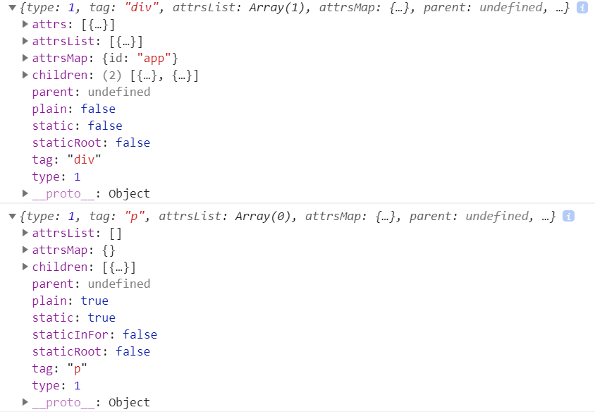
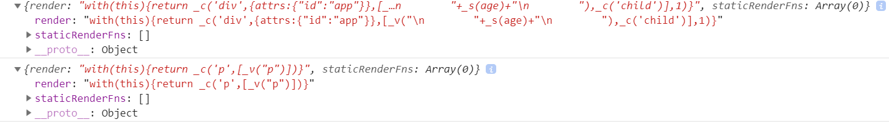

# Compilation State

## 预备知识
* `../Two-wayBinding.md`


## 编译过程简述
1. 在编译过程中，编译器首先读取组件模板，再经过“解析(Parsing)”——“优化(optimizing)”——
“代码生成(codegen )”三个阶段之后，会最终创建一个渲染函数。
2. 这个渲染函数进一步会创建一个 VNode，并最终渲染出真实 Node。


## Parsing stage
测试代码
```html
<div id="app">
    {{ age }}
    <child />
</div>
```
```js
new Vue({
    data: {
        age: 22,
    },
    components: {
        child: {
            template: `<p>p</p>`,
        },
    },
}).$mount('#app');
```

1. 在该阶段，解析器解析模板，生成 AST。
2. 在 v2.5.17 源码中，找到了`parse`函数，如下
    ```js
    /**
     * Convert HTML string to AST.
     */
    function parse (
      template,
      options
    ) {
        // ...

        return root;
    }
    ```
3. 可以看到，这个函数将模板转换为 AST。运行上面的例子，并在`parse`函数体内打印`root`，
输出如下
    


## Optimization stage
1. 优化阶段的目的是遍历生成的 AST，检查它的子树是否有纯静态内容，即不涉及数据更新会引起
变动的。
2. 从上面输出的 AST 可以看到，`<p>`对应的树的`static`属性为`true`，因为该节点没有数据
可以影响到它。
3. Vue 会把检测到的静态的子树设置为常亮，在重渲染整个节点的时候，就不会重新创建该子树的
VNode，节省下了一部分的时间。


## CodeGen stage
1. 这个阶段，会使用生成的 AST 来生成渲染函数。
2. 之后，渲染函数会被调用来创建 VNode 并渲染真实节点。
3. 在 v2.5.17 源码中，找到了`generate`函数，如下
    ```js
    function generate (
      ast,
      options
    ) {
      var state = new CodegenState(options);
      var code = ast ? genElement(ast, state) : '_c("div")';
      return {
        render: ("with(this){return " + code + "}"),
        staticRenderFns: state.staticRenderFns
      }
    }
    ```
4. 运行上面的例子，并输出该函数的返回值。因为有两个节点，输入如下
    


## References
* [Demystifying Vue.js internals](https://medium.com/js-imaginea/the-vue-js-internals-7b76f76813e3)
