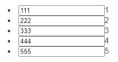
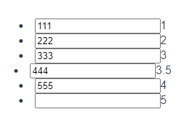
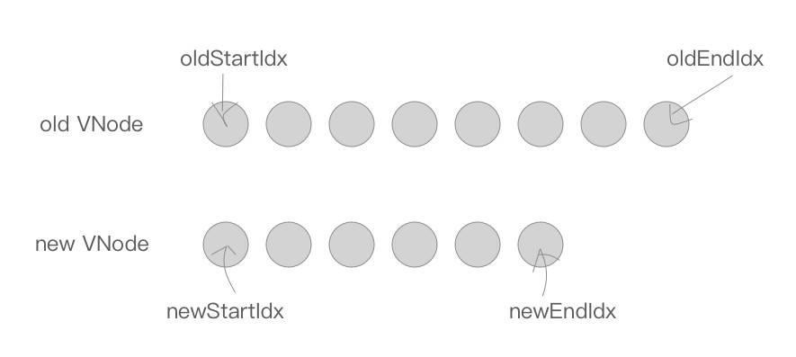
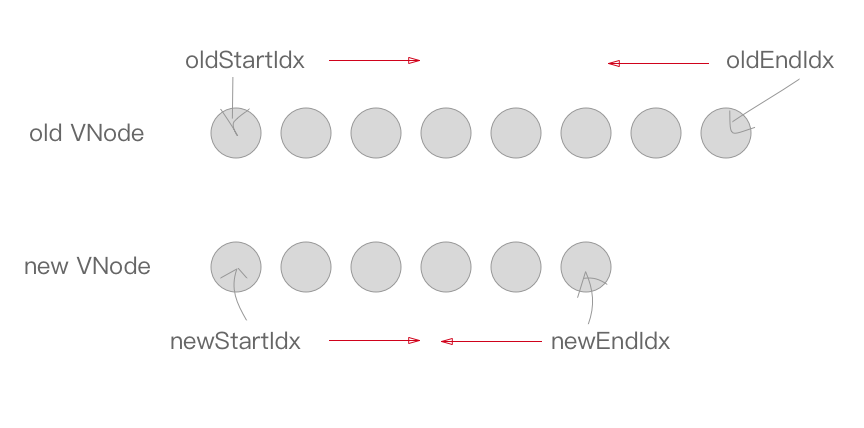

# Diff Algorithm

<!-- TOC -->

- [Diff Algorithm](#diff-algorithm)
    - [设计思想](#设计思想)
        - [性能权衡](#性能权衡)
    - [原理](#原理)
    - [本质](#本质)
    - [环境](#环境)
    - [准备知识](#准备知识)
    - [TODO](#todo)
    - [Level by Level](#level-by-level)
    - [List](#list)
        - [Diff 算法并不知道用户操作](#diff-算法并不知道用户操作)
        - [使用 key 给节点一个身边标识](#使用-key-给节点一个身边标识)
    - [渲染差异（patch）原理](#渲染差异patch原理)
        - [patch](#patch)
        - [sameVnode](#samevnode)
        - [`patch` 函数源码](#patch-函数源码)
    - [差异比较（patchVnode）](#差异比较patchvnode)
    - [`updateChildren`](#updatechildren)
        - [四个特殊的节点复用情况](#四个特殊的节点复用情况)
        - [其他情况](#其他情况)
        - [`while` 循环结束以后](#while-循环结束以后)
    - [References](#references)

<!-- /TOC -->


## 设计思想
### 性能权衡


## 原理


## 本质


## 环境
key | value
--|--
源码版本 | 2.5.21


## 准备知识
* `./VirtualDOM操作.md`


## TODO
从 watcher 更新到触发 patch 的代码流程


## Level by Level
1. Finding the minimal number of modifications between two arbitrary trees is a $O(n^3)$ problem. As you can imagine, this isn’t tractable for our use case. React uses simple and yet powerful heuristics to find a very good approximation in $O(n)$. TODO 复杂度分析，[参考](https://www.zhihu.com/question/66851503/answer/246766239)
2. React only tries to reconcile trees level by level. This drastically reduces the complexity and isn’t a big loss as it is very rare in web applications to have a component being moved to a different level in the tree. They usually only move laterally among children. 也就是说，不会进行深度 diff 比较。
    
3. 比如如下变动
    ```html
    <!-- 变动前 -->
    <div>                       <!-- 层级1 -->
        <p>                     <!-- 层级2 -->
            <b> aoy </b>        <!-- 层级3 -->   
            <span>diff</span>   <!-- 层级3 -->
        </p> 
    </div>

    <!-- 变动后 -->
    <div>                       <!-- 层级1 -->
        <p>                     <!-- 层级2 -->
            <b> aoy </b>        <!-- 层级3 -->
        </p>
        <span>diff</span>       <!-- 层级2 -->
    </div>
    ```
4. 如果 diff 算法会进行深度比较的话，它就会直接把 `<span>diff</span>` 从第三层提出来放到 `<p>` 后面，这样移动起来很高效，但是比较起来缺很低效。
5. 实际上，因为它只能同层比较，所以它在比较第二层的时候会发现多了一个 `<span>diff</span>`，所以就新加一个；然后再比较第三层的时候发现 `<span>diff</span>` 没了，于是就删除该节点。


## List
### Diff 算法并不知道用户操作
1. 比如根据一个数组 `[1, 2, 3, 4, 5]` 循环渲染出一个列表。之后往数组里又插入了一项，变成了 `[1, 2, 3, 3.5, 4, 5]`。
2. 你插入的时候当然是知道插入的 index 是 3，但是 diff 算法只是监听数据变化，它并不知道你插入的位置。
3. 所以，它对比两个数组的差异，会发现：前三项 `1`、`2`、`3` 都没变，第四项 `4` 变成了 `3.5`，第五项 `5` 变成了 `4`，后面新加了一个第六项 `5`。
4. 删除的时候也是同样的问题。
5. 当然如果只是这样的话，就算 diff 算法没有正确理解插入，它重新渲染列表后也是符合预期的。
6. 比如说本来通过 `<li v-for="item in array">{{item}}</li>` 渲染出这个列表
    ```html
    <ul>
        <li>1</li>
        <li>2</li>
        <li>3</li>
        <li>4</li>
        <li>5</li>
    </ul>
    ```
7. 数组改变后，按照 diff 算法的理解，它会复用前三个，然后更改之后的两个，最后再加一个新的。渲染为
    ```html
    <ul>
        <li>1</li>
        <li>2</li>
        <li>3</li>
        <li>3.5</li>
        <li>4</li>
        <li>5</li>
    </ul>
    ```
7. 但是如果在列表项里再加一个输入框 `<li v-for="item in array"><input>{{item}}</li>`，渲染好之后再往每个输入框里输入不一样的内容，比如这样
    
8. 然后再改变数组触发重渲染，就成了下面的样子
    
9. Diff 算法直接复用的前三个，没问题。
10. 因为 diff 算法并不知道你是插在哪个位置，所以只要按顺序继续往后比较，然后发现第四项的值从 `4` 变成了 `3.5`，所以它并不需要重新渲染整个`<li>`，只需要修改里面的文本节点值就行了。
11. 因为前面说了 diff 算法是 Level by Level 的，所以不会去看子节点 `<input>`，而且 `<input>` 也没有依赖什么数据，所以就直接复用它了，就出现了问题。

### 使用 key 给节点一个身边标识
1. 为了解决这个问题，需要给每个列表元素提供一个身份标识，diff 算法根据这个标识来判断到底发生了什么改变
    ```js
    <li v-for="item in array" :key="item"><input>{{item}}</li>
    ```
2. 现在五个列表项的 key 分别是 `1`、`2`、`3`、`4`、`5`。列表更新后，diff 算法发现这五个 key 所在的列表项都在，然后在第三项后面多了一个节点，现在就能正确的插入了。
3. 因为 key 必须是唯一的表明节点身份的，所以不能用列表循环的索引作为 key。


## 渲染差异（patch）原理
### patch
1. patch 的过程相当复杂，我们先用简单的代码来看一下
    ```js
    function patch (oldVnode, vnode, parentElm) {
        if ( !oldVnode ) {
            addVnodes(parentElm, null, vnode, 0, vnode.length - 1);
        } else if ( !vnode ) {
            removeVnodes(parentElm, oldVnode, 0, oldVnode.length - 1);
        } else {
            if ( sameVnode(oldVNode, vnode) ) {
                patchVnode(oldVNode, vnode);
            } else {
                removeVnodes(parentElm, oldVnode, 0, oldVnode.length - 1);
                addVnodes(parentElm, null, vnode, 0, vnode.length - 1);
            }
        }
    }
    ```
2. 因为 `patch` 的主要功能是比对两个 VNode 节点，将「差异」更新到视图上，所以入参有新老两个 `VNode` 以及父节点的 `element` 。
3. 首先在 `oldVnode`（老 VNode 节点）不存在的时候，相当于新的 VNode 替代原本没有的节点，所以直接用 `addVnodes` 将这些节点批量添加到 `parentElm` 上
    ```js
    if (!oldVnode) {
        addVnodes(parentElm, null, vnode, 0, vnode.length - 1);
    }
    ```
3. 然后同理，在 `vnode`（新 VNode 节点）不存在的时候，相当于要把老的节点删除，所以直接使用 `removeVnodes` 进行批量的节点删除即可
    ```js
    else if (!vnode) {
        removeVnodes(parentElm, oldVnode, 0, oldVnode.length - 1);
    }
    ```
4. 最后一种情况，当 `oldVNode` 与 vno`de 都存在的时候，需要判断它们是否属于 sameVnode（相同的节点）。如果是则进行 patchVnode（比对 VNode ）操作；如果不是则删除老节点，增加新节点
    ```js
    if (sameVnode(oldVNode, vnode)) {
        patchVnode(oldVNode, vnode);
    } else {
        removeVnodes(parentElm, oldVnode, 0, oldVnode.length - 1);
        addVnodes(parentElm, null, vnode, 0, vnode.length - 1);
    }
    ```

### sameVnode
1. 看看什么情况下两个 VNode 会属于 sameVnode （相同的节点）。
2. 示意代码
    ```js
    function sameVnode () {
        return (
            a.key === b.key &&
            a.tag === b.tag &&
            a.isComment === b.isComment &&
            (!!a.data) === (!!b.data) &&
            sameInputType(a, b)
        )
    }

    function sameInputType (a, b) {
        if (a.tag !== 'input') return true
        let i
        const typeA = (i = a.data) && (i = i.attrs) && i.type
        const typeB = (i = b.data) && (i = i.attrs) && i.type
        return typeA === typeB
    }
    ```
3. 当 `key`、 `tag`、 `isComment`（是否为注释节点）、 `data` 同时定义（或不定义），同时满足当标签类型为 `input` 的时候 `type` 相同（某些浏览器不支持动态修改 `<input>` 类型，所以他们被视为不同类型）时，两个节点就被视为相同的节点。
4. 源码
    ```js
    `/src/core/vdom/patch.js`
    function sameVnode(a, b) {
        return (
            a.key === b.key // 首先 key 必须要相同
            && ( // 且满足一下两个条件之一
                ( 
                    // 条件一
                    a.tag === b.tag 
                    && a.isComment === b.isComment 
                    && isDef(a.data) === isDef(b.data) 
                    && sameInputType(a, b)
                ) 
                || (
                    // 条件二
                    isTrue(a.isAsyncPlaceholder) 
                    && a.asyncFactory === b.asyncFactory 
                    && isUndef(b.asyncFactory.error)
                )
            )
        );
    }


    function sameInputType(a, b) {
        if (a.tag !== "input") {
            // 这个返回 true，看起来 sameInputType 的判断为真的情况是：可以不是 input，但如果是 input，那就必须满足下面的条件？
            return true
        };
        let i;
        const typeA = isDef((i = a.data)) && isDef((i = i.attrs)) && i.type;
        const typeB = isDef((i = b.data)) && isDef((i = i.attrs)) && i.type;
        return (
            // 要么是 type 一样，要么虽然不一样，但是都是文本输入的类型
            typeA === typeB || ( isTextInputType(typeA) && isTextInputType(typeB) )
        );
    }


    // isTextInputType 在 /src/platforms/web/util/element.js
    // const isTextInputType = makeMap('text,number,password,search,email,tel,url')
    ```

### `patch` 函数源码
`/src/core/vdom/patch.js`

```js
export function createPatchFunction (backend) {
    
    // ...
    
    return function patch(oldVnode, vnode, hydrating, removeOnly) {
        if (isUndef(vnode)) {
            if (isDef(oldVnode)) invokeDestroyHook(oldVnode);
            return;
        }

        let isInitialPatch = false;
        const insertedVnodeQueue = [];

        if ( isUndef(oldVnode) ) { // 旧节点不存在直接创建新节点
            // empty mount (likely as component), create new root element
            isInitialPatch = true;
            createElm(vnode, insertedVnodeQueue);
        } 
        else {
            const isRealElement = isDef( oldVnode.nodeType );
            if ( !isRealElement && sameVnode(oldVnode, vnode) ) { // 旧节点是虚拟节点，且新旧虚拟节点是 sameVnode
                // patch existing root node
                patchVnode(
                    oldVnode,
                    vnode,
                    insertedVnodeQueue,
                    null,
                    null,
                    removeOnly
                );
            } 
            else { // 要么旧节点不是虚拟节点，要么新旧节点不是 sameVnode
                if ( isRealElement ) { // 旧节点不是虚拟节点
                    // mounting to a real element
                    // check if this is server-rendered content and if we can perform
                    // a successful hydration.
                    if (
                        oldVnode.nodeType === 1 &&
                        oldVnode.hasAttribute(SSR_ATTR)
                    ) {
                        oldVnode.removeAttribute(SSR_ATTR);
                        hydrating = true;
                    }
                    if (isTrue(hydrating)) {
                        if (hydrate(oldVnode, vnode, insertedVnodeQueue)) {
                            invokeInsertHook(vnode, insertedVnodeQueue, true);
                            return oldVnode;
                        } else if (process.env.NODE_ENV !== "production") {
                            warn(
                                "The client-side rendered virtual DOM tree is not matching " +
                                    "server-rendered content. This is likely caused by incorrect " +
                                    "HTML markup, for example nesting block-level elements inside " +
                                    "<p>, or missing <tbody>. Bailing hydration and performing " +
                                    "full client-side render."
                            );
                        }
                    }
                    // either not server-rendered, or hydration failed.
                    // create an empty node and replace it
                    oldVnode = emptyNodeAt(oldVnode);
                }

                // replacing existing element
                const oldElm = oldVnode.elm;
                const parentElm = nodeOps.parentNode(oldElm);

                // create new node
                createElm(
                    vnode,
                    insertedVnodeQueue,
                    // extremely rare edge case: do not insert if old element is in a
                    // leaving transition. Only happens when combining transition +
                    // keep-alive + HOCs. (#4590)
                    oldElm._leaveCb ? null : parentElm,
                    nodeOps.nextSibling(oldElm)
                );

                // update parent placeholder node element, recursively
                if (isDef(vnode.parent)) {
                    let ancestor = vnode.parent;
                    const patchable = isPatchable(vnode);
                    while (ancestor) {
                        for (let i = 0; i < cbs.destroy.length; ++i) {
                            cbs.destroy[i](ancestor);
                        }
                        ancestor.elm = vnode.elm;
                        if (patchable) {
                            for (let i = 0; i < cbs.create.length; ++i) {
                                cbs.create[i](emptyNode, ancestor);
                            }
                            // #6513
                            // invoke insert hooks that may have been merged by create hooks.
                            // e.g. for directives that uses the "inserted" hook.
                            const insert = ancestor.data.hook.insert;
                            if (insert.merged) {
                                // start at index 1 to avoid re-invoking component mounted hook
                                for (let i = 1; i < insert.fns.length; i++) {
                                    insert.fns[i]();
                                }
                            }
                        } else {
                            registerRef(ancestor);
                        }
                        ancestor = ancestor.parent;
                    }
                }

                // destroy old node
                if ( isDef(parentElm) ) {
                    removeVnodes(parentElm, [oldVnode], 0, 0);
                } 
                else if ( isDef(oldVnode.tag) ) {
                    invokeDestroyHook(oldVnode);
                }
            }
        }

        invokeInsertHook(vnode, insertedVnodeQueue, isInitialPatch);
        return vnode.elm;
    };
}
```


## 差异比较（patchVnode）
1. patchVnode 是在符合 sameVnode 的条件下触发的，所以会进行「比对」。
2. 示意代码
    ```js
    `/src/core/vdom/patch.js`

    function patchVnode (oldVnode, vnode) {
        if (oldVnode === vnode) {
            return;
        }

        if (vnode.isStatic && oldVnode.isStatic && vnode.key === oldVnode.key) {
            vnode.elm = oldVnode.elm;
            vnode.componentInstance = oldVnode.componentInstance;
            return;
        }

        const elm = vnode.elm = oldVnode.elm;
        const oldCh = oldVnode.children;
        const ch = vnode.children;

        if (vnode.text) {
            nodeOps.setTextContent(elm, vnode.text);
        } else {
            if (oldCh && ch && (oldCh !== ch)) {
                updateChildren(elm, oldCh, ch);
            } else if (ch) {
                if (oldVnode.text) nodeOps.setTextContent(elm, '');
                addVnodes(elm, null, ch, 0, ch.length - 1);
            } else if (oldCh) {
                removeVnodes(elm, oldCh, 0, oldCh.length - 1)
            } else if (oldVnode.text) {
                nodeOps.setTextContent(elm, '')
            }
        }
    }
    ```
3. 首先在新老 VNode 节点相同的情况下，就不需要做任何改变了，直接 return。
4. 在当新老 VNode 节点都是 `isStatic`（静态的），并且 `key` 相同时，只要将 `componentInstance` 与 `elm` 从老 VNode 节点 “拿过来” 即可，这样就可以跳过比对的过程。
5. 接下来，当新 VNode 节点是文本节点的时候，直接用 `setTextContent` 来设置 text，这里的 `nodeOps` 是一个适配层，根据不同平台提供不同的操作平台 DOM 的方法，实现跨平台。
6. 当新 VNode 节点是非文本节点当时候，需要分几种情况
    * `oldCh` 与 `ch` 都存在且不相同时，使用 `updateChildren` 函数来更新子节点。
    * 如果只有 `ch` 存在的时候，如果老节点是文本节点则先将节点的文本清除，然后将 `ch` 批量插入插入到节点 `elm` 下。
    * 同理当只有 `oldCh` 存在时，说明需要将老节点通过 `removeVnodes` 全部清除。
    * 最后一种情况是如果两者都没有子节点，还要看看老节点是不是文本节点，是的话清除掉内容。
7. 源码
    ```js
    `/src/core/vdom/patch.js`

    function patchVnode(
        oldVnode,
        vnode,
        insertedVnodeQueue,
        ownerArray,
        index,
        removeOnly
    ) {
        if ( oldVnode === vnode ) {
            return;
        }

        if ( isDef(vnode.elm) && isDef(ownerArray) ) {
            // clone reused vnode
            vnode = ownerArray[index] = cloneVNode(vnode);
        }

        const elm = (vnode.elm = oldVnode.elm);

        if ( isTrue(oldVnode.isAsyncPlaceholder) ) {
            if ( isDef(vnode.asyncFactory.resolved) ) {
                hydrate(oldVnode.elm, vnode, insertedVnodeQueue);
            } 
            else {
                vnode.isAsyncPlaceholder = true;
            }
            return;
        }

        // reuse element for static trees.
        // note we only do this if the vnode is cloned -
        // if the new node is not cloned it means the render functions have been
        // reset by the hot-reload-api and we need to do a proper re-render.
        if (
            isTrue(vnode.isStatic) &&
            isTrue(oldVnode.isStatic) &&
            vnode.key === oldVnode.key &&
            (isTrue(vnode.isCloned) || isTrue(vnode.isOnce))
        ) {
            vnode.componentInstance = oldVnode.componentInstance;
            return;
        }

        let i;
        const data = vnode.data;
        if (isDef(data) && isDef((i = data.hook)) && isDef((i = i.prepatch))) {
            i(oldVnode, vnode);
        }

        const oldCh = oldVnode.children;
        const ch = vnode.children;
        if ( isDef(data) && isPatchable(vnode) ) {
            for (i = 0; i < cbs.update.length; ++i) cbs.update[i](oldVnode, vnode);
            if (isDef((i = data.hook)) && isDef((i = i.update))) i(oldVnode, vnode);
        }

        if ( isUndef(vnode.text) ) { // 新节点不是文本节点
            if ( isDef(oldCh) && isDef(ch) ) { // 都有子节点
                if ( oldCh !== ch ) // 且子节点不相同
                    updateChildren(elm, oldCh, ch, insertedVnodeQueue, removeOnly);
            } 
            else if ( isDef(ch) ) { // 新节点有子节点但旧节点没有子节点
                if ( process.env.NODE_ENV !== "production" ) {
                    checkDuplicateKeys(ch);
                }
                if ( isDef(oldVnode.text) ) { // 旧节点没有子节点但有可能有文本节点
                    nodeOps.setTextContent(elm, "");
                }
                addVnodes( elm, null, ch, 0, ch.length - 1, insertedVnodeQueue ); // 插入新节点的子节点
            } 
            else if ( isDef(oldCh) ) { // 旧节点有子节点但新节点没有子节点
                removeVnodes(elm, oldCh, 0, oldCh.length - 1); // 直接移除旧节点的子节点
            } 
            else if ( isDef(oldVnode.text) ) {
                nodeOps.setTextContent(elm, "");
            }
        } 
        else if ( oldVnode.text !== vnode.text ) { // 新节点是文本节点并且旧节点不是相同文本的文本节点节点时
            nodeOps.setTextContent(elm, vnode.text);
        }

        if (isDef(data)) {
            if (isDef((i = data.hook)) && isDef((i = i.postpatch)))
                i(oldVnode, vnode);
        }
    }
    ```


## `updateChildren`
1. 源码
    ```js
    `/src/core/vdom/patch.js`

    function updateChildren(
        parentElm,
        oldCh,
        newCh,
        insertedVnodeQueue,
        removeOnly
    ) {
        // 四个比对索引指针和对应的四个节点
        let oldStartIdx = 0;
        let newStartIdx = 0;
        let oldEndIdx = oldCh.length - 1;
        let oldStartVnode = oldCh[0];
        let oldEndVnode = oldCh[oldEndIdx];
        let newEndIdx = newCh.length - 1;
        let newStartVnode = newCh[0];
        let newEndVnode = newCh[newEndIdx];

        let oldKeyToIdx, idxInOld, vnodeToMove, refElm;

        // removeOnly is a special flag used only by <transition-group>
        // to ensure removed elements stay in correct relative positions
        // during leaving transitions
        const canMove = !removeOnly;

        if (process.env.NODE_ENV !== "production") {
            checkDuplicateKeys(newCh);
        }

        // while 为 false 的条件是新子节点列表或旧子节点列表其中之一的首位指针相遇，即其中一个列表比对结束
        while ( oldStartIdx <= oldEndIdx && newStartIdx <= newEndIdx ) { 
            if ( isUndef(oldStartVnode) ) {
                oldStartVnode = oldCh[++oldStartIdx]; // Vnode has been moved left
            } 
            else if ( isUndef(oldEndVnode) ) {
                oldEndVnode = oldCh[--oldEndIdx];
            } 

            else if ( sameVnode(oldStartVnode, newStartVnode) ) {
                patchVnode(
                    oldStartVnode,
                    newStartVnode,
                    insertedVnodeQueue,
                    newCh,
                    newStartIdx
                );
                oldStartVnode = oldCh[++oldStartIdx];
                newStartVnode = newCh[++newStartIdx];
            } 
            else if ( sameVnode(oldEndVnode, newEndVnode) ) {
                patchVnode(
                    oldEndVnode,
                    newEndVnode,
                    insertedVnodeQueue,
                    newCh,
                    newEndIdx
                );
                oldEndVnode = oldCh[--oldEndIdx];
                newEndVnode = newCh[--newEndIdx];
            } 
            else if ( sameVnode(oldStartVnode, newEndVnode) ) {
                // Vnode moved right
                patchVnode(
                    oldStartVnode,
                    newEndVnode,
                    insertedVnodeQueue,
                    newCh,
                    newEndIdx
                );
                canMove &&
                    nodeOps.insertBefore(
                        parentElm,
                        oldStartVnode.elm,
                        nodeOps.nextSibling(oldEndVnode.elm)
                    );
                oldStartVnode = oldCh[++oldStartIdx];
                newEndVnode = newCh[--newEndIdx];
            } 
            else if ( sameVnode(oldEndVnode, newStartVnode) ) {
                // Vnode moved left
                patchVnode(
                    oldEndVnode,
                    newStartVnode,
                    insertedVnodeQueue,
                    newCh,
                    newStartIdx
                );
                canMove &&
                    nodeOps.insertBefore(
                        parentElm,
                        oldEndVnode.elm,
                        oldStartVnode.elm
                    );
                oldEndVnode = oldCh[--oldEndIdx];
                newStartVnode = newCh[++newStartIdx];
            } 
            
            else {
                if ( isUndef(oldKeyToIdx) ) {
                    // 旧节点列表中，key 到 index 的映射
                    oldKeyToIdx = createKeyToOldIdx(oldCh, oldStartIdx, oldEndIdx);
                }

                // 如果 newStartVnode 存在 key，则通过 key 找到该节点在旧列表中对应的旧节点的索引；
                // 如果 newStartVnode 不存在 key，让然试图通过 findIdxInOld 找找在旧列表中有没有对应的节点，有的话返回索引
                idxInOld = isDef(newStartVnode.key)
                    ? oldKeyToIdx[newStartVnode.key]
                    : findIdxInOld(newStartVnode, oldCh, oldStartIdx, oldEndIdx);

                // 所以，idxInOld 存在意味着：
                // 1. 要么在旧节点列表中找到了 key 相同的节点（key 相同也不一定满足 sameVnode）
                // 2. 要么新节点虽然不存在 key 但是和旧节点列表中的某个节点 sameVnode

                if ( isUndef(idxInOld) ) { // 如果 newStartVnode 这个节点是新的
                    // New element
                    // 则新建一个元素
                    createElm(
                        newStartVnode,
                        insertedVnodeQueue,
                        parentElm,
                        oldStartVnode.elm,
                        false,
                        newCh,
                        newStartIdx
                    );
                } 
                else {
                    vnodeToMove = oldCh[idxInOld];
                    if ( sameVnode(vnodeToMove, newStartVnode) ) { // 有可能 key 相同但不是 sameVode，所以验证一下
                        patchVnode(
                            vnodeToMove,
                            newStartVnode,
                            insertedVnodeQueue,
                            newCh,
                            newStartIdx
                        );
                        oldCh[idxInOld] = undefined;
                        canMove &&
                            nodeOps.insertBefore(
                                parentElm,
                                vnodeToMove.elm,
                                oldStartVnode.elm
                            );
                    } 
                    else { // key 相同但不是 sameVnode，还是不能复用
                        // same key but different element. treat as new element
                        createElm(
                            newStartVnode,
                            insertedVnodeQueue,
                            parentElm,
                            oldStartVnode.elm,
                            false,
                            newCh,
                            newStartIdx
                        );
                    }
                }
                newStartVnode = newCh[++newStartIdx];
            }
        }

        if ( oldStartIdx > oldEndIdx ) { // 老节点比对完了，还有几个新的节点需要插入
            // 如果 newCh[newEndIdx + 1] 节点存在，则这个节点已经插入到
            // newCh[newEndIdx + 1] 是上一个从右边比对完成的子节点
            refElm = isUndef(newCh[newEndIdx + 1])
                ? null
                : newCh[newEndIdx + 1].elm;
            addVnodes(
                parentElm,
                refElm,
                newCh,
                newStartIdx,
                newEndIdx,
                insertedVnodeQueue
            );
        } 
        else if ( newStartIdx > newEndIdx ) {
            removeVnodes(parentElm, oldCh, oldStartIdx, oldEndIdx);
        }
    }


    function findIdxInOld (node, oldCh, start, end) {
        for (let i = start; i < end; i++) {
            const c = oldCh[i]
            if (isDef(c) && sameVnode(node, c)) return i
        }
    }
    ```
2. 首先我们定义 `oldStartIdx`、`newStartIdx`、`oldEndIdx` 以及 `newEndIdx` 分别是新老两个 VNode 的子节点两边的索引，同时 `oldStartVnode`、`newStartVnode`、`oldEndVnode` 以及 `newEndVnode` 分别指向这几个索引对应的 VNode 节点
    
3. 接下来是一个 `while` 循环，在这过程中，`oldStartIdx`、`newStartIdx`、`oldEndIdx` 以及 `newEndIdx` 会逐渐向中间靠拢
    
4. 首先的两个 `if`，是当 `oldStartVnode` 或者 `oldEndVnode` 不存在的时候，`oldStartIdx` 与 `oldEndIdx` 继续向中间靠拢，并更新对应的 `oldStartVnode` 与 `oldEndVnode` 的指向。不懂，为什么会不存在
    ```js
    if (!oldStartVnode) {
        oldStartVnode = oldCh[++oldStartIdx];
    } else if (!oldEndVnode) {
        oldEndVnode = oldCh[--oldEndIdx];
    }
    ```

### 四个特殊的节点复用情况
1. 接下的四个 `if`，是将 `oldStartIdx`、`newStartIdx`、`oldEndIdx` 以及 `newEndIdx` 两两比对的过程，一共会出现 2*2=4 种情况。
2. 第一种情况，`oldStartVnode` 与 `newStartVnode` 符合 `sameVnode` 时，说明老 VNode 节点的头部与新 VNode 节点的头部是相同的 VNode 节点，直接进行 `patchVnode` 进行复用，同时 `oldStartIdx` 与 `newStartIdx` 向后移动一位。
3. 第二种情况，`oldEndVnode` 与 `newEndVnode` 符合 `sameVnode`，也就是两个 VNode 的结尾是相同的 VNode，同样进行 `patchVnode` 操作进行复用，并将 `oldEndVnode` 与 `newEndVnode` 向前移动一位。
4. 第三种情况，`oldStartVnode` 与 `newEndVnode` 符合 `sameVnode` 的时候，也就是老 VNode 节点的头部与新 VNode 节点的尾部是同一节点的时候，将 `oldStartVnode.elm` 这个节点直接移动到 `oldEndVnode.elm` 这个节点的后面即可进行复用。然后 `oldStartIdx` 向后移动一位，`newEndIdx` 向前移动一位。
4. 第四种情况，`oldEndVnode` 与 `newStartVnode` 符合 `sameVnode` 时，也就是老 VNode 节点的尾部与新 VNode 节点的头部是同一节点的时候，将 `oldEndVnode.elm` 插入到 `oldStartVnode.elm` 前面进行复用。同样的，`oldEndIdx` 向前移动一位，`newStartIdx` 向后移动一位。

### 其他情况
```js
else {
    let elmToMove = oldCh[idxInOld];
    if ( !oldKeyToIdx ) {
        oldKeyToIdx = createKeyToOldIdx(oldCh, oldStartIdx, oldEndIdx);
    }
    idxInOld = newStartVnode.key ? oldKeyToIdx[newStartVnode.key] : null;
    if ( !idxInOld ) {
        createElm(newStartVnode, parentElm, oldStartVnode.elm);
        newStartVnode = newCh[++newStartIdx];
    } 
    else {
        elmToMove = oldCh[idxInOld];
        if ( sameVnode(elmToMove, newStartVnode) ) {
            patchVnode(elmToMove, newStartVnode);
            oldCh[idxInOld] = undefined;
            nodeOps.insertBefore(parentElm, newStartVnode.elm, oldStartVnode.elm);
            newStartVnode = newCh[++newStartIdx];
        } 
        else {
            createElm(newStartVnode, parentElm, oldStartVnode.elm);
            newStartVnode = newCh[++newStartIdx];
        }
    }
}

function createKeyToOldIdx (children, beginIdx, endIdx) {
    let i, key
    const map = {}
    for (i = beginIdx; i <= endIdx; ++i) {
        key = children[i].key
        if (isDef(key)) map[key] = i
    }
    return map
}
```

1. `createKeyToOldIdx` 的作用是产生 `key` 与 `index` 索引对应的一个 map 表。比如说：
    ```js
    [
        {xx: xx, key: 'key0'},
        {xx: xx, key: 'key1'}, 
        {xx: xx, key: 'key2'}
    ]
    ```
    在经过 `createKeyToOldIdx` 转化以后会变成：
    ```js
    {
        key0: 0, 
        key1: 1, 
        key2: 2
    }
    ```
    我们可以根据 `newCh` 中某一个节点的 `key` 值，快速地从 `oldKeyToIdx`（`createKeyToOldIdx` 的返回值）中获取相同 `key` 的节点的索引 `idxInOld`，然后找到 `oldCh` 中相同的节点。
2. 如果没有在 `oldCh` 中找到和 `newStartVnode` 同 `key` 的节点，则通过 `createElm` 创建一个新节点，插入到 `oldStartVnode` 前面，并将 `newStartIdx` 向后移动一位
    ```js
    if (!oldKeyToIdx) oldKeyToIdx = createKeyToOldIdx(oldCh, oldStartIdx, oldEndIdx);
    idxInOld = newStartVnode.key ? oldKeyToIdx[newStartVnode.key] : null;
    if (!idxInOld) {
        createElm(newStartVnode, parentElm, oldStartVnode.elm);
        newStartVnode = newCh[++newStartIdx];
    }
    ```
3. 否则如果找到了节点，同时它符合 `sameVnode`，则将这两个节点进行 `patchVnode`，将该位置的老节点赋值 `undefined`（之后如果还有新节点与该节点 `key` 相同可以检测出来提示已有重复的 `key` ），同时将 `newStartVnode.elm` 插入到 `oldStartVnode.elm` 的前面。同理，`newStartIdx` 往后移动一位
    ```js
    else {
        elmToMove = oldCh[idxInOld];
        if ( sameVnode(elmToMove, newStartVnode) ) {
            patchVnode(elmToMove, newStartVnode);
            oldCh[idxInOld] = undefined;
            nodeOps.insertBefore(parentElm, newStartVnode.elm, oldStartVnode.elm);
            newStartVnode = newCh[++newStartIdx];
        } 
        // ...
    }
    ```
4. 如果不符合 `sameVnode`，只能创建一个新节点插入到 `parentElm` 的子节点中，`newStartIdx` 往后移动一位
    ```js
    else {
        createElm(newStartVnode, parentElm, oldStartVnode.elm);
        newStartVnode = newCh[++newStartIdx];
    }
    ```

### `while` 循环结束以后
1. 如果 `oldStartIdx > oldEndIdx`，说明老节点比对完了，但是新节点还有多的，需要将新节点插入到真实 DOM 中去，调用 `addVnodes` 将这些节点插入即可
    ```js
    if (oldStartIdx > oldEndIdx) {
        refElm = (newCh[newEndIdx + 1]) ? newCh[newEndIdx + 1].elm : null;
        addVnodes(parentElm, refElm, newCh, newStartIdx, newEndIdx);
    } 
    ```
2. 同理，如果满足 `newStartIdx > newEndIdx` 条件，说明新节点比对完了，老节点还有多，将这些无用的老节点通过 `removeVnodes` 批量删除即可
    ```js
    else if (newStartIdx > newEndIdx) {
        removeVnodes(parentElm, oldCh, oldStartIdx, oldEndIdx);
    }
    ```


## References
* [React’s diff algorithm](https://calendar.perfplanet.com/2013/diff/)
* [React’s diff algorithm 翻译](https://zhuanlan.zhihu.com/p/82506257)
* [Vue2.0 v-for 中 :key 到底有什么用？ - 方应杭的回答 - 知乎](https://www.zhihu.com/question/61064119/answer/766607894)
* [解析vue2.0的diff算法](https://github.com/aooy/blog/issues/2)
* [深度剖析：如何实现一个 Virtual DOM 算法](https://github.com/livoras/blog/issues/13)
* [剖析 Vue.js 内部运行机制](https://juejin.im/book/6844733705089449991)