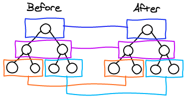

# Diff Algorithm

<!-- TOC -->

- [Diff Algorithm](#diff-algorithm)
    - [设计思想](#设计思想)
        - [性能权衡](#性能权衡)
    - [原理](#原理)
    - [本质](#本质)
    - [准备知识](#准备知识)
    - [Level by Level](#level-by-level)
    - [List](#list)
        - [Diff 算法并不知道用户操作](#diff-算法并不知道用户操作)
        - [使用 key 给节点一个身边标识](#使用-key-给节点一个身边标识)
    - [渲染差异（patch）原理](#渲染差异patch原理)
        - [patch](#patch)
        - [sameVnode](#samevnode)
    - [差异比较（patchVnode）](#差异比较patchvnode)
    - [updateChildren](#updatechildren)
        - [四个特殊的节点复用情况](#四个特殊的节点复用情况)
        - [其他情况](#其他情况)
        - [`while` 循环结束以后](#while-循环结束以后)
    - [References](#references)

<!-- /TOC -->


## 设计思想
### 性能权衡


## 原理


## 本质


## 准备知识
* `./VirtualDOM操作.md`


## Level by Level
1. Finding the minimal number of modifications between two arbitrary trees is a $O(n^3)$ problem. As you can imagine, this isn’t tractable for our use case. React uses simple and yet powerful heuristics to find a very good approximation in $O(n)$. TODO 复杂度分析，[参考](https://www.zhihu.com/question/66851503/answer/246766239)
2. React only tries to reconcile trees level by level. This drastically reduces the complexity and isn’t a big loss as it is very rare in web applications to have a component being moved to a different level in the tree. They usually only move laterally among children. 也就是说，不会进行深度 diff 比较。
    
3. 比如如下变动
    ```html
    <!-- 变动前 -->
    <div>                       <!-- 层级1 -->
        <p>                     <!-- 层级2 -->
            <b> aoy </b>        <!-- 层级3 -->   
            <span>diff</span>   <!-- 层级3 -->
        </p> 
    </div>

    <!-- 变动后 -->
    <div>                       <!-- 层级1 -->
        <p>                     <!-- 层级2 -->
            <b> aoy </b>        <!-- 层级3 -->
        </p>
        <span>diff</span>       <!-- 层级2 -->
    </div>
    ```
4. 如果 diff 算法会进行深度比较的话，它就会直接把 `<span>diff</span>` 从第三层提出来放到 `<p>` 后面，这样移动起来很高效，但是比较起来缺很低效。
5. 实际上，因为它只能同层比较，所以它在比较第二层的时候会发现多了一个 `<span>diff</span>`，所以就新加一个；然后再比较第三层的时候发现 `<span>diff</span>` 没了，于是就删除该节点。


## List
### Diff 算法并不知道用户操作
1. 比如根据一个数组 `[1, 2, 3, 4, 5]` 循环渲染出一个列表。之后往数组里又插入了一项，变成了 `[1, 2, 3, 3.5, 4, 5]`。
2. 你插入的时候当然是知道插入的 index 是 3，但是 diff 算法只是监听数据变化，它并不知道你插入的位置。
3. 所以，它对比两个数组的差异，会发现：前三项 `1`、`2`、`3` 都没变，第四项 `4` 变成了 `3.5`，第五项 `5` 变成了 `4`，后面新加了一个第六项 `5`。
4. 删除的时候也是同样的问题。
5. 当然如果只是这样的话，就算 diff 算法没有正确理解插入，它重新渲染列表后也是符合预期的。
6. 比如说本来通过 `<li v-for="item in array">{{item}}</li>` 渲染出这个列表
    ```html
    <ul>
        <li>1</li>
        <li>2</li>
        <li>3</li>
        <li>4</li>
        <li>5</li>
    </ul>
    ```
7. 数组改变后，按照 diff 算法的理解，它会复用前三个，然后更改之后的两个，最后再加一个新的。渲染为
    ```html
    <ul>
        <li>1</li>
        <li>2</li>
        <li>3</li>
        <li>3.5</li>
        <li>4</li>
        <li>5</li>
    </ul>
    ```
7. 但是如果在列表项里再加一个输入框 `<li v-for="item in array"><input>{{item}}</li>`，渲染好之后再往每个输入框里输入不一样的内容，比如这样
    
8. 然后再改变数组触发重渲染，就成了下面的样子
    
9. Diff 算法直接复用的前三个，没问题。
10. 因为 diff 算法并不知道你是插在哪个位置，所以只要按顺序继续往后比较，然后发现第四项的值从 `4` 变成了 `3.5`，所以它并不需要重新渲染整个`<li>`，只需要修改里面的文本节点值就行了。
11. 因为前面说了 diff 算法是 Level by Level 的，所以不会去看子节点 `<input>`，而且 `<input>` 也没有依赖什么数据，所以就直接复用它了，就出现了问题。

### 使用 key 给节点一个身边标识
1. 为了解决这个问题，需要给每个列表元素提供一个身份标识，diff 算法根据这个标识来判断到底发生了什么改变
    ```js
    <li v-for="item in array" :key="item"><input>{{item}}</li>
    ```
2. 现在五个列表项的 key 分别是 `1`、`2`、`3`、`4`、`5`。列表更新后，diff 算法发现这五个 key 所在的列表项都在，然后在第三项后面多了一个节点，现在就能正确的插入了。
3. 因为 key 必须是唯一的表明节点身份的，所以不能用列表循环的索引作为 key。


## 渲染差异（patch）原理
### patch
1. patch 的过程相当复杂，我们先用简单的代码来看一下
    ```js
    function patch (oldVnode, vnode, parentElm) {
        if ( !oldVnode ) {
            addVnodes(parentElm, null, vnode, 0, vnode.length - 1);
        } else if ( !vnode ) {
            removeVnodes(parentElm, oldVnode, 0, oldVnode.length - 1);
        } else {
            if ( sameVnode(oldVNode, vnode) ) {
                patchVnode(oldVNode, vnode);
            } else {
                removeVnodes(parentElm, oldVnode, 0, oldVnode.length - 1);
                addVnodes(parentElm, null, vnode, 0, vnode.length - 1);
            }
        }
    }
    ```
2. 因为 `patch` 的主要功能是比对两个 VNode 节点，将「差异」更新到视图上，所以入参有新老两个 `VNode` 以及父节点的 `element` 。
3. 首先在 `oldVnode`（老 VNode 节点）不存在的时候，相当于新的 VNode 替代原本没有的节点，所以直接用 `addVnodes` 将这些节点批量添加到 `parentElm` 上
    ```js
    if (!oldVnode) {
        addVnodes(parentElm, null, vnode, 0, vnode.length - 1);
    }
    ```
3. 然后同理，在 `vnode`（新 VNode 节点）不存在的时候，相当于要把老的节点删除，所以直接使用 `removeVnodes` 进行批量的节点删除即可
    ```js
    else if (!vnode) {
        removeVnodes(parentElm, oldVnode, 0, oldVnode.length - 1);
    }
    ```
4. 最后一种情况，当 `oldVNode` 与 vno`de 都存在的时候，需要判断它们是否属于 sameVnode（相同的节点）。如果是则进行 patchVnode（比对 VNode ）操作；如果不是则删除老节点，增加新节点
    ```js
    if (sameVnode(oldVNode, vnode)) {
        patchVnode(oldVNode, vnode);
    } else {
        removeVnodes(parentElm, oldVnode, 0, oldVnode.length - 1);
        addVnodes(parentElm, null, vnode, 0, vnode.length - 1);
    }
    ```

### sameVnode
1. 看看什么情况下两个 VNode 会属于 sameVnode （相同的节点）
    ```js
    function sameVnode () {
        return (
            a.key === b.key &&
            a.tag === b.tag &&
            a.isComment === b.isComment &&
            (!!a.data) === (!!b.data) &&
            sameInputType(a, b)
        )
    }

    function sameInputType (a, b) {
        if (a.tag !== 'input') return true
        let i
        const typeA = (i = a.data) && (i = i.attrs) && i.type
        const typeB = (i = b.data) && (i = i.attrs) && i.type
        return typeA === typeB
    }
    ```
2. 当 `key`、 `tag`、 `isComment`（是否为注释节点）、 `data` 同时定义（或不定义），同时满足当标签类型为 `input` 的时候 `type` 相同（某些浏览器不支持动态修改 `<input>` 类型，所以他们被视为不同类型）时，两个节点就被视为相同的节点。


## 差异比较（patchVnode）
1. patchVnode 是在符合 sameVnode 的条件下触发的，所以会进行「比对」
    ```js
    function patchVnode (oldVnode, vnode) {
        if (oldVnode === vnode) {
            return;
        }

        if (vnode.isStatic && oldVnode.isStatic && vnode.key === oldVnode.key) {
            vnode.elm = oldVnode.elm;
            vnode.componentInstance = oldVnode.componentInstance;
            return;
        }

        const elm = vnode.elm = oldVnode.elm;
        const oldCh = oldVnode.children;
        const ch = vnode.children;

        if (vnode.text) {
            nodeOps.setTextContent(elm, vnode.text);
        } else {
            if (oldCh && ch && (oldCh !== ch)) {
                updateChildren(elm, oldCh, ch);
            } else if (ch) {
                if (oldVnode.text) nodeOps.setTextContent(elm, '');
                addVnodes(elm, null, ch, 0, ch.length - 1);
            } else if (oldCh) {
                removeVnodes(elm, oldCh, 0, oldCh.length - 1)
            } else if (oldVnode.text) {
                nodeOps.setTextContent(elm, '')
            }
        }
    }
    ```
2. 首先在新老 VNode 节点相同的情况下，就不需要做任何改变了，直接 return。
3. 在当新老 VNode 节点都是 `isStatic`（静态的），并且 `key` 相同时，只要将 `componentInstance` 与 `elm` 从老 VNode 节点 “拿过来” 即可，这样就可以跳过比对的过程。
4. 接下来，当新 VNode 节点是文本节点的时候，直接用 `setTextContent` 来设置 text，这里的 `nodeOps` 是一个适配层，根据不同平台提供不同的操作平台 DOM 的方法，实现跨平台。
5. 当新 VNode 节点是非文本节点当时候，需要分几种情况
    * `oldCh` 与 `ch` 都存在且不相同时，使用 `updateChildren` 函数来更新子节点。
    * 如果只有 `ch` 存在的时候，如果老节点是文本节点则先将节点的文本清除，然后将 `ch` 批量插入插入到节点 `elm` 下。
    * 同理当只有 `oldCh` 存在时，说明需要将老节点通过 `removeVnodes` 全部清除。
    * 最后一种情况是如果两者都没有子节点，还要看看老节点是不是文本节点，是的话清除掉内容。


## updateChildren
```js
function updateChildren (parentElm, oldCh, newCh) {
    let oldStartIdx = 0;
    let newStartIdx = 0;
    let oldEndIdx = oldCh.length - 1;
    let oldStartVnode = oldCh[0];
    let oldEndVnode = oldCh[oldEndIdx];
    let newEndIdx = newCh.length - 1;
    let newStartVnode = newCh[0];
    let newEndVnode = newCh[newEndIdx];
    let oldKeyToIdx, idxInOld, elmToMove, refElm;

    while ( oldStartIdx <= oldEndIdx && newStartIdx <= newEndIdx ) {
        if ( !oldStartVnode ) {
            oldStartVnode = oldCh[++oldStartIdx];
        } 
        else if ( !oldEndVnode ) {
            oldEndVnode = oldCh[--oldEndIdx];
        } 
        else if ( sameVnode(oldStartVnode, newStartVnode) ) {
            patchVnode(oldStartVnode, newStartVnode);
            oldStartVnode = oldCh[++oldStartIdx];
            newStartVnode = newCh[++newStartIdx];
        } 
        else if ( sameVnode(oldEndVnode, newEndVnode) ) {
            patchVnode(oldEndVnode, newEndVnode);
            oldEndVnode = oldCh[--oldEndIdx];
            newEndVnode = newCh[--newEndIdx];
        } 
        else if ( sameVnode(oldStartVnode, newEndVnode) ) {
            patchVnode(oldStartVnode, newEndVnode);
            nodeOps.insertBefore(parentElm, oldStartVnode.elm, nodeOps.nextSibling(oldEndVnode.elm));
            oldStartVnode = oldCh[++oldStartIdx];
            newEndVnode = newCh[--newEndIdx];
        } 
        else if ( sameVnode(oldEndVnode, newStartVnode) ) {
            patchVnode(oldEndVnode, newStartVnode);
            nodeOps.insertBefore(parentElm, oldEndVnode.elm, oldStartVnode.elm);
            oldEndVnode = oldCh[--oldEndIdx];
            newStartVnode = newCh[++newStartIdx];
        } 
        else {
            let elmToMove = oldCh[idxInOld];
            if ( !oldKeyToIdx ) {
                oldKeyToIdx = createKeyToOldIdx(oldCh, oldStartIdx, oldEndIdx);
            }
            idxInOld = newStartVnode.key ? oldKeyToIdx[newStartVnode.key] : null;
            if ( !idxInOld ) {
                createElm(newStartVnode, parentElm, oldStartVnode.elm);
                newStartVnode = newCh[++newStartIdx];
            } 
            else {
                elmToMove = oldCh[idxInOld];
                if ( sameVnode(elmToMove, newStartVnode) ) {
                    patchVnode(elmToMove, newStartVnode);
                    oldCh[idxInOld] = undefined;
                    nodeOps.insertBefore(parentElm, newStartVnode.elm, oldStartVnode.elm);
                    newStartVnode = newCh[++newStartIdx];
                } 
                else {
                    createElm(newStartVnode, parentElm, oldStartVnode.elm);
                    newStartVnode = newCh[++newStartIdx];
                }
            }
        }
    }

    if (oldStartIdx > oldEndIdx) {
        refElm = (newCh[newEndIdx + 1]) ? newCh[newEndIdx + 1].elm : null;
        addVnodes(parentElm, refElm, newCh, newStartIdx, newEndIdx);
    } 
    else if (newStartIdx > newEndIdx) {
        removeVnodes(parentElm, oldCh, oldStartIdx, oldEndIdx);
    }
}
```

1. 首先我们定义 `oldStartIdx`、`newStartIdx`、`oldEndIdx` 以及 `newEndIdx` 分别是新老两个 VNode 的子节点两边的索引，同时 `oldStartVnode`、`newStartVnode`、`oldEndVnode` 以及 `newEndVnode` 分别指向这几个索引对应的 VNode 节点
    
2. 接下来是一个 `while` 循环，在这过程中，`oldStartIdx`、`newStartIdx`、`oldEndIdx` 以及 `newEndIdx` 会逐渐向中间靠拢
    
3. 首先的两个 `if`，是当 `oldStartVnode` 或者 `oldEndVnode` 不存在的时候，`oldStartIdx` 与 `oldEndIdx` 继续向中间靠拢，并更新对应的 `oldStartVnode` 与 `oldEndVnode` 的指向
    ```js
    if (!oldStartVnode) {
        oldStartVnode = oldCh[++oldStartIdx];
    } else if (!oldEndVnode) {
        oldEndVnode = oldCh[--oldEndIdx];
    }
    ```

### 四个特殊的节点复用情况
1. 接下的四个 `if`，是将 `oldStartIdx`、`newStartIdx`、`oldEndIdx` 以及 `newEndIdx` 两两比对的过程，一共会出现 2*2=4 种情况。
2. 第一种情况，`oldStartVnode` 与 `newStartVnode` 符合 `sameVnode` 时，说明老 VNode 节点的头部与新 VNode 节点的头部是相同的 VNode 节点，直接进行 `patchVnode` 进行复用，同时 `oldStartIdx` 与 `newStartIdx` 向后移动一位。
3. 第二种情况，`oldEndVnode` 与 `newEndVnode` 符合 `sameVnode`，也就是两个 VNode 的结尾是相同的 VNode，同样进行 `patchVnode` 操作进行复用，并将 `oldEndVnode` 与 `newEndVnode` 向前移动一位。
4. 第三种情况，`oldStartVnode` 与 `newEndVnode` 符合 `sameVnode` 的时候，也就是老 VNode 节点的头部与新 VNode 节点的尾部是同一节点的时候，将 `oldStartVnode.elm` 这个节点直接移动到 `oldEndVnode.elm` 这个节点的后面即可进行复用。然后 `oldStartIdx` `向后移动一位，newEndIdx` 向前移动一位。
4. 第四种情况，`oldEndVnode` 与 `newStartVnode` 符合 `sameVnode` 时，也就是老 VNode 节点的尾部与新 VNode 节点的头部是同一节点的时候，将 `oldEndVnode.elm` 插入到 `oldStartVnode.elm` 前面进行复用。同样的，`oldEndIdx` 向前移动一位，`newStartIdx` 向后移动一位。

### 其他情况
```js
else {
    let elmToMove = oldCh[idxInOld];
    if ( !oldKeyToIdx ) {
        oldKeyToIdx = createKeyToOldIdx(oldCh, oldStartIdx, oldEndIdx);
    }
    idxInOld = newStartVnode.key ? oldKeyToIdx[newStartVnode.key] : null;
    if ( !idxInOld ) {
        createElm(newStartVnode, parentElm, oldStartVnode.elm);
        newStartVnode = newCh[++newStartIdx];
    } 
    else {
        elmToMove = oldCh[idxInOld];
        if ( sameVnode(elmToMove, newStartVnode) ) {
            patchVnode(elmToMove, newStartVnode);
            oldCh[idxInOld] = undefined;
            nodeOps.insertBefore(parentElm, newStartVnode.elm, oldStartVnode.elm);
            newStartVnode = newCh[++newStartIdx];
        } 
        else {
            createElm(newStartVnode, parentElm, oldStartVnode.elm);
            newStartVnode = newCh[++newStartIdx];
        }
    }
}

function createKeyToOldIdx (children, beginIdx, endIdx) {
    let i, key
    const map = {}
    for (i = beginIdx; i <= endIdx; ++i) {
        key = children[i].key
        if (isDef(key)) map[key] = i
    }
    return map
}
```

1. `createKeyToOldIdx` 的作用是产生 `key` 与 `index` 索引对应的一个 map 表。比如说：
    ```js
    [
        {xx: xx, key: 'key0'},
        {xx: xx, key: 'key1'}, 
        {xx: xx, key: 'key2'}
    ]
    ```
    在经过 `createKeyToOldIdx` 转化以后会变成：
    ```js
    {
        key0: 0, 
        key1: 1, 
        key2: 2
    }
    ```
    我们可以根据 `newCh` 中某一个节点的 `key` 值，快速地从 `oldKeyToIdx`（`createKeyToOldIdx` 的返回值）中获取相同 `key` 的节点的索引 `idxInOld`，然后找到 `oldCh` 中相同的节点。
2. 如果没有在 `oldCh` 中找到和 `newStartVnode` 同 `key` 的节点，则通过 `createElm` 创建一个新节点，插入到 `oldStartVnode` 前面，并将 `newStartIdx` 向后移动一位
    ```js
    if (!oldKeyToIdx) oldKeyToIdx = createKeyToOldIdx(oldCh, oldStartIdx, oldEndIdx);
    idxInOld = newStartVnode.key ? oldKeyToIdx[newStartVnode.key] : null;
    if (!idxInOld) {
        createElm(newStartVnode, parentElm, oldStartVnode.elm);
        newStartVnode = newCh[++newStartIdx];
    }
    ```
3. 否则如果找到了节点，同时它符合 `sameVnode`，则将这两个节点进行 `patchVnode`，将该位置的老节点赋值 `undefined`（之后如果还有新节点与该节点 `key` 相同可以检测出来提示已有重复的 `key` ），同时将 `newStartVnode.elm` 插入到 `oldStartVnode.elm` 的前面。同理，`newStartIdx` 往后移动一位
    ```js
    else {
        elmToMove = oldCh[idxInOld];
        if ( sameVnode(elmToMove, newStartVnode) ) {
            patchVnode(elmToMove, newStartVnode);
            oldCh[idxInOld] = undefined;
            nodeOps.insertBefore(parentElm, newStartVnode.elm, oldStartVnode.elm);
            newStartVnode = newCh[++newStartIdx];
        } 
        // ...
    }
    ```
4. 如果不符合 `sameVnode`，只能创建一个新节点插入到 `parentElm` 的子节点中，`newStartIdx` 往后移动一位
    ```js
    else {
        createElm(newStartVnode, parentElm, oldStartVnode.elm);
        newStartVnode = newCh[++newStartIdx];
    }
    ```

### `while` 循环结束以后
1. 如果 `oldStartIdx > oldEndIdx`，说明老节点比对完了，但是新节点还有多的，需要将新节点插入到真实 DOM 中去，调用 `addVnodes` 将这些节点插入即可
    ```js
    if (oldStartIdx > oldEndIdx) {
        refElm = (newCh[newEndIdx + 1]) ? newCh[newEndIdx + 1].elm : null;
        addVnodes(parentElm, refElm, newCh, newStartIdx, newEndIdx);
    } 
    ```
2. 同理，如果满足 `newStartIdx > newEndIdx` 条件，说明新节点比对完了，老节点还有多，将这些无用的老节点通过 `removeVnodes` 批量删除即可
    ```js
    else if (newStartIdx > newEndIdx) {
        removeVnodes(parentElm, oldCh, oldStartIdx, oldEndIdx);
    }
    ```


## References
* [React’s diff algorithm](https://calendar.perfplanet.com/2013/diff/)
* [React’s diff algorithm 翻译](https://zhuanlan.zhihu.com/p/82506257)
* [Vue2.0 v-for 中 :key 到底有什么用？ - 方应杭的回答 - 知乎](https://www.zhihu.com/question/61064119/answer/766607894)
* [解析vue2.0的diff算法](https://github.com/aooy/blog/issues/2)
* [深度剖析：如何实现一个 Virtual DOM 算法](https://github.com/livoras/blog/issues/13)
* [剖析 Vue.js 内部运行机制](https://juejin.im/book/6844733705089449991)