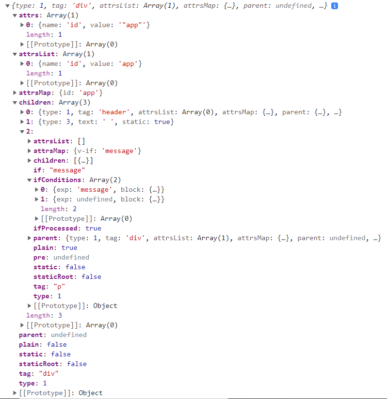

# 编译基本流程

源码版本 | 2.5.21


<!-- TOC -->

- [编译基本流程](#编译基本流程)
    - [设计目的](#设计目的)
        - [关键细节](#关键细节)
    - [实现原理](#实现原理)
    - [抽象本质](#抽象本质)
    - [设计思想](#设计思想)
    - [整体流程](#整体流程)
        - [创建编译器](#创建编译器)
        - [编译接口](#编译接口)
        - [parse](#parse)
        - [optimize](#optimize)
        - [generate](#generate)
        - [生成的渲染函数](#生成的渲染函数)
    - [References](#references)

<!-- /TOC -->


## 设计目的
1. [文档](https://vuejs.org/v2/guide/installation.html#Runtime-Compiler-vs-Runtime-only) 中说到 Vue 的构建分为完整版本（Runtime + Compiler）和运行时版本（Runtime-only），两者的区别就是运行时版本不会进行模板编译的工作。
2. 也就是说不会把模板字符串编译为渲染函数，只能使用渲染函数而不能使用模板语法。
3. 所以编译器就是用来将模板字符串编译成为 JavaScript 渲染函数的代码。

### 关键细节


## 实现原理


## 抽象本质


## 设计思想


## 整体流程
1. 编译可以分成 parse、optimize 与 generate 三个阶段。
2. parse 阶段负责把模板编译成 AST，optimize 阶段负责对 AST 进行优化，generate 阶段负责把优化后的 AST 生成渲染函数
    
3. 之后渲染函数被调用后会生成虚拟 DOM，虚拟 DOM 经过挂载（mount）会被渲染为真实 DOM，之后依赖更新时渲染函数会生成一个新的虚拟 DOM，然后通过 patch 过程更新真实 DOM。但这些步骤不属于编译模块负责。

### 创建编译器
1. 入口如下
    ```js
    // /src/server/compiler/index.js

    export const createCompiler = createCompilerCreator(function baseCompile (
        template: string,
        options: CompilerOptions
    ): CompiledResult {
        const ast = parse(template.trim(), options)
        optimize(ast, options)
        const code = generate(ast, options)
        return {
            ast,
            render: code.render,
            staticRenderFns: code.staticRenderFns
        }
    })
    ```
2. `createCompilerCreator` 名字拗口，创建一个 “编译器创建器”。调用时唯一的参数是 `baseCompile` 函数，返回值赋给了 `createCompiler`，也就是负责创建编译器的编译器创建器。调用 `createCompiler` 会返回一个真正的编译器。
3. `createCompilerCreator` 源码如下
    ```js
    // /src/server/compiler/create-compiler.js

    export function createCompilerCreator(baseCompile: Function): Function {
        return function createCompiler(baseOptions: CompilerOptions) {
            function compile(
                template: string,
                options?: CompilerOptions
            ): CompiledResult {
                const finalOptions = Object.create(baseOptions);
                const errors = [];
                const tips = [];
                finalOptions.warn = (msg, tip) => {
                    (tip ? tips : errors).push(msg);
                };
                
                if (options) {
                    // merge custom modules
                    if (options.modules) {
                        finalOptions.modules = (baseOptions.modules || []).concat(
                            options.modules
                        );
                    }
                    // merge custom directives
                    if (options.directives) {
                        finalOptions.directives = extend(
                            Object.create(baseOptions.directives || null),
                            options.directives
                        );
                    }
                    // copy other options
                    for (const key in options) {
                        if (key !== "modules" && key !== "directives") {
                            finalOptions[key] = options[key];
                        }
                    }
                }

                // compile 调用 baseCompile 进行编译
                const compiled = baseCompile(template, finalOptions);
                if (process.env.NODE_ENV !== "production") {
                    errors.push.apply(errors, detectErrors(compiled.ast));
                }
                compiled.errors = errors;
                compiled.tips = tips;
                return compiled;
            }

            return {
                compile,
                compileToFunctions: createCompileToFunctionFn(compile)
            };
        };
    }
    ```
    可以看到返回了一个函数，名字也是 `createCompiler`。
4. 再看 `createCompiler` 函数，调用后会返回一个编译器。可以看到这个编译器的接口对象包含 `compile` 和 `compileToFunctions` 两个方法。
5. 其中 `compile` 方法内部会调用 `createCompilerCreator` 的唯一参数函数 `baseCompile`，而 `compileToFunctions` 也是接收 `compile` 作为参数在内部使用。所以真正的编译工作就是右 `baseCompile` 开始的。

### 编译接口
1. 单独看一下 `baseCompile` 函数
    ```js
    function baseCompile (
        template: string,
        options: CompilerOptions
    ): CompiledResult {
        const ast = parse(template.trim(), options)
        optimize(ast, options)
        const code = generate(ast, options)
        return {
            ast,
            render: code.render,
            staticRenderFns: code.staticRenderFns
        }
    }
    ```
2. 它接受模板和编译选项两个参数；内部解析模板生成 AST，对其进行优化，然后生成 code；code 中包含渲染函数和静态渲染函数；返回 AST 和两个渲染函数。
3. 假设编译以下模板
    ```html
    <div id="app">
        <header>
            <h1>I'm a template!</h1>
        </header>
        <p v-if="message">{{ message }}</p>
        <p v-else>No message.</p>
    </div>
    ```
    返回的 `ast` 部分展开如下
    

### parse
1. parse 会用正则等方式将 template 模板中进行字符串解析，得到指令、class、style 等数据，最终形成 AST。AST 的每一个节点都是一个 `ASTElement` 实例。
2. `parse` 函数内部调用 `parseHTML` 函数解析模板，源码在 `/src/compiler/parser/index.js`。`parseHTML` 就很复杂了，源码在 `/src/compiler/parser/html-parser.js`，也不是 Vue.js 自己实现的。

### optimize
1. 源码在 `/src/compiler/optimizer.js`。
2. `optimize` 接受 AST 作为参数
    ```js
    export function optimize (root: ?ASTElement, options: CompilerOptions) {
        if (!root) return
        isStaticKey = genStaticKeysCached(options.staticKeys || '')
        isPlatformReservedTag = options.isReservedTag || no
        // first pass: mark all non-static nodes.
        markStatic(root)
        // second pass: mark static roots.
        markStaticRoots(root, false)
    }
    ```
3. 优化的内容是标记出 AST 里面的静态子节点树，也就是不涉及数据响应更新的。后面当 `update` 更新界面时，会有一个 patch 的过程，diff 算法会直接跳过静态子节点树，从而减少了比较的过程，优化了 patch 的性能。

### generate
1. generate 最终生成渲染函数和静态渲染函数。源码在 `/src/compiler/codegen/index.js`
    ```js
    export function generate (
        ast: ASTElement | void,
        options: CompilerOptions
    ): CodegenResult {
        const state = new CodegenState(options)
        const code = ast ? genElement(ast, state) : '_c("div")'
        return {
            render: `with(this){return ${code}}`,
            staticRenderFns: state.staticRenderFns
        }
    }
    ```

### 生成的渲染函数
1. 以官方文档上模板编译中的 [模板](https://vuejs.org/v2/guide/render-function.html#Template-Compilation) 为例
    ```html
    <div id="app">
        <header>
            <h1>I'm a template!</h1>
        </header>
        <p v-if="message">{{ message }}</p>
        <p v-else>No message.</p>
    </div>
    ```
2. 生成的 `render` 字符串格式化之后如下
    ```js
    with (this) { 
        return _c('div', 
                    { attrs: { "id": "app" } }, 
                    [
                        _m(0), 
                        _v(" "), 
                        (message) ? 
                            _c('p', [_v(_s(message))]) : 
                            _c('p', [_v("No message.")])
                    ]
                ) 
    }
    ```
3. `staticRenderFns` 有一个，字符串格式化之后如下
    ```js
    with (this) { 
        return _c('header',
                    [_c('h1',[_v("I'm a template!")])]
                )
    }
    ```
4. `_c` 就是渲染函数中的 `createElement`，其他带下划线的方法的意义可以从 `src/core/instance/render-helpers/index.js` 中找到
    ```js
    export function installRenderHelpers (target: any) {
        target._o = markOnce
        target._n = toNumber
        target._s = toString
        target._l = renderList
        target._t = renderSlot
        target._q = looseEqual
        target._i = looseIndexOf
        target._m = renderStatic
        target._f = resolveFilter
        target._k = checkKeyCodes
        target._b = bindObjectProps
        target._v = createTextVNode
        target._e = createEmptyVNode
        target._u = resolveScopedSlots
        target._g = bindObjectListeners
    }
    ```
5. 可以看到上面例子中 `render` 和 `staticRenderFns` 和 Vue 提供的渲染函数很相似。


## References
* [剖析 Vue.js 内部运行机制](https://juejin.cn/book/6844733705089449991)
* [Vue 源码编译思想之parse那些事](https://juejin.cn/post/6844903861975531528)