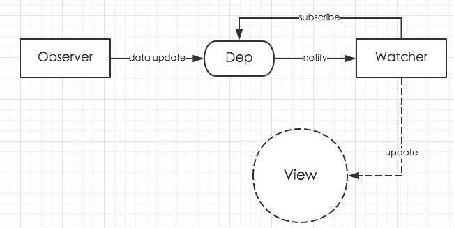

# observer

key | value
--|--
源码版本 | 2.5.2
文件路径 | `src/core/observer`



## Observer
1. 位于`core/observer/index.js`中的`Observer`类。
2. Observer class that is attached to each observed object. Once attached, the observer converts the target object's property keys into getter/setters that collect dependencies and dispatch updates.
3. 简单来说，就是观察`data`对象。


## Watcher
1. 位于`core/observer/watcher.js`
2. 相当于 Publisher & Subscriber 模式的 Subscriber。

### 作用
1. A watcher parses an expression, collects dependencies, and fires callback when the expression value changes. This is used for both the `$watch()` api and directives.

### Watch 的对象：Watcher 构造函数的`expOrFn`参数
1. 一个 watcher 会 watch 一个计算属性表达式或者一个`watch`属性，同时还会 watch 一个统一的渲染表达式。不懂，watcher 并不会 watch 方法，但是方法内部依赖的数据更新时为什么方法也会被重新调用。
    ```html
    <div id="app">
      {{m}}
      {{n}}
      {{sum}}
    </div>
    ```
    ```js
    new Vue({
        el: '#app',
        data(){
          return {
            m: 22,
            n: 33,
          }
        },
        computed: {
            sum(){
                return this.m + this.n;
            },
        },
        watch: {
            m(){
                console.log('m has been changed');
            },
        },
    });
    ```
    Watcher 构造函数会被调用三次，`expOrFn`参数分别如下：
    ```js
    ƒ sum(){
        return this.m + this.n;
    }
    ```
    ```js
    m
    ```
    ```js
    ƒ () {
        vm._update(vm._render(), hydrating);
    }
    ```
2. 所谓“统一的渲染表达式”，不管是上面例子中有三个渲染表达式，还是一个都没有，都会有且只有一个上面 watch 的函数。也就是说，只要有一个 vm 实例，就会有一个 watch 渲染表达式的 watcher。

### Watch 到变化后的回调：Watcher 构造函数的`cb`参数
1. 还是上面例子中的情况，`cb`参数分别为：
    ```js
    ƒ noop (a, b, c) {}
    ```
    ```js
    ƒ m(){
        console.log('m has been changed');
    }
    ```
    ```js
    ƒ noop (a, b, c) {}
    ```
    可以看到，观察到计算属性和渲染表达式的依赖更新后，并不会执行实际回调操作；只有 watch 的属性变化后才会执行设置的回调。


### 从单词语义上看 Watcher 和 Observer 的区别
1. 来自这个[视频](https://www.youtube.com/watch?v=X864N8H9OCg)的解释
    * Watch: To look at something or someone for a time, paying attention to what happens.
    * Observe: To watch something or someone carefully, especially to learn more about them.
2. 所以 Watcher 只是一直盯着看有没有变化，而 Observer 除了观察以外，还要深入其中去给数据设置 getter 和 setter，显然做了更多。


## References
* [Vue原理解析之observer模块](https://segmentfault.com/a/1190000008377887)
