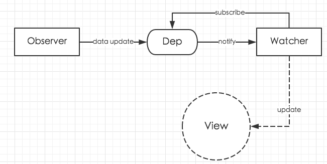

# observer





<!-- TOC -->

- [observer](#observer)
    - [相关信息](#相关信息)
    - [TODO](#todo)
    - [设计思想](#设计思想)
    - [本质](#本质)
    - [发布-订阅模式的要素](#发布-订阅模式的要素)
        - [订阅者](#订阅者)
        - [发布者](#发布者)
    - [整体流程](#整体流程)
    - [主要模块](#主要模块)
        - [`Observer` 模块](#observer-模块)
        - [`Dep` 类](#dep-类)
        - [`Watcher` 类](#watcher-类)
        - [从单词语义上看 `Watcher` 和 `Observer` 的命名](#从单词语义上看-watcher-和-observer-的命名)
    - [`Dep.target` 的作用](#deptarget-的作用)
    - [实现](#实现)
        - [第一步：实现数据响应式](#第一步实现数据响应式)
            - [初始化](#初始化)
                - [对 `data` 的属性和 `prop` 的属性的访问代理](#对-data-的属性和-prop-的属性的访问代理)
            - [为实例 data 对象创建 `Observer` 实例](#为实例-data-对象创建-observer-实例)
                - [被 observe 的属性是数组的情况](#被-observe-的属性是数组的情况)
            - [`defineReactive` 函数实际实现订阅者和响应式](#definereactive-函数实际实现订阅者和响应式)
            - [`Observer` 模块几个主要子模块的分工](#observer-模块几个主要子模块的分工)
        - [第二步：实际的依赖收集](#第二步实际的依赖收集)
        - [第三步：通知更新](#第三步通知更新)
    - [Watcher 的实现](#watcher-的实现)
        - [依赖订阅](#依赖订阅)
        - [更新求值](#更新求值)
    - [References](#references)

<!-- /TOC -->


## 相关信息
* 源码版本：2.5.21


## TODO
对于一个被观察的对象来说，看起来是在 Observe 建立的的过程中建立的 Dep，那 Watcher 是在之前建立的？


## 设计思想


## 本质


## 发布-订阅模式的要素
### 订阅者
* 变动回调函数：依赖的数据发生变化后，发布者会调用这个函数，里面的逻辑是订阅者针对数据变动做出相应的改变。
* 对发布者的引用：需要引用到发布者的订阅函数，把自己的变动回调函数传递给发布者。

### 发布者
* 订阅者列表：保存每个订阅者的变动回调函数。
* 订阅函数：接受订阅者的变动回调函数并保存进订阅者列表。
* 通知函数：订阅者依赖的数据发生变动后，依次调用订阅者列表里每个订阅者的变动回调函数，并传递新的数据值。


## 整体流程


1. **实现发布者**：`Observer` 为每个被依赖的数据构造一个发布者对象实例，依赖的数据发生变化后通知订阅者。发布者由 `Dep` 类实现。
2. **实现数据响应式**：要获得依赖数据的变化事件，如果让发布者轮询显然不合适，所以需要让数据变动时主动通知发布者。数据响应由 `Observer` 类构造函数调用响应函数实现数据的 getter 和 setter。
3. **实现订阅者**：每一个依赖该数据的对象，要先把自己变成一个订阅者实例。订阅者由 `Watcher` 类实现。
4. **订阅依赖**：订阅者向发布者订阅数据变动。订阅时需要调用发布者的订阅函数并传递订阅者，但这个调用是由被依赖数据的 getter 发起的。下述原因。
5. **响应数据变动**：依赖的数据变化后，数据的 setter 被调用，内部会让发布者者获得变化通知，发布者从自己的订阅者列表里找到所有的订阅者，依次调用它们的回调函数。


## 主要模块
### `Observer` 模块
1. 位于 `/src/core/observer/index.js`。
2. Observe 一个 vue 实例，也就是将它的 data 对象里面的属性转换为访问器属性（递归的）。
3. 通过使用 `Dep` 类，将每一个属性设置为发布者，从而实现在其值更新的时候通知依赖，也就是实现响应式。

### `Dep` 类
1. 位于 `/src/core/observer/dep.js`，相当于发布者。
2. 每一个被依赖的属性创建一个对应的 `Dep` 实例，管理着订阅者们（`Watcher`）对该属性的订阅操作和属性值更新后通知订阅者。

### `Watcher` 类
1. 位于 `/src/core/observer/watcher.js`，相当于订阅。
2. 管理一个表达式，确定它依赖哪些 `Dep` 实例并订阅该实例对应的数据的变动。
3. 这个表达式代表着依赖某数据的节点、计算属性或者 `watch` 属性。

### 从单词语义上看 `Watcher` 和 `Observer` 的命名
1. 来自这个 [视频](https://www.youtube.com/watch?v=X864N8H9OCg) 的解释：
    * Watch: To look at something or someone for a time, paying attention to what happens.
    * Observe: To watch something or someone carefully, especially to learn more about them.
2. 所以 `Watcher` 只是一直盯着看有没有变化，而 `Observer` 除了观察以外，还要深入其中去给数据设置 getter 和 setter。


## `Dep.target` 的作用
1. 引用当前的 watcher
2. 只对有 watcher 的属性进行响应式化


## 实现
1. 我们举例假设有一个计算属性内部依赖了两个 data 属性，来看看这个依赖关系是怎么绑定的。
2. 计算属性是订阅者，对应 `Watcher`；data 属性是发布者，对应 `Dep`。

### 第一步：实现数据响应式
#### 初始化
1. 最初调用 `/src/core/instance/index.js` 中的 `Vue` 构造函数并传入 options 对象，创建 Vue 根实例。然后通过实例方法 `_init` 调用 `/src/core/instance/state.js` 中的 `initState` 方法调用，`initState` 进一步调用 `initData` 方法。
2. `initData` 会对实例的 `data` 进行一些处理，然后交给 `observe` 函数对其属性进行响应式化，以便在之后进行依赖订阅
    ```js
    // /src/core/instance/state.js

    function initData(vm: Component) {
        // 获取实例的 data 属性
        let data = vm.$options.data;

        // 该属性可能直接是个简单对象，也可能是一个返回简单对象的函数。如果是函数的话就调用并获得简单对象。
        data = vm._data = typeof data === "function" ? getData(data, vm) : data || {};

        // data 如果是函数必须要返回一个简单对象
        // 如果不是简单对象，会被赋值为一个空的简单对象
        if ( !isPlainObject(data) ) {
            data = {};
            process.env.NODE_ENV !== "production" &&
                warn(
                    "data functions should return an object:\n" +
                        "https://vuejs.org/v2/guide/components.html#data-Must-Be-a-Function",
                    vm
                );
        }

        // proxy data on instance
        const keys = Object.keys(data);
        const props = vm.$options.props;
        const methods = vm.$options.methods;
        let i = keys.length;
        // 遍历 data 对象
        while (i--) {
            const key = keys[i];

            // 不能定义和 data 属性名同名的 method
            if (process.env.NODE_ENV !== "production") {
                if (methods && hasOwn(methods, key)) {
                    warn(
                        `Method "${key}" has already been defined as a data property.`,
                        vm
                    );
                }
            }

            // 不能定义和 data 属性名同名的 prop
            if (props && hasOwn(props, key)) {
                process.env.NODE_ENV !== "production" &&
                    warn(
                        `The data property "${key}" is already declared as a prop. ` +
                            `Use prop default value instead.`,
                        vm
                    );
            } 
            // 属性名不能使保留字
            else if (!isReserved(key)) {
                // 将 vm._data 上面的属性代理到了 vm 实例上
                proxy(vm, `_data`, key);
            }
        }
        // observe data
        observe(data, true /* asRootData */);
    }
    ```

##### 对 `data` 的属性和 `prop` 的属性的访问代理
1. `data` 的属性和 `prop` 的属性实际上是保存在实例的 `_data` 和 `_props` 属性上的，但是用户访问的时候并不是通过 `this._data.name` 和 `this._props.age`，而是直接通过 `this.name` 和 `this.age`。就是因为使用了 `proxy` 函数让实例对这两中属性的访问进行了代理
    ```js   
    // /src/core/instance/state.js

    const sharedPropertyDefinition = {
        enumerable: true,
        configurable: true,
        get: noop,
        set: noop
    };

    export function proxy(target: Object, sourceKey: string, key: string) {
        sharedPropertyDefinition.get = function proxyGetter() {
            return this[sourceKey][key];
        };
        sharedPropertyDefinition.set = function proxySetter(val) {
            this[sourceKey][key] = val;
        };
        Object.defineProperty(target, key, sharedPropertyDefinition);
    }
    ```
2. 现在，访问 `vm[key]` 的时候，实际返回的是 `vm[_data][key]`，设置 `vm[key]` 的时候，实际设置的是 `vm[_data][key]`。

#### 为实例 data 对象创建 `Observer` 实例
1. 上面 `initData` 函数的最后一步调用了 `observe` 方法，并传递了 `data` 对象。从这里开始，就要对 `data` 中的数据进行响应化处理。
2. 但是 `observe` 并不会亲自处理 `data` 对象，而是通过创建 `Observer` 实例来实现
    ```js
    // /src/core/observer/index.js

    /**
     * Attempt to create an observer instance for a value,
     * returns the new observer if successfully observed,
     * or the existing observer if the value already has one.
     */
    export function observe(value: any, asRootData: ?boolean): Observer | void {
        // TODO
        if ( !isObject(value) || value instanceof VNode ) {
            return;
        }

        let ob: Observer | void;
        // 如果该 data 对象已经有了 Observer 实例（会保存在 `__ob__` 属性上），则不需要新创建，之后直接返回
        if ( hasOwn(value, "__ob__") && value.__ob__ instanceof Observer ) {
            ob = value.__ob__;
        } 
        // 如果没有 Ovserver 实例
        else if (
            // TODO
            shouldObserve &&
            !isServerRendering() &&
            ( Array.isArray(value) || isPlainObject(value) ) &&
            Object.isExtensible(value) &&
            !value._isVue ) 
        {
            ob = new Observer(value); // 为该 data 对象创建 Observer 实例
        }

        // TODO
        if ( asRootData && ob ) {
            ob.vmCount++;
        }
        return ob;
    }
    ```
3. `Observer` 实例化时会为 data 对象的每个属性通过 `defineReactive` 函数创建发布者实例（`Dep` 实例）并实现对象的响应式
    ```js
    // /src/core/observer/index.js

    // Observe 一个 vue 实例，将它的 data 对象里面的属性转换为访问器属性。
    // 将每一个属性设置为 publisher，从而实现在其值更新的时候通知依赖，也就是实现响应式
    /**
     * Observer class that is attached to each observed
     * object. Once attached, the observer converts the target
     * object's property keys into getter/setters that
     * collect dependencies and dispatch updates.
     */
    export class Observer {
        value: any;
        dep: Dep;
        vmCount: number; // number of vms that have this object as root $data

        constructor(value: any) {
            this.value = value;

            // 为整个 data 对象创建一个 publisher，之后还会遍历为每个子属性创建对应的 publisher
            this.dep = new Dep();
            this.vmCount = 0;

            // def 函数出自 src/core/util/lang.js
            // 为 data 对象添加名为 `__ob__` 的属性，指向这里被构建的 Observer 实例，用来标志该 data 对象已经 observed
            def(value, "__ob__", this);
            
            if ( Array.isArray(value) ) {
                if ( hasProto ) {
                    protoAugment(value, arrayMethods);
                } 
                else {
                    copyAugment(value, arrayMethods, arrayKeys);
                }

                // 需要遍历数组的每一个成员进行 observe
                this.observeArray(value);
            } 
            else {
                // 遍历 data 对象的每个属性，将其定义为访问器属性
                this.walk(value);
            }
        }

        /**
         * Walk through all properties and convert them into
         * getter/setters. This method should only be called when
         * value type is Object.
         */
        walk(obj: Object) {
            const keys = Object.keys(obj);
            for (let i = 0; i < keys.length; i++) {
                // defineReactive 会实际的把属性转换为访问器属性
                defineReactive(obj, keys[i]);
            }
        }

        /**
         * Observe a list of Array items.
         */
        observeArray(items: Array<any>) {
            for (let i = 0, l = items.length; i < l; i++) {
                observe(items[i]);
            }
        }
    }
    ```

##### 被 observe 的属性是数组的情况
1. 对数组属性设置的响应式之后，只有直接改变数组才能触发 setter，而数组的 `pop`、`push` 等方法都是无法触发的。那么我们如何监听数组的这些变化呢？ 
2. Vue.js 提供的方法是重写 `push`、`pop`、`shift`、`unshift`、`splice`、`sort`、`reverse` 这七个数组方法，并组成一个对象作为原型
    ```js
    // /src/core/observer/array.js

    /*
    * not type checking this file because flow doesn't play well with
    * dynamically accessing methods on Array prototype
    */

    import { def } from "../util/index";

    const arrayProto = Array.prototype;

    // 创建一个新的数组对象，修改该对象上的数组的七个方法，防止污染原生数组方法
    export const arrayMethods = Object.create(arrayProto);

    // 重新包装下面的几个数组方法，让它们可以触发数组的变动监听
    const methodsToPatch = [
        "push",
        "pop",
        "shift",
        "unshift",
        "splice",
        "sort",
        "reverse"
    ];

    /**
     * Intercept mutating methods and emit events
     */
    // 截获数组的成员发生的变化，执行原生数组操作的同时通过 dep 发布变化给订阅者
    methodsToPatch.forEach(function(method) {
        // cache original method
        const original = arrayProto[method]; // 基本的数组操作还是要用原始的方法来执行
        // 把 `arrayMethods[method]` 这个数组方法重写为 `mutator` 函数
        def(arrayMethods, method, function mutator(...args) {
            const result = original.apply(this, args);
            const ob = this.__ob__;
            let inserted;
            // 如果是往数组里添加新数组项的方法，通过 inserted 记录被插入的数组项，
            // 然后通过 ob.observeArray 把这些数组项也变成响应式的。
            switch (method) {
                case "push":
                case "unshift":
                    inserted = args;
                    break;
                case "splice":
                    inserted = args.slice(2);
                    break;
            }
            if (inserted) ob.observeArray(inserted);
            // notify change
            ob.dep.notify();
            return result;
        });
    });
    ```
3. 并通过 `protoAugment` 和 `copyAugment` 两个方法调用把上面的原型应用在被 observe 的数组上
    ```js
    // /src/core/observer/index.js
    
    /**
     * Augment a target Object or Array by intercepting
     * the prototype chain using __proto__
     */
    function protoAugment(target, src: Object) {
        /* eslint-disable no-proto */
        target.__proto__ = src;
        /* eslint-enable no-proto */
    }

    /**
     * Augment a target Object or Array by defining
     * hidden properties.
     */
    /* istanbul ignore next */
    function copyAugment(target: Object, src: Object, keys: Array<string>) {
        for (let i = 0, l = keys.length; i < l; i++) {
            const key = keys[i];
            def(target, key, src[key]);
        }
    }
    ```
4. 但是修改了数组的原生方法以后，直接通过数组的下标或者设置 `length` 来修改数组依然不会实现响应式。

#### `defineReactive` 函数实际实现订阅者和响应式
1. `defineReactive` 函数为每个属性创建一个发布者对象——`Dep` 实例，并且把属性转化为访问器属性，来为之后的依赖收集和响应式做好准备。
2. 源码
    ```js
    // /src/core/observer/index.js
    
    /**
     * Define a reactive property on an Object.
     */
    export function defineReactive(
        obj: Object,
        key: string,
        val: any,
        customSetter?: ?Function,
        shallow?: boolean
    ) {
        // 为每个数据属性创建一个 publisher，所有依赖该数据属性的 subscriber 都会订阅这个 publisher
        const dep = new Dep();

        // 跳过不可配置的属性
        const property = Object.getOwnPropertyDescriptor(obj, key);
        if (property && property.configurable === false) {
            return;
        }

        // cater for pre-defined getter/setters
        // 如果该属性本来就定义了 getter，则以该 getter 为基础
        const getter = property && property.get;
        // 如果该属性本来就定义了 setter，则以该 setter 为基础
        const setter = property && property.set;

        // 如果当前属性不是访问器属性且是用户定义的属性，获取它的属性值，作为 getter 的返回值
        // 如果是用户自定义的数据属性，arguments 就只有两个，但内置的会更多，
        // 看到 Vue 对象上的 $listeners 的情况时，有 5 个参数
        if ((!getter || setter) && arguments.length === 2) {
            val = obj[key];
        }

        let childOb = !shallow && observe(val);

        Object.defineProperty(obj, key, {
            enumerable: true,
            configurable: true,
            
            // 在编译阶段，会对模板、计算属性之类的求值，求值的过程就会对其依赖属性求值，进而触发这里的 get 函数，完成依赖订阅。
            // 这样也保证了，只有真正被依赖的数据才会被响应式化，那些没人依赖的数据就不会被 observe。
            get: function reactiveGetter() {
                // 如果属性已经有 getter，则使用本身 getter 返回值
                const value = getter ? getter.call(obj) : val;
                // Dep.target 如果有对象，就说明当前有一个 watcher 正在求值
                // 而求值过程中访问了当前属性 `obj[key]`，就证明它依赖 `obj[key]`，所以它就是 `obj[key]` 的订阅者
                if ( Dep.target ) {
                    // 当前 watcher 订阅依赖，把 watcher 添加到 `obj[key]` 的订阅者列表里
                    // 但是这个添加的方法并不是定义在 Dep 上的，而是定义在 Watcher 上的
                    // dep.depend 方法会通过 Dep.target 引用当前 watcher，将其添加到 dep 的订阅列表里，代码如下：
                    // depend() {
                    //     if (Dep.target) {
                    //         Dep.target.addDep(this);
                    //     }
                    // }
                    dep.depend();

                    // 如果该对象的子属性对象也被 observe 了，那么子属性对象也会作为其父对象 watcher 的依赖
                    // 例如一个计算属性依赖了对象 outer: {inner: {age: 22}}，那么对象 inner: {age: 22} 也会被设置为该计算属性的依赖
                    if ( childOb ) {
                        childOb.dep.depend();
                        if ( Array.isArray(value) ) {
                            dependArray(value);
                        }
                    }
                }
                return value;
            },

            // 依赖更新后通知订阅者。下述
            set: function reactiveSetter(newVal) {
                // ...
            }
        });
    }
    ```
2. 在编译阶段，会对模板、计算属性之类的求值，求值的过程就会对其依赖属性求值，进而触发这里的 `get` 函数，完成依赖订阅。
3. 而依赖的属性变化后，会触发 `set` 函数，函数内部会根据之前收集的依赖 watcher 列表，使用新的值来通知他们。
4. 这样收集依赖的方式保证了只有真正被依赖的数据才会被响应式化，那些没人依赖的数据就不会被 observe。

#### `Observer` 模块几个主要子模块的分工
* `observe` 函数：为一个值（记为 `value`）创建一个 `Observer` 实例，并返回该实例。
* `Observer` 类：为 `value` 创建一个 `Dep` 实例；使用 `value.__ob__` 上面创建的 `Observer` 实例；对 `value` 的每个属性调用 `defineReactive`。
* `defineReactive` 函数：为 `value` 的属性创建一个 `Dep` 实例，并把该属性变为响应式的；并对该属性调用 `observe`。

1. 可以看到，`observe` 把不会为 `value` 本身转变为响应式的，只会把 `value` 的属性转变为响应式的。
2. 因此，对 `data` 对象调用 `observe` 时，`data` 本身并不会成为响应式的，而事实上也没有这个必要；但 `data` 还有 `Dep` 实例的；当然也有 `Observer` 实例，可以通过 `data.__ob__` 访问。
3. 而 `data` 的每个属性才实现了响应式。

### 第二步：实际的依赖收集   
1. 整体思路为：watcher 对表达式求值，触发依赖属性的 getter 函数，在函数内进行依赖收集。
2. 初次对模板中的变量或计算属性之类进行求值，就会访问到里面依赖的属性，进而触发该属性的 getter，也就是上面 `defineReactive` 中的 `get` 函数。
3. 譬如说现在的 data 中有 `a`、`b`、`c` 三个数据，一个计算属性的值要被渲染，该计算属性依赖 `a` 和 `c`。
4. 那么在对计算属性求值之前，会读取里面的 `a` 和 `c` 两个属性，进而触发 `a` 和 `c` 的 getter 函数。
5. 同时，在对计算属性求值的时候，全局的 `Dep.target` 会被设置为该计算属性的 `watcher` 实例。
6. 因此，在触发 `a` 和 `c` 的 getter 函数的时候，就可以通过 `Dep.target` 得知是哪个 `watcher` 在依赖自己，然后把这个 `watcher` 添加到自己的依赖列表 `subs` 中。
7. 看一下 `Watcher` 的求值函数
    ```js
    // /src/core/observer/watcher.js

    get () {
        // `pushTarget` 会把当前 watcher 设为全局可以见的 `Dep.target`
        pushTarget(this)
        let value
        const vm = this.vm
        try {
            // 调用 watch 的表达式的 getter 函数进行求值
            // 这个过程就会访问到依赖的属性，进而完成依赖收集
            value = this.getter.call(vm, vm)
        }
        catch (e) {
            if (this.user) {
                handleError(e, vm, `getter for watcher "${this.expression}"`)
            }
            else {
                throw e
            }
        }
        finally {
            if (this.deep) {
                traverse(value)
            }
            popTarget()
            this.cleanupDeps()
        }
        return value
    }
    ```

### 第三步：通知更新
1. 因为 `defineReactive` 将一个属性转化为了访问器属性，所以属性值发生变化时会触发 setter，也就是上面的 `reactiveSetter` 函数。源码如下
    ```js
    // /src/core/observer/index.js
    
    set: function reactiveSetter(newVal) {
        const value = getter ? getter.call(obj) : val;
        /* eslint-disable no-self-compare */
        // 试图设置相同的值时不更新。|| 前面不能排除 NaN，|| 后面排除掉 NaN = NaN 这样的赋值
        if (newVal === value || (newVal !== newVal && value !== value)) {
            return;
        }
        /* eslint-enable no-self-compare */
        // 什么时候会传自定义性 setter
        if (process.env.NODE_ENV !== "production" && customSetter) {
            customSetter();
        }
        // #7981: for accessor properties without setter
        if (getter && !setter) return;
        // 如果属性自己定义了 setter 就调用自己的
        if (setter) {
            setter.call(obj, newVal);
        } else {
            val = newVal;
        }
        // TODO
        childOb = !shallow && observe(newVal);
        // 通知 subscriber
        dep.notify();
    }
    ```
2. 最后的 `dep.notify()` 的通知依赖该属性的 watcher。是 `Dep` 的方法，实现如下
    ```js
    // /src/core/observer/dep.js
    
    notify() {
        // stabilize the subscriber list first
        const subs = this.subs.slice();
        if (process.env.NODE_ENV !== "production" && !config.async) {
            // subs aren't sorted in scheduler if not running async
            // we need to sort them now to make sure they fire in correct
            // order
            subs.sort((a, b) => a.id - b.id);
        }
        for (let i = 0, l = subs.length; i < l; i++) {
            subs[i].update();
        }
    }
    ```
3. `Watcher` 类实现了 `update` 方法，用来接受依赖的更新，所以 `notify` 中会依次调用每个 watcher 的 `update` 方法。
4. 注意到调用 `notify` 时并没有传 `newVal` 进去，也就是说并没有把依赖的更新值传给 watcher。这是因为在调用 watcher 的 `update` 方法之后，watcher 会直接调用自己的 getter 重新求值。

## Watcher 的实现
### 依赖订阅
1. 下面的三种情况，都会创建一个 `Watcher` 实例：
    * 创建一个 `Vue` 实例时：在 `/src/core/instance/lifecycle.js` 中的 `mountComponent` 函数中
    * 设置一个计算属性时：在 `/src/core/instance/state.js` 中的 `initComputed` 函数中
    * 设置一个侦听器属性时：在 `/src/core/instance/state.js` 中的 实例方法 `$watch` 方法中
2. `Watcher` 的构造函数中会调用实例的 `get` 方法，这个方法会对当前 watcher 对应的表达式求值。求值的过程中会访问到依赖的属性，进而绑定依赖
    ```js
    get() {
        // pushTarget 将当前 watcher 设置为 Dep 的静态属性 target，用以依赖收集。
        pushTarget(this);
        let value;
        const vm = this.vm;
        try {
            // 调用 watch 的表达式的 getter 函数进行求值
            // 这个过程就会访问到依赖的属性，进而完成依赖收集
            value = this.getter.call(vm, vm);
        } 
        catch (e) {
            if (this.user) {
                handleError(e, vm, `getter for watcher "${this.expression}"`);
            } 
            else {
                throw e;
            }
        } 
        finally {
            // "touch" every property so they are all tracked as
            // dependencies for deep watching

            // TODO 详细
            // 看到在使用 deep $watch 的时候，这个会是 true。比如下面这种情况
            // vm.$watch('someObject', callback, {
            //     deep: true
            // })
            // 比如这时 someObject 是
            // someObject: {
            //     name: '33',
            //     age: 22,
            // }
            // value 就是 someObject 对应的 observer
            // traverse 应该就是把 someObject 的子属性也作为当前 watcher 的依赖
            if (this.deep) {
                traverse(value);
            }
            popTarget(); // TODO
            this.cleanupDeps(); // TODO
        }
        return value;
    }
    ```
3. `pushTarget` 将当前 watcher 设置到全局的 `Dep.target` 上。
4. `this.getter.call(vm, vm)` 对表达式求值，里面会访问到依赖属性的 getter，也就是上面的 `reactiveGetter` 函数。这样就完成了依赖的订阅。

### 更新求值
1. 前面说到，依赖更新后会调用 watcher 的 `update` 方法来重新求值。`update` 实现如下
    ```js
    update() {
        /* istanbul ignore else */
        if (this.lazy) {
            this.dirty = true;
        } 
        // sync 更新立刻执行
        else if (this.sync) {
            this.run();
        } 
        else {
            // 加入队列等待执行
            queueWatcher(this);
        }
    }
    ```
2. 默认是加入缓冲队列等到微任务阶段再异步更新，但也可以同步更新。异步更新的分析在 `./异步更新.md` 中，这里看看同步更新，也就是直接调用 `run` 方法
    ```js
    run() {
        if (this.active) {
            const value = this.get();
            if (
                value !== this.value ||
                // Deep watchers and watchers on Object/Arrays should fire even
                // when the value is the same, because the value may
                // have mutated.
                isObject(value) ||
                this.deep
            ) {
                // set new value
                const oldValue = this.value;
                this.value = value;
                if (this.user) {
                    try {
                        this.cb.call(this.vm, value, oldValue);
                    } 
                    catch (e) {
                        handleError(
                            e,
                            this.vm,
                            `callback for watcher "${this.expression}"`
                        );
                    }
                } 
                else {
                    this.cb.call(this.vm, value, oldValue);
                }
            }
        }
    }
    ```
3. 可以看到里面会调用 `get` 方法进行求值。
4. 设置侦听器属性时创建的 `Watcher` 实例，会设置值为 `true` 的 `user` 选项值，因此会调用 `this.cb`，也就是侦听器属性的函数。


## References
* [Vue原理解析之observer模块](https://segmentfault.com/a/1190000008377887)
* [learnVue](https://github.com/answershuto/learnVue)
