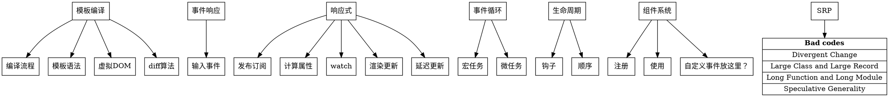
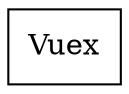
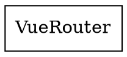

# 设计图谱

设计目的是什么
有什么观念、原则、规则

## 前端框架解决的问题
### 声明式视图更新
1. 命令式视图更新是直接用 JavaScript（jQuery 也一样）操作 DOM，视图更新必须通过明确的命令进行，也就是手动的修改 DOM。
2. 随着 web 动态性越来越强，对视图的更新就越来越多，
3. Model 层和 View 层的节点是一一对应的，但是命令式的更新会将这种对应复杂化。
4. 比如 Model 层的购物车商品数和 View 层购物车角标数字是一一对应的。
OCP：数据和逻辑解耦合 MVVM

初始加载后，可能要修改角标、按钮和提醒，还要修改变量
增加数量后要修改角标，可能要修改按钮和提醒，还要修改变量
移除后要修改角标，可能要修改按钮和提醒，还要修改变量

### 无法同步更新
5. 每个命令其实还要干两件事：分别更新 Model 层和 View 层。比如用户添加了一个商品，你必须要修改 Model 层里某个表示商品数的变量，还要操作 DOM 修改购物车角标标签里的数字。不能实现一次修改同时更新。

### 繁琐的事件驱动更新
1. 考虑用户删除购物车中一个商品的情况，可能的步骤如下：
    1. 在 View 层绑定事件监听；
    2. 监听到点击删除按钮后，修改 Model 层中商品数量变量；
    3. 修改

1. 下面的 [DOT](https://en.wikipedia.org/wiki/DOT_(graph_description_language)) 图表使用 [Viz.js](http://viz-js.com/) 绘制，可以通过 VSCode 的 Markdown Preview Enhanced 插件查看

## Vue 核心

## Vuex

## Vue-router

## References
* [Does your web app need a front-end framework?](https://stackoverflow.blog/2020/02/03/is-it-time-for-a-front-end-framework/)
* [Evan You on Vue.js: Seeking the Balance in Framework Design | JSConf.Asia 2019
](https://www.youtube.com/watch?v=ANtSWq-zI0s)