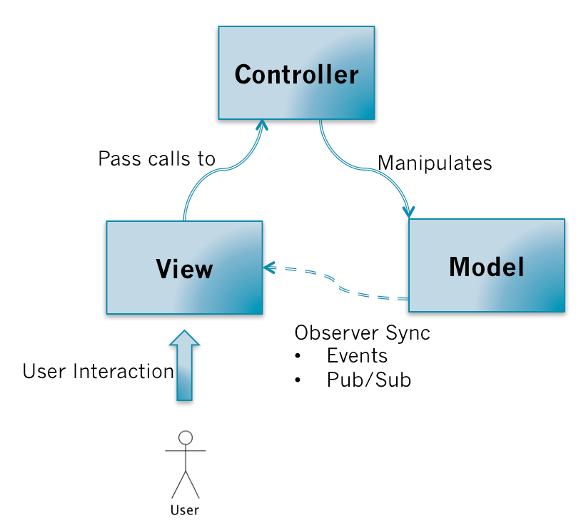

# MV* 模式

<!-- TOC -->

- [MV* 模式](#mv-模式)
    - [设计思想](#设计思想)
        - [SRP 和 OCP](#srp-和-ocp)
        - [LKP](#lkp)
        - [声明式和命令时的权衡](#声明式和命令时的权衡)
    - [沟通 Model 和 View](#沟通-model-和-view)
    - [MVC](#mvc)
        - [通信关系](#通信关系)
        - [优缺点](#优缺点)
            - [优点](#优点)
            - [缺点](#缺点)
    - [MVP](#mvp)
        - [通信关系](#通信关系-1)
        - [优缺点](#优缺点-1)
            - [优点](#优点-1)
            - [缺点](#缺点-1)
    - [MVVM](#mvvm)
        - [ViewModel](#viewmodel)
        - [通信关系](#通信关系-2)
        - [优缺点](#优缺点-2)
            - [优点](#优点-2)
            - [缺点](#缺点-2)
    - [References](#references)

<!-- /TOC -->

## 设计思想
### SRP 和 OCP

### LKP

### 声明式和命令时的权衡

## 沟通 Model 和 View
1. Model 是数据，View 是视图。
2. 不同的 MV* 架构的设计意图就是为了实现 Model 和 View 解耦，同时又保证两者能高效的交流。
3. 实现的方法，就是实现一个 Model 和 View 之间的桥梁：MVC 通过 Controller，MVP 通过 Presenter，MVVM 通过 ViewModel。

## MVC
### 通信关系
1. MVC 的各部分的通信关系如下
    
2. 用户输入触发 View 更新，View 将更新提交到 Controller，Controller 据此修改 Model，Model 的改变又触发 View 的变化。
3. Model 触发 View 更新的方式是观察者模式或发布订阅模式。通过观察者模式的好处就是：不同的 MVC 三角关系可能会有共同的 Model，一个 MVC 三角中的 Controller 操作了 Model 以后，两个 MVC 三角的 View 都会接受到通知，然后更新自己。保持了依赖同一块 Model 的不同 View 显示数据的实时性和准确性。

### 优缺点
#### 优点
* 业务逻辑和展示逻辑分离，模块化程度高。当应用逻辑需要变更的时候，不需要变更业务逻辑和展示逻辑，只需要改变 Controller 就行。
* 观察者模式可以做到多视图同时更新。

#### 缺点
* Controller 测试困难。因为视图同步操作是由 View 自己执行，而 View 只能在有 UI 的环境下运行。在没有 UI 环境下对 Controller 进行单元测试的时候，应用逻辑正确性是无法验证的：Model 更新的时候，无法对 View 的更新操作进行断言。
* View 无法组件化。View 是强依赖特定的 Model 的，如果需要把这个 View 抽出来作为一个另外一个应用程序可复用的组件就困难了。因为不同程序的的 Model 是不一样的。

## MVP
### 通信关系
1. MVP 的各部分的通信关系如下
    
2. 同样是用户输入触发 View 更新，View 将更新提交到 Presenter，Presenter 据此修改 Model。
3. 但是 Model 的变化不会直接触发 View 的变化，而是先触发 Presenter 的变化，然后再由 Presenter 更新 View。

### 优缺点
#### 优点
* 便于测试。Presenter 对 View 是通过接口进行，在对 Presenter 进行不依赖 UI 环境的单元测试的时候，可以通过 mock 一个 View 对象，这个对象只需要实现了 View 的接口即可。然后依赖注入到 Presenter 中，单元测试的时候就可以完整的测试 Presenter 应用逻辑的正确性。
* View 可以进行组件化。在 MVP 当中，View 不依赖 Model。这样就可以让 View 从特定的业务场景中脱离出来，可以说 View 可以做到对业务完全无知。它只需要提供一系列接口提供给上层操作，这样就可以做到高度可复用的 View 组件。

#### 缺点
Presenter 中除了应用逻辑以外，还有大量的 View->Model，Model->View 的手动同步逻辑，造成 Presenter 比较笨重，维护起来会比较困难。

## MVVM
MVVM 可以看作是一种特殊的 MVP 模式，或者说是对 MVP 模式的一种改良。

### ViewModel
1. The ViewModel represents the view. This means that fields in a view model usually match up more closely with the view than with the model.
2. 可以简单把 ViewModel 理解为页面上所显示内容的数据抽象。

### 通信关系
1. MVVM 的各部分的通信关系如下
    
2. MVVM 和 MVP 类似，区别在于在 ViewModel 中会有一个 Binder，View 和 Model 之间数据同步操作交由给 Binder 处理。你需要在 View 的模版语法当中，指令式地声明 View 上的显示的内容是和 Model 的哪一块数据绑定的。
3. 当 ViewModel 对进行 Model 更新的时候，Binder 会自动把数据更新到 View上去；当用户对 View 进行操作（例如表单输入），Binder 也会自动把数据更新到 Model 上去。这种方式称为双向数据绑定。
4. 也就是说，MVVM 把 View 和 Model 的同步逻辑自动化了。以前 Presenter 负责的 View 和 Model 同步不再手动地进行操作，而是交由框架所提供的 Binder 进行负责。 

### 优缺点
#### 优点
* 提高可维护性。解决了 MVP 大量的手动 View 和 Model 同步的问题，提供双向绑定机制。提高了代码的可维护性。
* 简化测试。因为同步逻辑是交由 Binder 做的，View 跟着 Model 同时变更，所以只需要保证 Model 的正确性，View 就正确。大大减少了对 View 同步更新的测试。

#### 缺点
* 对于大型的图形应用程序，视图状态较多，ViewModel 的构建和维护的成本都会比较高。
* 数据绑定的声明是指令式地写在 View 的模版当中的，这些内容是没办法打断点。

## References
* [界面之下：还原真实的MV*模式](https://github.com/livoras/blog/issues/11)
* [MVC，MVP 和 MVVM 的图示](https://www.ruanyifeng.com/blog/2015/02/mvcmvp_mvvm.html)
* [MVVM vs MVP vs MVC: The differences explained](https://web.archive.org/web/20150219153055/http://joel.inpointform.net/software-development/mvvm-vs-mvp-vs-mvc-the-differences-explained/)
* [你对MVC、MVP、MVVM 三种组合模式分别有什么样的理解？](https://www.zhihu.com/question/20148405)
* [https://012.vuejs.org/guide/](https://012.vuejs.org/guide/)