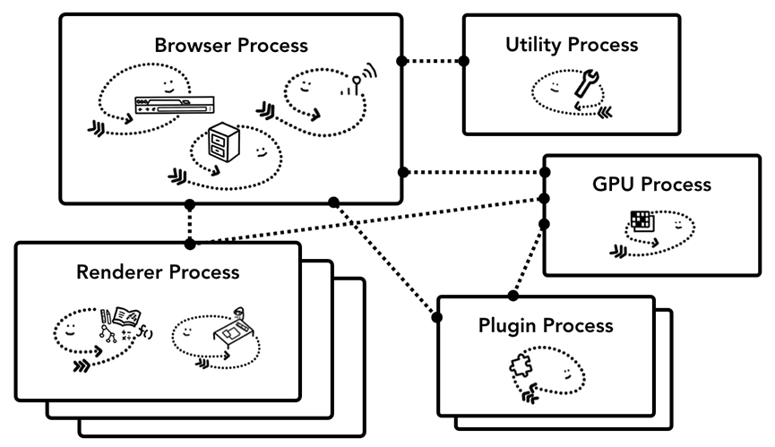

# Browser Architecture

最好直接看[原文](https://developers.google.com/web/updates/2018/09/inside-browser-part1)，这里只是对原文的摘抄备份

## Summary
1. So how is a web browser built using processes and threads? Well, it could be one process with many different threads or many different processes with a few threads communicating over IPC.
    <figure>
        
        <figcaption style="font-size: 0.8em"> Different browser architectures in process/thread diagram</figcaption>
    </figure>
2. The important thing to note here is that these different architectures are implementation details. There is no standard specification on how one might build a web browser. One browser’s approach may be completely different from another.
3. For the sake of this blog series, we are going to use Chrome’s recent architecture described in the diagram below.
4. At the top is the browser process coordinating with other processes that take care of different parts of the application. For the renderer process, multiple processes are created and assigned to each tab. Until very recently, Chrome gave each tab a process when it could; now it tries to give each site its own process, including iframes.
    <figure>
        
        <figcaption style="font-size: 0.8em">Diagram of Chrome’s multi-process architecture. Multiple layers are shown under Renderer Process to represent Chrome running multiple Renderer Processes for each tab.</figcaption>
    </figure>

## Which process controls what?
1. The following table describes each Chrome process and what it controls:

    <table>
        <tbody>
            <tr>
                <th colspan="2">Process and What it controls</th>
            </tr>
            <tr>
                <td>Browser</td>
                <td>
                    Controls "chrome" part of the application including address bar, bookmarks, back and
                    forward buttons.  Also handles the invisible, privileged parts of a web browser such as
                    network requests and file access.
                </td>
            </tr>
            <tr>
                <td>Renderer</td>
                <td>Controls anything inside of the tab where a website is displayed.</td>
            </tr>
            <tr>
                <td>Plugin</td>
                <td>Controls any plugins used by the website, for example, flash.</td>
            </tr>
            <tr>
                <td>GPU</td>
                <td>
                    Handles GPU tasks in isolation from other processes. It is separated into different process
                    because GPUs handles requests from multiple apps and draw them in the same surface.
                </td>
            </tr>
        </tbody>
    </table>

    <figure>
        
        <figcaption style="font-size: 0.8em">Different processes pointing to different parts of browser UI</figcaption>
    </figure>

2. There are even more processes like the Extension process and utility processes. If you want to see how many processes are running in your Chrome, click the options menu icon(三个竖点) at the top right corner, select More Tools, then select Task Manager. This opens up a window with a list of processes that are currently running and how much CPU/Memory they are using.

## The benefit of multi-process architecture in Chrome
1. Earlier, I mentioned Chrome uses multiple renderer process. In the most simple case, you can imagine each tab has its own renderer process. Let’s say you have 3 tabs open and each tab is run by an independent renderer process. If one tab becomes unresponsive, then you can close the unresponsive tab and move on while keeping other tabs alive. If all tabs are running on one process, when one tab becomes unresponsive, all the tabs are unresponsive. That’s sad.
2. Another benefit of separating the browser's work into multiple processes is security and sandboxing. Since operating systems provide a way to restrict processes’ privileges, the browser can sandbox certain processes from certain features. For example, the Chrome browser restricts arbitrary file access for processes that handle arbitrary user input like the renderer process.
3. Because processes have their own private memory space, they often contain copies of common infrastructure (like V8 which is a Chrome's JavaScript engine). This means more memory usage as they can't be shared the way they would be if they were threads inside the same process. In order to save memory, Chrome puts a limit on how many processes it can spin up. The limit varies depending on how much memory and CPU power your device has, but when Chrome hits the limit, it starts to run multiple tabs from the same site in one process.

## Saving more memory - Servicification in Chrome
1. The same approach is applied to the browser process. Chrome is undergoing architecture changes to run each part of the browser program as a service allowing to easily split into different processes or aggregate into one.
2. General idea is that when Chrome is running on powerful hardware, it may split each service into different processes giving more stability, but if it is on a resource-constraint device, Chrome consolidates services into one process saving memory footprint. Similar approach of consolidating processes for less memory usage have been used on platform like Android before this change.
    [动图](https://developers.google.com/web/updates/images/inside-browser/part1/servicfication.svg)

## Per-frame renderer processes - Site Isolation
1. [Site Isolation](https://developers.google.com/web/updates/2018/07/site-isolation) is a feature in Chrome that runs a separate renderer process for each cross-site iframe.
2. We’ve been talking about one renderer process per tab model which allowed cross-site iframes to run in a single renderer process with sharing memory space between different sites. 不懂，共享内存？
3. Running `a.com` and `b.com` in the same renderer process might seem okay.
4. The Same Origin Policy is the core security model of the web; it makes sure one site cannot access data from other sites without consent. Bypassing this policy is a primary goal of security attacks.
5. Process isolation is the most effective way to separate sites. With [Meltdown and Spectre](https://developers.google.com/web/updates/2018/02/meltdown-spectre), it became even more apparent that we need to separate sites using processes.
6. With Site Isolation enabled on desktop by default since Chrome 67, each cross-site iframe in a tab gets a separate renderer process.

<figure>
    
    <figcaption style="font-size: 0.8em">Diagram of site isolation; multiple renderer processes pointing to iframes within a site</figcaption>
</figure>

7. Enabling Site Isolation has been a multi-year engineering effort. Site Isolation isn’t as simple as assigning different renderer processes; it fundamentally changes the way iframes talk to each other.
8. Opening devtools on a page with iframes running on different processes means devtools had to implement behind-the-scenes work to make it appear seamless. Even running a simple Ctrl+F to find a word in a page means searching across different renderer processes. You can see the reason why browser engineers talk about the release of Site Isolation as a major milestone!

## References
* [Inside look at modern web browser (part 1)](https://developers.google.com/web/updates/2018/09/inside-browser-part1)
