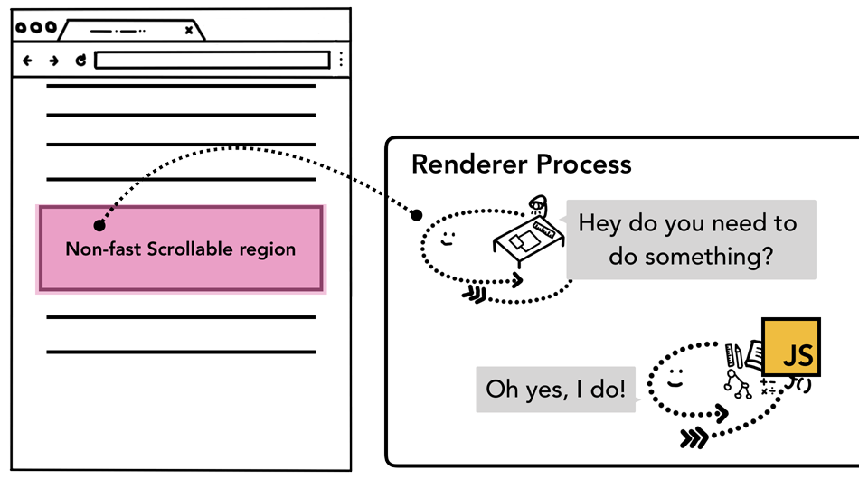

# Compositor

不懂 重看

最好直接看[原文](https://developers.google.com/web/updates/2018/09/inside-browser-part4)，这里只是对原文的摘抄备份

## Input events from the browser's point of view
1. When you hear "input events" you might only think of a typing in textbox or mouse click, but from the browser's point of view, input means any gesture from the user. Mouse wheel scroll is an input event and touch or mouse over is also an input event.
2. When user gesture like touch on a screen occurs, the browser process is the one that receives the gesture at first. However, the browser process is only aware of where that gesture occurred since content inside of a tab is handled by the renderer process. So the browser process sends the event type (like `touchstart`) and its coordinates to the renderer process. Renderer process handles the event appropriately by finding the event target and running event listeners that are attached.

<figure>
    
    <figcaption style="font-size: 0.8em">Input event routed through the browser process to the renderer process</figcaption>
</figure>

## Compositor receives input events
In the previous post, we looked at how the compositor could handle scroll smoothly by compositing rasterized layers. If no input event listeners are attached to the page, Compositor thread can create a new composite frame completely independent of the main thread. But what if some event listeners were attached to the page? How would the compositor thread find out if the event needs to be handled?

## Understanding non-fast scrollable region
Since running JavaScript is the main thread's job, when a page is composited, the compositor thread marks a region of the page that has event handlers attached as "Non-Fast Scrollable Region". By having this information, the compositor thread can make sure to send input event to the main thread if the event occurs in that region. If input event comes from outside of this region, then the compositor thread carries on compositing new frame without waiting for the main thread.
<figure>
    
    <figcaption style="font-size: 0.8em">Diagram of described input to the non-fast scrollable region</figcaption>
</figure>

## Executing program on Process and Thread
1. A process can be described as an application’s executing program. A thread is the one that lives inside of process and executes any part of its process's program.
2. When you start an application, a process is created. The program might create thread(s) to help it do work, but that's optional.
    <figure>
        
        <figcaption style="font-size: 0.8em">Process as a bounding box, threads as abstract fish swimming inside of a process</figcaption>
    </figure>
3. The Operating System gives the process a "slab" of memory to work with and all application state is kept in that private memory space.
4. When you close the application, the process also goes away and the Operating System frees up the memory.
5. A process can ask the Operating System to spin up another process to run different tasks. When this happens, different parts of the memory are allocated for the new process.
6. If two processes need to talk, they can do so by using Inter Process Communication (IPC). Many applications are designed to work this way so that if a worker process get unresponsive, it can be restarted without stopping other processes which are running different parts of the application.

## References
* [Inside look at modern web browser (part 4)](https://developers.google.com/web/updates/2018/09/inside-browser-part4)
