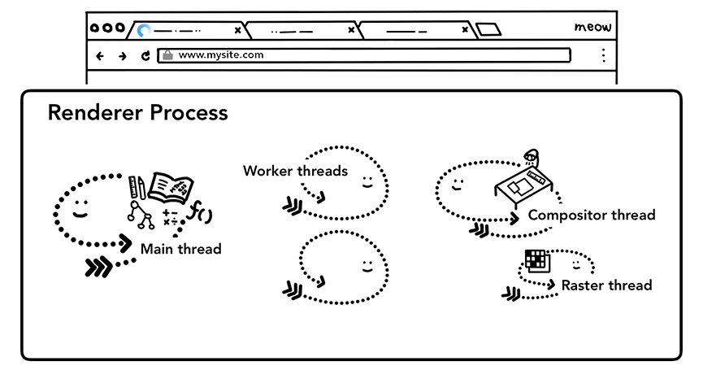
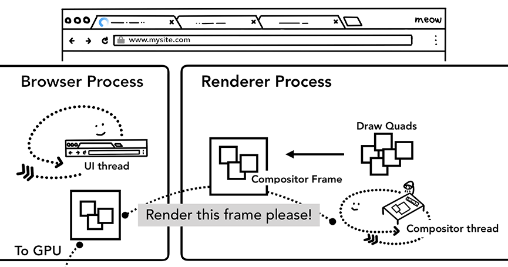

# Renderer Process

* 最好直接看[原文](https://developers.google.com/web/updates/2018/09/inside-browser-part3)，这里只是对原文的摘抄备份
* 本片主要是从进程线程的角度来讲渲染过程，详细的渲染过程笔记在`/note/Theories/Web/Architecture/Performance/CriticalRenderingPath与首屏优化/`

## Summary
1. The renderer process is responsible for everything that happens inside of a tab.
2. In a renderer process, the main thread handles most of the code you send to the user. Sometimes parts of your JavaScript is handled by worker threads if you use a web worker or a service worker.
3. Compositor and raster threads are also run inside of a renderer processes to render a page efficiently and smoothly.
4. The renderer process's core job is to turn HTML, CSS, and JavaScript into a web page that the user can interact with.

<figure>
    
    <figcaption style="font-size: 0.8em">Renderer process with a main thread, worker threads, a compositor thread, and a raster thread inside</figcaption>
</figure>

## Parsing
### Construction of a DOM
1. When the renderer process receives a commit message for a navigation and starts to receive HTML data, the main thread begins to parse the text string (HTML) and turn it into a Document Object Model (DOM).
2. The DOM is a browser's internal representation of the page as well as the data structure and API that web developer can interact with via JavaScript.

### Subresource loading
1. A website usually uses external resources like images, CSS, and JavaScript. Those files need to be loaded from network or cache.
2. The main thread could request them one by one as they find them while parsing to build a DOM, but in order to speed up, "preload scanner" is run concurrently.
3. If there are things like `` or `<link>` in the HTML document, preload scanner peeks at tokens generated by HTML parser and sends requests to the network thread in the browser process.
4. 想想脚本不能并行加载，那如果能在 DOM 解析到该`<script>`之前就加载好，然后同步执行，那好像也没有什么问题。但应该大多数时候，如果是并行加载，肯定不会加载这么快，等到脚本加载完成，解析就已经过了该`<script>`甚至解析完成，那么这时该脚本如果有要操作 DOM，那就会进行重新解析。

### JavaScript can block the parsing
When the HTML parser finds a `<script>` tag, it pauses the parsing of the HTML document and has to load, parse, and execute the JavaScript code. Why? because JavaScript can change the shape of the document using things like `document.write()` which changes the entire DOM structure . This is why the HTML parser has to wait for JavaScript to run before it can resume parsing of the HTML document.

## Hint to browser how you want to load resources
1. There are many ways web developers can send hints to the browser in order to load resources nicely.
2. If your JavaScript does not use `document.write()`, you can add `async` or `defer` attribute to the `<script>` tag. The browser then loads and runs the JavaScript code asynchronously and does not block the parsing.
3. You may also use JavaScript module if that's suitable. `<link rel="preload">` is a way to inform browser that the resource is definitely needed for current navigation and you would like to download as soon as possible. You are read more on this at [Resource Prioritization – Getting the Browser to Help You](Resource Prioritization – Getting the Browser to Help You).

## Style calculation
1. Having a DOM is not enough to know what the page would look like because we can style page elements in CSS.
2. The main thread parses CSS and determines the computed style for each DOM node. This is information about what kind of style is applied to each element based on CSS selectors. You can see this information in the computed section of DevTools.

<figure>
    
    <figcaption style="font-size: 0.8em">The main thread parsing CSS to add computed style</figcaption>
</figure>

## Layout
1. Now the renderer process knows the structure of a document and styles for each nodes, but that is not enough to render a page.
2. The layout is a process to find the geometry of elements.
3. The main thread walks through the DOM and computed styles and creates the layout tree which has information like x y coordinates and bounding box sizes.
4. Layout tree may be similar structure to the DOM tree, but it only contains information related to what's visible on the page. If `display: none` is applied, that element is not part of the layout tree (however, an element with `visibility: hidden` is in the layout tree). Similarly, if a pseudo class with content like `p::before{content:"Hi!"}` is applied, it is included in the layout tree even though that is not in the DOM.
5. Determining the Layout of a page is a challenging task. Even the simplest page layout like a block flow from top to bottom has to consider how big the font is and where to line break them because those affect the size and shape of a paragraph; which then affects where the following paragraph needs to be.
6. CSS can make element float to one side, mask overflow item, and change writing directions. You can imagine, this layout stage has a mighty task. In Chrome, a whole team of engineers works on the layout.

<figure>
    
    <figcaption style="font-size: 0.8em">The main thread going over DOM tree with computed styles and producing layout tree</figcaption>
</figure>

## Paint
1. Having a DOM, style, and layout is still not enough to render a page. Let's say you are trying to reproduce a painting. You know the size, shape, and location of elements, but you still have to judge in what order you paint them.
2. For example, `z-index` might be set for certain elements, in that case painting in order of elements written in the HTML will result in incorrect rendering.
3. At this paint step, the main thread walks the layout tree to create paint records. Paint record is a note of painting process like "background first, then text, then rectangle". If you have drawn on `<canvas>` element using JavaScript, this process might be familiar to you.

<figure>
    
    <figcaption style="font-size: 0.8em">The main thread walking through layout tree and producing paint records</figcaption>
</figure>

### Updating rendering pipeline is costly
1. The most important thing to grasp in rendering pipeline is that at each step the result of the previous operation is used to create new data. For example, if something changes in the layout tree, then the Paint order needs to be regenerated for affected parts of the document.
2. If you are animating elements, the browser has to run these operations in between every frame. Most of our displays refresh the screen 60 times a second (60 fps); animation will appear smooth to human eyes when you are moving things across the screen at every frame. However, if the animation misses the frames in between, then the page will appear "janky".
    <figure>
        
        <figcaption style="font-size: 0.8em">Animation frames on a timeline</figcaption>
    </figure>
3. Even if your rendering operations are keeping up with screen refresh, these calculations are running on the main thread, which means it could be blocked when your application is running JavaScript.
    <figure>
        
        <figcaption style="font-size: 0.8em">Animation frames on a timeline, but one frame is blocked by JavaScript</figcaption>
    </figure>
4. You can divide JavaScript operation into small chunks and schedule to run at every frame using `requestAnimationFrame()`. You might also run your JavaScript in Web Workers to avoid blocking the main thread.
    <figure>
        
        <figcaption style="font-size: 0.8em">Smaller chunks of JavaScript running on a timeline with animation frame</figcaption>
    </figure>

## Compositing
原文有[视频演示](https://developers.google.com/web/updates/2018/09/inside-browser-part3#compositing)

### How would you draw a page?
1. Now that the browser knows the structure of the document, the style of each element, the geometry of the page, and the paint order, how does it draw a page? Turning this information into pixels on the screen is called rasterizing.
2. Perhaps a naive way to handle this would be to raster parts inside of the viewport. If a user scrolls the page, then move the rastered frame, and fill in the missing parts by rastering more. This is how Chrome handled rasterizing when it was first released. However, the modern browser runs a more sophisticated process called compositing.

### What is compositing
1. Compositing is a technique to separate parts of a page into layers, rasterize them separately, and composite as a page in a separate thread called compositor thread. If scroll happens, since layers are already rasterized, all it has to do is to composite a new frame. Animation can be achieved in the same way by moving layers and composite a new frame.
2. You can see how your website is divided into layers in DevTools using [Layers panel](https://blog.logrocket.com/eliminate-content-repaints-with-the-new-layers-panel-in-chrome-e2c306d4d752)(DevTools-右上角三个竖点按钮-More tools-Layers).

### Dividing into layers
1. In order to find out which elements need to be in which layers, the main thread walks through the layout tree to create the layer tree (this part is called "Update Layer Tree" in the DevTools performance panel).
2. If certain parts of a page that should be separate layer (like slide-in side menu) is not getting one, then you can hint to the browser by using [will-change](https://developer.mozilla.org/en-US/docs/Web/CSS/will-change) attribute in CSS.
3. You might be tempted to give layers to every element, but compositing across an excess number of layers could result in slower operation than rasterizing small parts of a page every frame, so it is crucial that you measure rendering performance of your application.

### Raster and composite off of the main thread
1. Once the layer tree is created and paint orders are determined, the main thread commits that information to the compositor thread. The compositor thread then rasterizes each layer. A layer could be large like the entire length of a page, so the compositor thread divides them into tiles and sends each tile off to raster threads. Raster threads rasterize each tile and store them in GPU memory.
    <figure>
        
        <figcaption style="font-size: 0.8em">Raster threads creating the bitmap of tiles and sending to GPU</figcaption>
    </figure>
2. The compositor thread can prioritize different aster threads so that things within the viewport (or nearby) can be rastered first. A layer also has multiple tilings for different resolutions to handle things like zoom-in action.
3. Once tiles are rastered, compositor thread gathers tile information called draw quads to create a compositor frame.
    * **Draw quads**: Contains information such as the tile's location in memory and where in the page to draw the tile taking in consideration of the page compositing.
    * **Compositor frame**:	A collection of draw quads that represents a frame of a page.
4. A compositor frame is then submitted to the browser process via IPC. At this point, another compositor frame could be added from UI thread for the browser UI change or from other renderer processes for extensions. These compositor frames are sent to the GPU to display it on a screen. If a scroll event comes in, compositor thread creates another compositor frame to be sent to the GPU.
    <figure>
        
        <figcaption style="font-size: 0.8em">Compositor thread creating compositing frame. Frame is sent to the browser process then to GPU</figcaption>
    </figure>
5. The benefit of compositing is that it is done without involving the main thread. Compositor thread does not need to wait on style calculation or JavaScript execution. This is why [compositing only animations](https://www.html5rocks.com/en/tutorials/speed/high-performance-animations/) are considered the best for smooth performance. If layout or paint needs to be calculated again then the main thread has to be involved.

## References
* [Inside look at modern web browser (part 3)](https://developers.google.com/web/updates/2018/09/inside-browser-part3)
