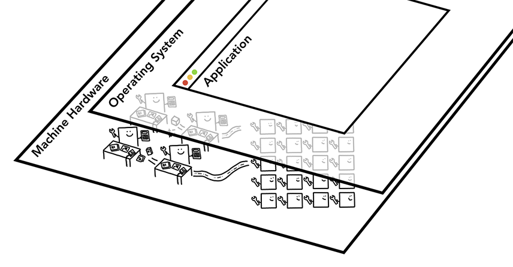

# 准备知识

最好直接看[原文](https://developers.google.com/web/updates/2018/09/inside-browser-part1)，这里只是对原文的摘抄备份

## At the core of the computer are the CPU and GPU
### CPU
1. First is the Central Processing Unit - or CPU. The CPU can be considered your computer’s brain.
2. A CPU core, pictured here as an office worker, can handle many different tasks one by one as they come in. It can handle everything from math to art while knowing how to reply to a customer call.
3. In the past most CPUs were a single chip. A core is like another CPU living in the same chip. In modern hardware, you often get more than one core, giving more computing power to your phones and laptops.

<figure>
    
    <figcaption style="font-size: 0.8em">4 CPU cores as office workers sitting at each desk handling tasks as they come in</figcaption>
</figure>

### GPU
1. Graphics Processing Unit - or GPU is another part of the computer.
2. Unlike CPU, GPU is good at handling simple tasks but across multiple cores at the same time.
3. As the name suggests, it was first developed to handle graphics. This is why in the context of graphics "using GPU" or "GPU-backed" is associated with fast rendering and smooth interaction.
4. In recent years, with GPU-accelerated computing, more and more computation is becoming possible on GPU alone.

<figure>
    
    <figcaption style="font-size: 0.8em">Many GPU cores with wrench suggesting they handle a limited task 在2018年，GPU 的核心数都是成百成千的</figcaption>
</figure>

### 协同
When you start an application on your computer or phone, the CPU and GPU are the ones powering the application. Usually, applications run on the CPU and GPU using mechanisms provided by the Operating System.
<figure>
    
    <figcaption style="font-size: 0.8em">Three layers of computer architecture. Machine Hardware at the bottom, Operating System in the middle, and Application on top.</figcaption>
</figure>

## Executing program on Process and Thread
1. A process can be described as an application’s executing program. A thread is the one that lives inside of process and executes any part of its process's program.
2. When you start an application, a process is created. The program might create thread(s) to help it do work, but that's optional.
    <figure>
        
        <figcaption style="font-size: 0.8em">Process as a bounding box, threads as abstract fish swimming inside of a process</figcaption>
    </figure>
3. The Operating System gives the process a "slab" of memory to work with and all application state is kept in that private memory space.
4. When you close the application, the process also goes away and the Operating System frees up the memory.
5. A process can ask the Operating System to spin up another process to run different tasks. When this happens, different parts of the memory are allocated for the new process.
6. If two processes need to talk, they can do so by using Inter Process Communication (IPC). Many applications are designed to work this way so that if a worker process get unresponsive, it can be restarted without stopping other processes which are running different parts of the application.

## References
* [Inside look at modern web browser (part 1)](https://developers.google.com/web/updates/2018/09/inside-browser-part1)
