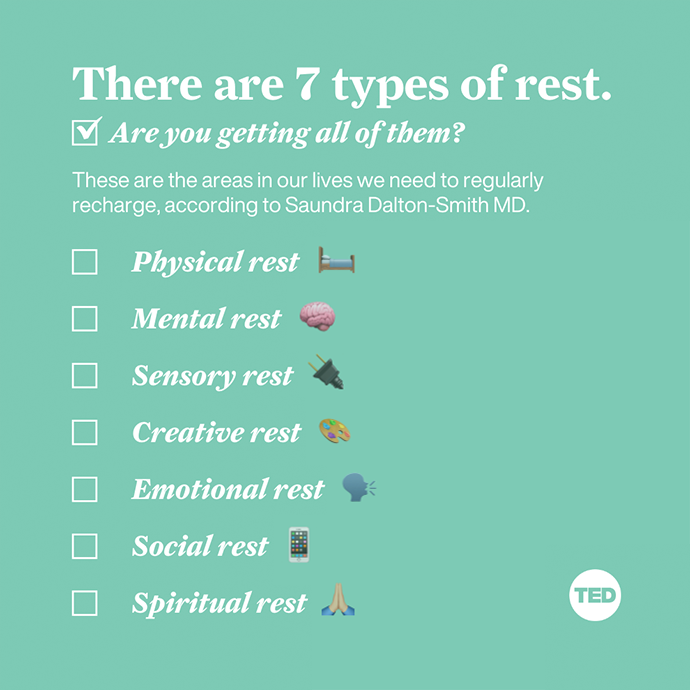

# 七种休息

1. Have you ever tried to fix an ongoing lack of energy by getting more sleep — only to do so and still feel exhausted? 
2. If that’s you, here’s the secret: Sleep and rest are not the same thing, although many of us incorrectly confuse the two.
3. We go through life thinking we’ve rested because we have gotten enough sleep — but in reality we are missing out on the other types of rest we desperately need. The result is a culture of high-achieving, high-producing, chronically tired and chronically burned-out individuals. We’re suffering from a rest deficit because we don’t understand the true power of rest.
4. Rest should equal restoration in seven key areas of your life.
    

## Pysical rest
1. 静态的部分，包括睡觉或者安静歇着；
2. 动态的部分，包括一些放松活动，比如瑜伽、按摩等。

## Mental rest
1. 不要连续长时间脑力劳动，中间要穿插休息；
2. 这个休息不应该是看手机、玩游戏这样的，而应该是身体活动或者安静放松这样非脑力的。

## Sensory rest
1. 原文举得例子是看屏幕、背景噪音和多方对话（multiple conversations）。
2. 对于我来说，感官方面需要休息的，就是少看屏幕，少听耳机。

## Creative rest
1. 做一些审美的活动和有创造性的活动，比如走进大自然、看艺术展、将自己所在的工作环境和工作布置的更有美感（比如插花、布置装饰）。
2. 其实就是记性审美活动。那么看电影、读书、听音乐应该也算这一类。

## Emotional rest
1. 可以真实表现自己的情绪，而不必伪装。
2. 这需要有勇气忠于自我，也可能需要一些独处的时光或者可以真诚面对的关系。

## Social rest 
1. 积极的和支持性的社交关系。
2. 和上面 Emotional rest 也是相结合的。

## Spiritual rest
1. 灵性方面的，冥想、修行、宗教等。

## References
* [The 7 types of rest that every person needs](https://ideas.ted.com/the-7-types-of-rest-that-every-person-needs/)
* [7 Types of Rest That You and Your Body Needs Right Now](https://www.calmsage.com/types-of-rest-that-you-and-your-body-needs-right-now/)